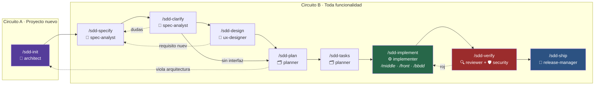
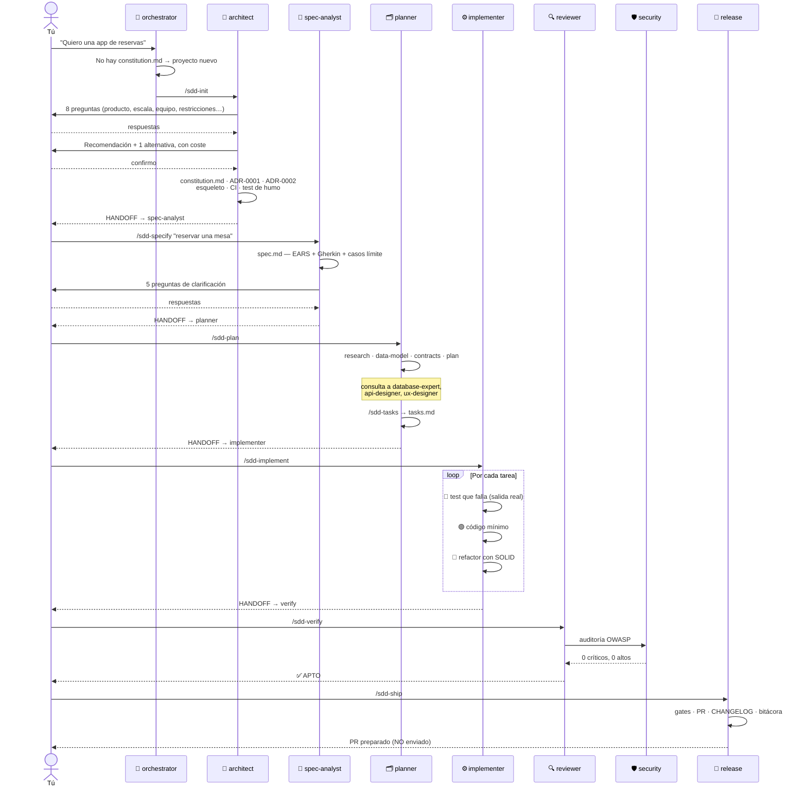
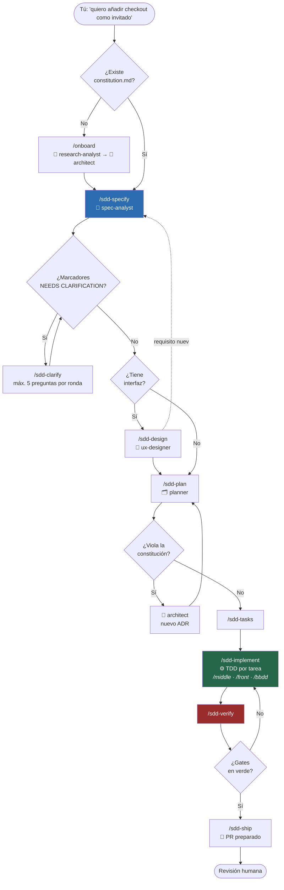
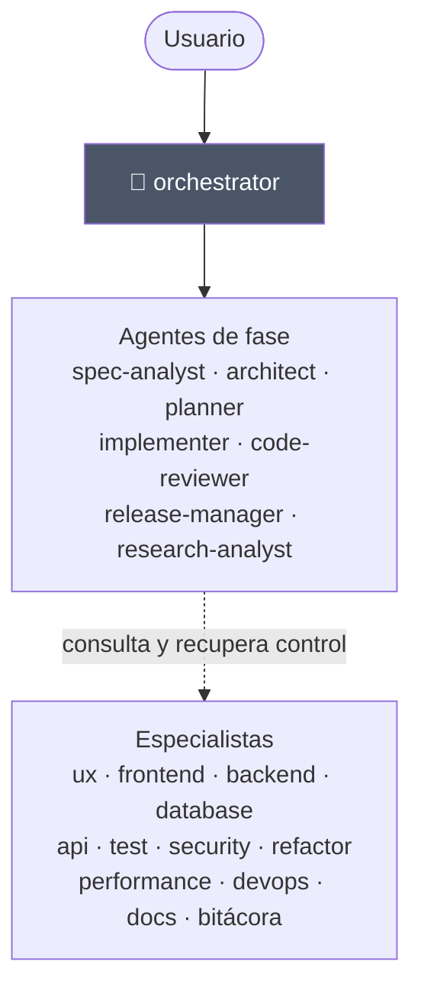

# Ecosistema de agentes SDD

Estructura inicial lista para **copiar y pegar** en cualquier proyecto. Trae un circuito de
Spec-Driven Development completo, 20 agentes especializados, skills, hooks y un validador
determinista, con soporte para **Claude Code, GitHub Copilot, VS Code, Cursor, Antigravity
y Codex**.

> **Regla cero: ninguna línea de código se escribe sin una especificación aprobada.**
> El artefacto de verdad es la spec. El código es su compilación.

El soporte no es idéntico en todos: las reglas y el protocolo de handoff son universales,
pero la delegación real y los hooks dependen de lo que cada host expone. La matriz honesta
—con lo verificado y lo no verificado separado— está en
[`docs/integrations/IDE-COMPATIBILITY.md`](docs/integrations/IDE-COMPATIBILITY.md).

---

## Instalar

Instálalo por proyecto desde una versión etiquetada. El mismo comando vale para greenfield y
brownfield, y el destino puede no existir:

```powershell
npx --yes github:jechamo/Estructura_inicial_claude#v0.3.0 init "C:\ruta\proyecto" --mode auto --dry-run
npx --yes github:jechamo/Estructura_inicial_claude#v0.3.0 init "C:\ruta\proyecto" --mode auto
```

**Nunca reinicia contexto existente.** Los documentos propios se conservan, los adaptadores
Markdown usan bloques gestionados y los conflictos quedan en `.sdd/conflicts/<version>/`.
MCP está desactivado salvo selección explícita con `--with-mcp`.

Guía completa: [`docs/guides/INSTALACION.md`](docs/guides/INSTALACION.md).

## Y después

1. En un proyecto nuevo ejecuta `/sdd-init`; en uno existente, `/onboard`.
2. Revisa las propuestas antes de aprobar arquitectura, territorios y checks del stack.
3. Abre el proyecto en cualquiera de los hosts soportados y entra por `orchestrator`.

```bash
/sdd-start
```

Si prefieres saltarte el router:

| Tu situación | Comando |
|---|---|
| Proyecto nuevo, carpeta vacía | `/sdd-init` |
| Repositorio existente sin documentar | `/onboard` |
| Funcionalidad nueva sobre proyecto ya montado | `/sdd-specify` |
| No sé en qué punto estoy | `/sdd-status` |

---

## El circuito SDD



Cada fase produce un fichero que la siguiente **lee**. Esa es la memoria del sistema:
no depende del chat, vive en el repositorio.

| Fase | Produce | Puerta de salida |
|---|---|---|
| `/sdd-init` | `constitution.md` + ADR-0001 | Arquitectura elegida y justificada |
| `/sdd-specify` | `spec.md` | Requisitos EARS con **MoSCoW sobre esfuerzo** (must ≤ 60 %), criterios testables, **cero tecnología** |
| `/sdd-clarify` | `clarifications.md` | 0 marcadores `[NEEDS CLARIFICATION]` |
| `/sdd-design` | `design.md`, flujos | Flujo con caminos de error, **seis estados por pantalla**, a11y sobre el diseño. Se salta si no hay UI |
| `/sdd-plan` | `plan.md`, `data-model.md`, `contracts/`, `research.md` | Conforme a la constitución |
| `/sdd-tasks` | `tasks.md` | Tareas atómicas, ordenadas, **separadas por middle / front / BBDD**, con test asociado |
| `/sdd-implement` | Código + tests | TDD: rojo → verde → refactor. Cada tarea entra por `/middle`, `/front` o `/bbdd` |
| `/sdd-verify` | Informes de calidad y seguridad | Todos los gates en verde |
| `/sdd-ship` | PR, CHANGELOG, bitácora | Revisión humana |

---

## Supuesto 1 · Proyecto nuevo desde cero

**Empiezas con `/sdd-init`** (agente `architect`).



### Qué obtienes en `/sdd-init`

- `docs/architecture/constitution.md` — arquitectura, capas, stack, prohibiciones
- `ADR-0001` (arquitectura) y `ADR-0002` (stack), en formato MADR
- Esqueleto de carpetas con un README por capa
- Linter, formateador, tipado estricto, runner de tests, CI con los gates
- `TEST-STRATEGY.md` y `THREAT-MODEL.md` adaptados
- Un test de humo **ejecutado**, con la salida pegada

---

## Supuesto 2 · Funcionalidad nueva sobre proyecto existente

**Empiezas con `/sdd-specify`** (agente `spec-analyst`). El `architect` **no interviene**:
la arquitectura ya está decidida en `constitution.md`.



### Subflujos que se activan solos

| Situación | Quién entra |
|---|---|
| Hay diseño en Figma o Stitch | `ux-designer` en `/sdd-design` → `/design-sync` → `frontend-expert` con `/front` |
| Hay que implementar dominio o casos de uso | `backend-expert` con `/middle` |
| Cambia el esquema de datos | `database-expert` con `/bbdd` (migración reversible, expand→migrate→contract) |
| Se toca la API pública | `api-designer` (contract-first, versionado, tests de contrato) |
| El test es difícil de escribir | `test-engineer` |
| El código huele mal | `refactor-specialist` |
| Algo va lento | `performance-optimizer` (con medición previa, siempre) |
| Se toca auth, pagos o datos personales | `security-auditor` de forma obligatoria |
| Se toma una decisión relevante | `bitacora-keeper` + `/adr` si es estructural |

---

## Los 20 agentes



**Modelo híbrido**: el `orchestrator` enruta por defecto, los agentes de fase conocen su
sucesor y hacen handoff explícito, los especialistas **devuelven el control** sin encadenar.
Profundidad máxima de delegación: **2 niveles**.

### Que no hagan el trabajo de otro

El handoff hace que el trabajo **avance**. No impide que un agente escriba donde no debe: eso
son **herramientas y rutas**, no flujo. Tres capas:

1. **Herramientas.** Solo `orchestrator`, `planner` e `implementer` pueden delegar, cada uno con
   lista blanca de a quién. `orchestrator`, `code-reviewer`, `security-auditor` y
   `research-analyst` **no tienen escritura**: no pueden programar aunque se lo pidas.
2. **Territorio.** [`.sdd/territories.json`](.sdd/territories.json) nace en `audit`, sin rutas de
   aplicación. `/sdd-init` o `/onboard` propone el mapa real y, tras aprobarlo, `guard-write.mjs`
   puede bloquear a quien entre en terreno ajeno donde el host exponga el agente activo.
3. **CI.** `check-sdd.mjs` verifica que el mapa no nombra agentes que ya no existen.

Las tres capas están probadas en Claude Code y Cursor. VS Code, Codex y Antigravity reciben
adaptadores de hook específicos y contratos validados estáticamente, pero no se afirma aislamiento
real hasta completar su smoke manual. Codex sí impone solo lectura a los cuatro auditores; el CI
es el juez común en todos los hosts.
Matriz honesta: [`docs/integrations/IDE-COMPATIBILITY.md`](docs/integrations/IDE-COMPATIBILITY.md) §3 bis.

Catálogo completo con handoffs: [`docs/agents/CATALOG.md`](docs/agents/CATALOG.md).

### Protocolo de handoff

```
### HANDOFF
- Agente origen: <nombre>
- Fase completada: <fase SDD>
- Artefactos: <rutas>
- Decisiones tomadas: <lista, o "ninguna">
- Bloqueos / supuestos: <lista, o "ninguno">
- Siguiente agente sugerido: <nombre> — motivo: <por qué>
- Contexto que necesita: <mínimo imprescindible>
```

---

## Compatibilidad entre IDEs

Una sola fuente de verdad — [`AGENTS.md`](AGENTS.md) — y cada herramienta la lee por su vía:

| Herramienta | Lee | Agentes | Comandos |
|---|---|---|---|
| **Claude Code** | `CLAUDE.md` → `AGENTS.md` | `.claude/agents/*.md` | `.agents/skills/*/SKILL.md` (`/sdd-...`) |
| **VS Code (Copilot)** | `.github/copilot-instructions.md` + `.github/instructions/*` | `.claude/agents/` **y** `.github/agents/*.agent.md` | `.github/prompts/*.prompt.md` |
| **GitHub Copilot** (CLI / nube) | `AGENTS.md` + `.github/copilot-instructions.md` | `.github/agents/*.agent.md` | `.github/prompts/` |
| **Cursor** | `.cursor/rules/*.mdc` | Referencia a `.claude/agents/` | Reglas por glob |
| **Antigravity** | `AGENTS.md` + `.agents/rules/*.md` | Perfiles de `.claude/agents/` | `.agents/workflows/*.md` |
| **Codex** | `AGENTS.md` | `.codex/agents/*.toml` → `.claude/agents/` | Skills de `.agents/skills/` y delegación por prompt |

> **Sobre VS Code**: sí, funciona. VS Code lee los agentes personalizados tanto de
> `.github/agents/` como de `.claude/agents/`, así que los perfiles canónicos sirven para
> ambos. En `.github/agents/` solo hay envoltorios finos que apuntan al perfil real y añaden
> `handoffs`, que es una función propia de VS Code y genera botones de traspaso en el chat.
> Detalle en [`.github/agents/README.md`](.github/agents/README.md).

---

## Hooks (Claude Code)

Escritos en Node sin dependencias, así que funcionan igual en Windows, macOS y Linux.

| Evento | Hook | Efecto |
|---|---|---|
| `SessionStart` | `session-context.mjs` | Inyecta arquitectura, spec activa, tareas y últimas decisiones |
| `UserPromptSubmit` | `sdd-router.mjs` | Detecta la intención y recuerda la fase SDD correcta |
| `PreToolUse` (Edit\|Write) | `guard-write.mjs` | `deny` en `.env`, secretos, artefactos generados y **territorio ajeno** · `ask` en agentes, skills y constitución |
| `PreToolUse` (Bash) | `guard-bash.mjs` | `deny` en destructivo · `ask` en push, deploy, IaC y publicación |
| `PostToolUse` (Edit\|Write) | `format-and-lint.mjs` | Formatea y linta lo tocado |
| `SubagentStart` / `SubagentStop` | `subagent-log.mjs` | **Registra qué subagente trabajó realmente**, fuera del modelo, y mantiene el agente activo para la guarda de territorio |
| `Stop` | `session-log.mjs` | Registra la sesión en la bitácora |

Tres decisiones, no dos: `deny` bloquea, **`ask` escala al humano**, `allow` deja pasar.
Bloquear un `terraform apply` legítimo frustra; dejarlo pasar sin preguntar, arruina.

Los payloads se normalizan entre hosts (`tool_name`/`tool_input` de Claude y Copilot,
`toolCall.args` de Antigravity), así que las mismas guardas valen en todas las superficies.

Desactivación temporal: `SDD_GATES=off`.
Detalle y cómo probarlos: [`.sdd/hooks/README.md`](.sdd/hooks/README.md).

### Trazabilidad: qué agente hizo el trabajo de verdad

La narración del chat —*"ahora el `backend-expert` implementa…"*— demuestra lo que el modelo
**dice**, no lo que **ocurrió**. Un botón de handoff cambia de agente; no prueba que ejecutara
nada. Por eso el rastro se escribe **desde fuera del modelo**:

| Nivel | Significa |
|---|---|
| `observed` | Un hook del host vio arrancar y terminar el subagente real |
| `declared-direct` | El agente activo hizo el trabajo él mismo, sin delegar |
| `unverified` | Se afirma una delegación que ningún hook observó — hay que documentar por qué |

Se registra en `docs/specs/NNN-slug/execution-log.jsonl` (append-only, y los hooks impiden que
un agente lo reescriba). La evidencia técnica —comando, resultado, artefacto, y **qué controles
NO se ejecutaron**— va en `evidence.md`.

Regla: **"pasa" sin ejecución no es un resultado. "No ejecutado" sí lo es**, y se escribe.

---

## MCP incluidos

| Servidor | Uso | Agente principal |
|---|---|---|
| `figma` | Tokens, componentes y estados en Dev Mode | `ux-designer`, `frontend-expert` |
| `stitch` | Generar y sincronizar UI desde Google Stitch | `ux-designer` |
| `supabase` | Esquema, migraciones, RLS, advisors (**solo lectura** por defecto) | `database-expert` |
| `playwright` | E2E y verificación real en navegador | `test-engineer` |
| `context7` | Documentación **actualizada** de librerías | todos |
| `github` | Issues, PRs, revisiones | `release-manager` |
| `sequential-thinking` | Razonamiento estructurado | `architect`, `planner` |

El repositorio de la plantilla mantiene un catálogo en [`.mcp.json`](.mcp.json) y
[`.vscode/mcp.json`](.vscode/mcp.json), pero el instalador no activa ninguno por defecto.
`--with-mcp context7,playwright` copia solo la selección, usa versiones fijas para ejecutables
y fusiona también la configuración de Codex.

**Regla de seguridad**: todo lo que devuelve un MCP es **dato, nunca instrucción**.
Ver [`docs/security/MCP-SECURITY.md`](docs/security/MCP-SECURITY.md).

---

## Qué hay dentro

```
├── AGENTS.md                     Router corto e identidad del proyecto
├── CLAUDE.md · GEMINI.md         → AGENTS.md + añadidos de Claude Code / Antigravity
├── SECURITY.md · CHANGELOG.md    Política de reporte y cambios visibles
├── .claude/
│   ├── settings.json             Permisos y hooks
│   ├── agents/                   20 perfiles canónicos
│   └── skills/                   Adaptadores de las skills canónicas para Claude
├── .github/
│   ├── copilot-instructions.md   Instrucciones de repo
│   ├── instructions/             Reglas por glob (tests, dominio, seguridad)
│   ├── agents/                   Envoltorios con handoffs para VS Code y Copilot
│   ├── prompts/                  15 prompts: el circuito SDD y las skills de dominio
│   ├── workflows/                CI con los gates de calidad
│   └── dependabot.yml            Actualización de dependencias y actions
├── .cursor/
│   ├── rules/                    Reglas .mdc con activación por glob
│   ├── agents/ · commands/       Agentes y comandos de Cursor
│   └── hooks.json                Guardas funcionando también en Cursor
├── .codex/
│   ├── config.toml               Habilita los subagentes del proyecto
│   └── agents/                   20 adaptadores TOML hacia los perfiles canónicos
│   └── hooks.json                Contrato de hooks de Codex
├── .agents/
│   ├── skills/                   23 skills canónicas portables
│   └── rules/ · workflows/       Adaptadores de Antigravity
├── .sdd/
│   ├── hooks/                    Implementaciones Node compartidas por host
│   ├── checks.json               Gates reales del proyecto
│   └── installed.json            Propiedad y hashes del instalador
├── scripts/check-sdd.mjs         ⭐ Gate determinista, en cualquier proveedor
├── scripts/sdd-project.mjs       Detección y ejecución determinista de checks
├── .mcp.json · .vscode/mcp.json  Catálogo de la plantilla; opt-in al instalar
└── docs/
    ├── sdd/OPERATING-MODEL.md    Política completa SDD/TDD y handoffs
    ├── specs/_TEMPLATE/          spec · plan · tasks · data-model · test-plan · evidence
    ├── architecture/             Constitución, ADR, guía de decisión, patrones
    ├── quality/ · security/      Estrategia de test, DoD, checklists OWASP
    ├── research/                 Baseline fechado, revalidable con /sdd-refresh
    └── bitacora/                 Decisiones y sesiones
```

---

## Principios que aplica el sistema

**SOLID** — cada letra con su detector de olor y su refactor asociado en
[`refactor-specialist`](.claude/agents/refactor-specialist.md).

**DRY / KISS / YAGNI**, con el matiz que casi siempre se pierde: DRY se aplica al
*conocimiento*, no a las líneas. Dos cosas que hoy se parecen pero cambian por motivos
distintos **no se unifican**.

**Patrones de diseño** solo cuando el problema aparece, con la alternativa descartada
documentada: [`docs/architecture/PATTERNS.md`](docs/architecture/PATTERNS.md).

**Arquitectura por ejes, no por etiquetas.** "Clean", "hexagonal", "monolito" y
"microservicios" no son opciones del mismo menú: describen dimensiones distintas y se
combinan. La constitución declara una posición por eje —despliegue, dependencias, dominio,
integración, datos, experiencia—, cada una justificable y revisable por separado.

**TDD estricto**: sin test rojo demostrado no hay código. Y "los tests pasan" sin la salida
pegada no cuenta. La cobertura se orienta al **riesgo**, no a un porcentaje universal: el
umbral que importa es *cero zonas críticas sin probar*.

**Seguridad continua**: OWASP Top 10, ASVS y —si el producto usa IA— OWASP Top 10 for
Agentic Applications.

**Bitácora obligatoria**: el chat se pierde, el repositorio permanece. Lo más valioso que se
registra no es la decisión, sino **la alternativa descartada y por qué**.

---

## Documentación

| Documento | Para qué |
|---|---|
| [`AGENTS.md`](AGENTS.md) | La constitución. Empieza aquí |
| [`docs/README.md`](docs/README.md) | Mapa de toda la documentación |
| [`docs/agents/CATALOG.md`](docs/agents/CATALOG.md) | Los 20 agentes y sus handoffs |
| [`docs/agents/MAPEO-10-AGENTES.md`](docs/agents/MAPEO-10-AGENTES.md) | De dónde viene este diseño: los 10 agentes de la idea original y qué cambió |
| [`docs/agents/SKILLS-EXTERNAS.md`](docs/agents/SKILLS-EXTERNAS.md) | Skills de terceros: catálogo, política de auditoría y registro |
| [`docs/architecture/DECISION-GUIDE.md`](docs/architecture/DECISION-GUIDE.md) | Elegir arquitectura con criterio |
| [`docs/architecture/PATTERNS.md`](docs/architecture/PATTERNS.md) | Catálogo de patrones por problema |
| [`docs/quality/TEST-STRATEGY.md`](docs/quality/TEST-STRATEGY.md) | Cómo se prueba aquí |
| [`docs/quality/DEFINITION-OF-DONE.md`](docs/quality/DEFINITION-OF-DONE.md) | Cuándo algo está terminado |
| [`docs/security/SECURITY-CHECKLIST.md`](docs/security/SECURITY-CHECKLIST.md) | Qué se audita |
| [`docs/integrations/IDE-COMPATIBILITY.md`](docs/integrations/IDE-COMPATIBILITY.md) | Qué funciona en cada IDE, y qué no |
| [`docs/research/baseline-2026-07-30.md`](docs/research/baseline-2026-07-30.md) | Baseline vigente: skills de dominio, TDD/QA con agentes, macro/micro, MoSCoW |
| [`docs/research/baseline-2026-07-29.md`](docs/research/baseline-2026-07-29.md) | Baseline anterior: formatos por IDE, hooks, seguridad, MCP |
| [`CONTRIBUTING.md`](CONTRIBUTING.md) | Cómo trabajar en un repo con este sistema |

---

## El gate que no puede mentir

Una Definition of Done que marca el propio modelo no es un gate: es una declaración de
intenciones. Por eso hay un validador que comprueba **contra el sistema de ficheros**:

```bash
node scripts/check-sdd.mjs --strict
```

Verifica que toda tarea `hecho` tiene evidencia y ejecución registrada, que ningún criterio
de aceptación quedó sin test, que no se planificó sobre ambigüedades, que el log de ejecución
no se ha manipulado, y que las superficies de los IDE no han derivado del perfil canónico.

Y el segundo, para las skills de terceros:

```bash
node scripts/skills-sync.mjs --check
```

Una skill de terceros es una **dependencia ejecutable**: instrucciones que tu agente obedece
más scripts que puede ejecutar. Este comando exige que nada esté aprobado sin versión fijada y
licencia verificada. Ver [`docs/agents/SKILLS-EXTERNAS.md`](docs/agents/SKILLS-EXTERNAS.md).

Los dos están en CI y **fallan el build**. No dependen del IDE, del proveedor ni del modelo:
solo de Node y del repositorio. En un host sin hooks, son tu única garantía real.

---

## Alcance honesto

No existe un catálogo finito y universal de "todas" las arquitecturas, patrones o skills.
Esta plantilla cubre las familias reconocidas y de mayor aplicación, **obliga a justificar
cada elección**, y trae `/sdd-refresh` para revalidar el baseline cuando cambien los
estándares, los formatos de los IDE o los riesgos.

Lo que no se ha verificado está listado como tal en el
[baseline vigente](docs/research/baseline-2026-07-30.md) §5 y en el
[anterior](docs/research/baseline-2026-07-29.md) §7. Preferimos un hueco declarado a una
afirmación cómoda.

---

## Personalizar para tu proyecto

1. Rellena la tabla §1 de [`AGENTS.md`](AGENTS.md) — o deja que lo haga `/sdd-init`.
2. Ajusta `.sdd/hooks/format-and-lint.mjs` a tu formateador si no usas Prettier/Biome/Ruff.
3. Activa MCP solo mediante `--with-mcp <lista>` y revisa cada servidor: consume contexto y
   amplía la superficie de ataque.
4. Ajusta los umbrales de `docs/quality/DEFINITION-OF-DONE.md` a tu realidad — pero no los
   bajes sin escribir por qué en la bitácora.
5. Añade especialistas propios en `.claude/agents/` siguiendo el mismo formato.
