# Sistema de agentes SDD — Memoria técnica

> Documento de entrega de Trabajo Fin de Máster.
> Versión del sistema descrito: **0.7.0** · Manifiesto de instalación: **v7**
> Ámbito: plantilla portable de ecosistema de agentes para desarrollo dirigido por especificación.

---

## Índice

1. [Descripción del proyecto](#1-descripción-del-proyecto)
2. [Marco metodológico: los cuatro pilares](#2-marco-metodológico-los-cuatro-pilares)
3. [Instalación limpia: comandos y verificación](#3-instalación-limpia-comandos-y-verificación)
4. [Estructura de ficheros y carpetas](#4-estructura-de-ficheros-y-carpetas)
5. [Catálogo de agentes](#5-catálogo-de-agentes)
6. [Diagramas Excalidraw](#6-diagramas-excalidraw)
7. [Catálogo de skills](#7-catálogo-de-skills)
8. [Workflows principales](#8-workflows-principales)
9. [Prompts tipo por workflow](#9-prompts-tipo-por-workflow)
10. [Consideraciones, evaluación crítica y trabajo futuro](#10-consideraciones-evaluación-crítica-y-trabajo-futuro)
11. [Cobertura del ciclo de vida del software](#11-cobertura-del-ciclo-de-vida-del-software)

Anexos: [A. Árbol del repositorio plantilla](#anexo-a--árbol-del-repositorio-plantilla) ·
[B. Referencia de la CLI](#anexo-b--referencia-completa-de-la-cli) ·
[C. Contrato de hooks](#anexo-c--contrato-de-hooks) ·
[D. Matriz de compatibilidad por IDE](#anexo-d--matriz-de-compatibilidad-por-ide) ·
[E. Catálogo de IDs de trazabilidad](#anexo-e--catálogo-de-ids-de-trazabilidad) ·
[F. Glosario y bibliografía](#anexo-f--glosario-y-bibliografía)

---

## 1. Descripción del proyecto

### 1.1 Qué es

Este proyecto es una **plantilla portable e instalable de un ecosistema de agentes de IA**
orientado a producir software mediante desarrollo dirigido por especificación
(*Spec-Driven Development*, SDD). No es una aplicación: es la capa de método, gobierno y
verificación que se instala **sobre** cualquier proyecto de software para que un asistente de
IA deje de improvisar y empiece a trabajar contra un circuito auditable.

La tesis operativa del sistema se resume en una frase: **a partir de un documento funcional o
de diseño, el ecosistema debe poder avanzar "solo agénticamente"** —encadenando fases,
delegando en especialistas y produciendo artefactos trazables— **deteniéndose únicamente en
los puntos donde una persona debe decidir**.

La materialización concreta son cuatro piezas:

| Pieza | Cantidad | Función |
|---|---|---|
| **Agentes** | 20 | Perfiles de rol con herramientas acotadas, capacidad de delegación explícita y destinos de handoff tipados |
| **Skills** | 26 | Procedimientos reutilizables invocables como `/comando`, con puerta de entrada, pasos y lista de comprobación |
| **Hooks** | 7 activos + 1 librería | Controles deterministas del *host* que se ejecutan fuera del modelo y no dependen de su buena voluntad |
| **Scripts** | 6 ejecutables + 3 librerías | Verificación, instalación, generación y export en Node.js puro, sin dependencias de runtime |

### 1.2 Qué problema resuelve

Un asistente de IA moderno escribe código competente. El problema no es la capacidad de
generación: es la **falta de contrato**. Sin contrato aparecen cinco patologías recurrentes:

1. **Deriva de requisitos.** El modelo interpreta la petición, no la especifica. Dos sesiones
   distintas producen dos interpretaciones distintas del mismo enunciado.
2. **Tests escritos después.** Un test escrito tras el código verifica lo que el código hace,
   no lo que debía hacer. Pasa siempre y no prueba nada.
3. **Narración como evidencia.** El modelo afirma *"he ejecutado los tests y pasan"*. Nadie lo
   comprobó. La afirmación no es verificable a posteriori.
4. **Seguridad como comentario.** Se menciona OWASP en la respuesta y no se aplica ningún
   control concreto en ningún punto del código.
5. **Amnesia entre sesiones.** La decisión de la semana pasada no existe. Se vuelve a decidir,
   distinto, y nadie recuerda por qué.

El sistema ataca cada una con un mecanismo material, no con una recomendación en el prompt:

| Patología | Mecanismo |
|---|---|
| Deriva de requisitos | Spec EARS aprobada por una persona antes de escribir código (regla dura 1) |
| Tests a posteriori | Ciclo RED→GREEN→REFACTOR con salida real pegada como evidencia (regla dura 4) |
| Narración como evidencia | Hooks del *host* que registran eventos reales en JSONL *append-only* que el propio agente no puede editar |
| Seguridad declarativa | Impacto de seguridad obligatorio por spec + auditor de solo lectura + informe parseable con GO/NO-GO (regla dura 12) |
| Amnesia | Bitácora de decisiones, ADR en formato MADR y contexto inyectado al arrancar sesión |

### 1.3 Principio de diseño dominante: separación entre lo probabilístico y lo determinista

La decisión estructural más relevante del sistema es **no confiar la verificación al modelo**.

El modelo hace lo que hace bien: leer contexto, redactar, razonar sobre diseño, proponer
implementaciones. Todo lo que debe ser **cierto** —el recuento de agentes, la existencia de un
fichero, la ejecución de un test, la ausencia de un secreto, la coherencia de la trazabilidad—
lo comprueba un script de Node.js con código de salida.

Esto tiene una consecuencia que atraviesa toda la memoria: *"pasa" sin ejecución real no es un
resultado; "no ejecutado" sí lo es*, siempre que se declare con su riesgo y su siguiente paso
(regla dura 7). El sistema prefiere una laguna declarada a una afirmación cómoda.

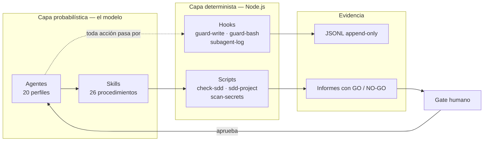

### 1.4 Portabilidad: un método, seis superficies

El mismo contrato de 20 agentes y 26 skills se replica sobre **seis superficies de IDE**, cada
una con el formato nativo que su *host* espera:

| Superficie | Directorio | Formato de agente |
|---|---|---|
| Claude Code | `.claude/agents/` | Markdown con *frontmatter* YAML |
| GitHub Copilot / VS Code | `.github/agents/` | `.agent.md` con `handoffs:` tipados |
| Cursor | `.cursor/agents/` | Markdown con *frontmatter* YAML |
| Codex | `.codex/agents/` | TOML |
| Gemini | `.gemini/agents/` | Markdown con *frontmatter* YAML |
| Genérico / Antigravity | `.agents/agents/` | Markdown con *frontmatter* YAML |

Las skills, en cambio, **no se duplican**: viven una sola vez en `.agents/skills/*/SKILL.md` y
`.claude/skills/` contiene únicamente adaptadores de descubrimiento. Esta asimetría es
deliberada y está documentada: los agentes necesitan formato nativo porque el *host* los parsea;
las skills son procedimientos en prosa y son portables tal cual.

Los hooks también se implementan una sola vez, en `.sdd/hooks/*.mjs`, y cada *host* los registra
en su propio adaptador de configuración.

### 1.5 Restricciones autoimpuestas

| Restricción | Motivo |
|---|---|
| **Cero dependencias de runtime** | Instalable con `npx` en cualquier repositorio sin contaminar su `package.json` ni su árbol de dependencias |
| **Node.js ≥ 18, `.mjs`** | Comportamiento idéntico en Windows, macOS y Linux sin capa de compatibilidad |
| **Agnóstico de stack** | Los gates de calidad se **declaran** en `.sdd/checks.json`; el sistema nunca presupone npm, Python, Java ni Docker |
| **Nunca reinicia contexto existente** | Los documentos propios se conservan, los bloques gestionados se actualizan y los conflictos van a `.sdd/conflicts/<versión>/` |
| **MCP siempre *opt-in*** | La instalación normal no crea ninguna configuración MCP; hay que pedirla con `--with-mcp` |
| **El instalador no cambia permisos** | Si un *git hook* necesita el bit de ejecución, se entrega el comando exacto a la persona; no se ejecuta a escondidas (regla dura 11) |

### 1.6 Estado de madurez en el momento de la entrega

Cifras reales obtenidas de la ejecución de los verificadores del propio repositorio:

```text
$ node scripts/check-sdd.mjs
check-sdd (normal) · 12 spec(s) · 82 tarea(s) hecha(s) · 20 agente(s) · 26 skill(s)
✅ Estructura y coherencia correctas. Usa --strict antes de entregar.
```

```text
$ node scripts/install.mjs init <destino> --mode greenfield --si
modo greenfield · 309 escrito(s) · 0 fusionado(s) · 0 conservado(s) · 0 conflicto(s)
```

El sistema se ha construido **aplicándose a sí mismo**: las doce especificaciones de
`docs/specs/` son las de su propia evolución, desde `001-agentes-codex` hasta
`012-autocumplimiento-cli-y-gates`. Esto es relevante metodológicamente porque significa
que el circuito descrito en el capítulo 8 no es una propuesta teórica: es el procedimiento con
el que se produjo el artefacto que esta memoria describe.

---

## 2. Marco metodológico: los cuatro pilares

Este capítulo es el núcleo conceptual de la memoria. Los cuatro pilares —**SDD, TDD, Calidad y
Seguridad**— no son secciones paralelas de un documento: son cuatro exigencias que atraviesan
cada agente, cada skill, cada hook y cada fase del circuito. Los capítulos siguientes se leen
mejor como *materializaciones* de este.

Cada pilar se presenta con la misma estructura: **(a)** qué problema resuelve, **(b)** cómo lo
materializa el sistema, **(c)** qué artefacto, agente, skill o script lo hace cumplir, y
**(d)** cómo se demuestra que se cumplió.

### 2.1 Pilar SDD — la especificación es la fuente de verdad

#### (a) El problema

El código generado por IA es rápido de escribir y caro de verificar. Si no existe un enunciado
previo, verificable y aprobado, no hay forma de decidir si lo que se produjo es correcto: solo
hay forma de decidir si *parece* razonable. La revisión se convierte en una discusión de gustos.

#### (b) La materialización

La regla dura 1 del sistema es literal: **ningún código se implementa sin una spec aprobada en
`docs/specs/NNN-slug/`**. La spec no es un documento libre; tiene una gramática.

**Requisitos en sintaxis EARS.** Cada requisito funcional se escribe con uno de estos cuatro
patrones, sin variantes:

| Patrón | Forma literal | Cuándo se usa |
|---|---|---|
| Ubicuo | `El sistema DEBE <comportamiento>.` | Comportamiento siempre activo |
| Dirigido por evento | `CUANDO <disparador>, el sistema DEBE <comportamiento>.` | Reacción a un suceso |
| Dirigido por estado | `MIENTRAS <estado>, el sistema DEBE <comportamiento>.` | Comportamiento condicionado a un modo |
| No deseado | `SI <condición no deseada>, ENTONCES el sistema DEBE <comportamiento>.` | Manejo de error o excepción |

La restricción del vocabulario no es estética: un requisito EARS **se traduce mecánicamente a
un test**. `CUANDO el usuario envía credenciales inválidas, el sistema DEBE responder 401 sin
revelar si el usuario existe` ya contiene el *arrange*, el *act* y el *assert*.

**Priorización MoSCoW sobre esfuerzo, no sobre número de requisitos.** El sistema exige que los
requisitos `Must` no superen el **60 % del esfuerzo estimado**. Es una diferencia importante
respecto a la aplicación habitual de MoSCoW: contar requisitos permite hacer trampa marcando
como `Must` diez requisitos triviales y uno enorme. Contar esfuerzo obliga a priorizar de verdad.

**Tres declaraciones de impacto obligatorias.** Toda spec debe declarar explícitamente:

| Declaración | Valores | Consecuencia si aplica |
|---|---|---|
| `Impacto de seguridad` | `sensible` / `no-sensible` | Cada control `SEC-*` enlaza decisión, tarea, test y evidencia |
| `Impacto de usabilidad` | `aplicable` / `no-aplica · motivo` | Cada control `UX-*` enlaza decisión, tarea, test y evidencia |
| `Impacto de documentación` | `aplicable` / `no-aplica · motivo` / `docs-pending` | Cada `DOC-ID` enlaza tarea, artefacto, comprobación y evidencia |

Declarar `no-aplica` está permitido; declararlo **sin motivo**, no. La obligación no es aplicar
el control: es pronunciarse sobre él de forma trazable.

**Seis gates humanos.** El circuito se detiene y espera aprobación explícita en seis puntos:

| # | Gate | Fase |
|---|---|---|
| 1 | Producto, casos, discrepancias y mapa de specs | `/sdd-intake` |
| 2 | Arquitectura y stack *(solo greenfield)* | `/sdd-init` |
| 3 | Spec sin ambigüedades | `/sdd-clarify` |
| 4 | Dirección visual y diseño | `/sdd-design` |
| 5 | Plan técnico | `/sdd-plan` |
| 6 | Entrega final | `/sdd-ship` |

**Cadena de trazabilidad completa.** El sistema mantiene una cadena sin eslabones sueltos:

```text
OBJ-NNN  →  PRD-RF-NNN  →  UC-NNN  →  RF-NN  →  CA-NN  →  T-NNN-NN  →  test  →  evidencia
objetivo    requisito PRD   caso uso   req. spec  criterio   tarea      ejecución  salida real
```

#### (c) Quién lo hace cumplir

| Elemento | Rol en el pilar |
|---|---|
| **Artefactos** | `docs/specs/NNN-slug/{spec,plan,tasks,evidence}.md`, `docs/product/`, `docs/architecture/constitution.md` |
| **Agentes** | `spec-analyst` (redacta), `orchestrator` (enruta y para en el gate), `planner` (convierte a plan) |
| **Skills** | `/sdd-start`, `/sdd-intake`, `/sdd-specify`, `/sdd-clarify`, `/sdd-plan`, `/sdd-tasks` |
| **Scripts** | `check-sdd.mjs` (estructura y coherencia), `sdd-project.mjs new-spec`, `scaffold`, `trace-status`, `product-status`, `approve-product` |
| **Hooks** | `sdd-router.mjs` recuerda la fase correcta al detectar la intención del prompt |

#### (d) Cómo se demuestra

`node scripts/sdd-project.mjs trace-status --spec NNN --json` devuelve la cadena completa y
señala los eslabones rotos. `check-sdd.mjs` falla si una spec carece de artefactos obligatorios
o si una tarea no enlaza con un criterio de aceptación.

---

### 2.2 Pilar TDD — el test primero, y la salida real como prueba

#### (a) El problema

Un modelo de lenguaje generará gustosamente un test que pasa. El problema es que un test escrito
después del código está condicionado por el código: describe la implementación, no el requisito.
Y un modelo que *afirma* haber ejecutado los tests no ha demostrado nada.

#### (b) La materialización

La regla dura 4 es explícita: **RED demostrado → GREEN mínimo → REFACTOR con la suite verde**.

**RED tiene un criterio de validez.** No basta con que el test falle: debe fallar **por el
*assert*, no por un import roto ni por un error de sintaxis**. Un test que falla porque el
módulo no existe no ha probado el comportamiento; ha probado que el fichero no está. La skill
`/tdd` exige pegar la salida real del fallo, y esa salida debe mostrar la aserción que no se
cumple.

**GREEN es mínimo por definición.** Se escribe el código más pequeño que hace pasar el test.
Adelantarse a requisitos futuros está prohibido: eso es YAGNI y el `refactor-specialist` lo
marca como olor.

**Triangulación.** La regla operativa que decide cuántos tests hacen falta:

> Un test permite falsear la implementación. Dos fuerzan a generalizar. Tres confirman la regla.

**Pirámide 70/20/10.** Setenta por ciento unitarios, veinte de integración, diez extremo a
extremo. La proporción no es dogma: es una consecuencia del coste. Un E2E que tarda dos minutos
y falla intermitentemente destruye más confianza de la que aporta.

**Cobertura por niveles, no por número global.** El sistema rechaza el "85 % de cobertura" como
objetivo porque premia cubrir lo fácil:

| Nivel | Qué incluye | Exigencia |
|---|---|---|
| **CORE** | Dominio, reglas de negocio, invariantes | **100 %** |
| **IMPORTANT** | Casos de uso, servicios de aplicación, adaptadores | **80 %** |
| **INFRASTRUCTURE** | *Boilerplate*, configuración, generado | **Excluido del cómputo** |

**Batería adversarial de 18 casos.** Antes de dar por buena una suite, se comprueba
sistemáticamente el comportamiento frente a: nulo, vacío, cero, negativo, límite inferior,
límite superior, desbordamiento, unicode, cadena muy larga, duplicado, orden inverso,
concurrencia, timeout, fallo de red, respuesta parcial, permiso denegado, entrada maliciosa y
estado corrupto previo.

**Convenciones prohibidas y obligatorias.**

| Prohibido | Obligatorio |
|---|---|
| `.only` y `.skip` en la suite entregada | Nombre `debe_<comportamiento>_cuando_<condición>` |
| Más de un *Act* por test | Un único motivo de fallo por test |
| Tests que dependen del orden de ejecución | Aserción sobre comportamiento observable, no sobre implementación |

#### (c) Quién lo hace cumplir

| Elemento | Rol en el pilar |
|---|---|
| **Artefactos** | `docs/quality/TEST-STRATEGY.md`, `docs/specs/NNN/evidence.md`, `.github/instructions/tests.instructions.md` |
| **Agentes** | `implementer` (ejecuta el ciclo), `test-engineer` (diseña estrategia y tests difíciles), `refactor-specialist` (fase REFACTOR) |
| **Skills** | `/tdd` (ciclo sobre un comportamiento), `/sdd-implement` (ciclo sobre `tasks.md`), `/middle`, `/front`, `/bbdd` |
| **Scripts** | `sdd-project.mjs run --fast` incluye el gate `test`; `run --slow` incluye `coverage` y `mutation` |
| **Instrucciones** | `tests.instructions.md` se aplica automáticamente por *glob* a todo fichero de test |

#### (d) Cómo se demuestra

La salida real de la ejecución, pegada en `evidence.md`, con el estado RED y el estado GREEN
diferenciados. La afirmación *"los tests pasan"* sin salida adjunta no cuenta como evidencia.

---

### 2.3 Pilar Calidad — gates ejecutables, no buenas intenciones

#### (a) El problema

"Revisado" y "de calidad" son afirmaciones sin condición de falsedad. Una lista de buenas
prácticas en un README no impide que se incumplan. Y quien escribe el código es el peor
candidato para auditarlo: no por mala fe, sino porque revisa contra la intención que tenía, no
contra el requisito.

#### (b) La materialización

**Definition of Done en dos niveles.** Aproximadamente **8 comprobaciones por tarea** y
**25 por spec**, escritas como verificaciones binarias, no como adjetivos.

**Catorce gates de vocabulario cerrado.** Los gates se declaran en `.sdd/checks.json` con un
vocabulario fijo. El sistema es agnóstico de stack: no sabe si el proyecto usa Jest, pytest o
JUnit, solo sabe que existe un gate llamado `test` y cuál es el comando que lo ejecuta.

| Velocidad | Gates | Cuándo se ejecuta |
|---|---|---|
| **`fast`** | `sdd`, `lint`, `test`, `typecheck`, `build`, `smells` | Antes de cada *commit* |
| **`slow`** | `security`, `coverage`, `e2e`, `visual`, `a11y`, `deps-audit`, `docs`, `mutation` | Antes de cada *push* |

Un gate no declarado aparece como `unconfigured`, y eso es **visible, no silencioso**: el sistema
distingue "no aplica" de "nadie lo configuró".

**La regla dura 10 es la que sostiene el pilar en la práctica:**

> Antes de commitear, `node scripts/sdd-project.mjs run --fast`. Antes de empujar,
> `run --slow`. Y se pega la salida. No depende de que el *host* tenga *git hooks*: en los que
> no los tienen, esto es el único control que existe.

**Mutation score como número.** La cobertura mide qué líneas se ejecutan; el *mutation testing*
mide si los tests **detectan** cambios en esas líneas. Un 90 % de cobertura con un 20 % de
*mutation score* significa que la suite recorre el código sin comprobarlo.

**Tres auditores independientes de solo lectura.** Este es el mecanismo estructural del pilar:

| Auditor | Audita | Escritura |
|---|---|---|
| `code-reviewer` | Corrección, trazabilidad con la spec, SOLID, patrones, legibilidad, operación, usabilidad | **No** |
| `refactor-specialist` | Principios de diseño, olores, duplicación de conocimiento | Sí (solo refactor) |
| `security-auditor` | OWASP, ASVS, superficie de ataque | **No** |

Que `orchestrator`, `code-reviewer`, `security-auditor` y `research-analyst` **carezcan de
herramienta de escritura** no es una convención: está en su *frontmatter* y el *host* lo impone.
Nadie audita su propio trabajo.

#### (c) Quién lo hace cumplir

| Elemento | Rol en el pilar |
|---|---|
| **Artefactos** | `docs/quality/DEFINITION-OF-DONE.md`, `METRICS.md`, `TECH-DEBT.md`, `docs/quality/reports/`, `.sdd/checks.json` |
| **Agentes** | `code-reviewer`, `refactor-specialist`, `test-engineer`, `performance-optimizer`, `release-manager` |
| **Skills** | `/sdd-verify`, `/sdd-ship`, `/tdd` (fase REFACTOR) |
| **Scripts** | `sdd-project.mjs run --fast \| --slow \| --ci`, `configure`, `debt`, `check-sdd.mjs --strict` |
| **Hooks** | `format-and-lint.mjs` formatea y linta cada fichero tocado; `.sdd/githooks/pre-commit` y `pre-push` |

#### (d) Cómo se demuestra

Un informe en `docs/quality/reports/YYYY-MM-DD-NNN-slug.md` con una fila por gate, el comando
literal y la salida. Un gate no ejecutado se declara como **NO EJECUTADO** con su riesgo, no se
omite de la tabla.

---

### 2.4 Pilar Seguridad — controles enlazados, auditor sin escritura

#### (a) El problema

La seguridad generada por IA tiende a ser **declarativa**: la respuesta menciona "validación de
entrada" y el código no valida nada. Y el modelo que implementó una autenticación es
estructuralmente incapaz de auditarla con imparcialidad.

Hay además un riesgo específico de los sistemas agénticos: un agente con acceso a terminal y a
disco puede leer un `.env`, ejecutar un `rm -rf`, hacer `git push --force` o filtrar una
credencial en un log. El riesgo no es hipotético.

#### (b) La materialización

**Estándares con versión.** `OWASP Top 10:2025` y `ASVS 5.0.0 nivel L2`. Citar la versión
importa: "seguimos OWASP" sin año es una afirmación sin contenido.

**La regla dura 12.** Toda spec declara `Impacto de seguridad`. Si es `sensible`, **cada control
aplicable enlaza decisión, tarea, test y evidencia**. Y el veredicto tiene una condición binaria:

> Un `GO` exige informe parseable **sin CRÍTICO/ALTO ni controles no ejecutados**.

Un control no ejecutado bloquea igual que un hallazgo crítico. Esto es deliberado: la ignorancia
sobre un control no es una posición neutra.

**Tres modos de auditoría.** La skill `/security-scan` opera en:

| Modo | Momento | Qué produce |
|---|---|---|
| `plan` | Al planificar | Modelo de amenazas y controles exigidos para la spec |
| `verify` | Al verificar | Comprobación control a control con evidencia |
| `complete` | Antes de release | Auditoría completa del ámbito |

**Guardas deterministas en el *host*.** Aquí la separación probabilístico/determinista es
crítica, porque una guarda implementada como instrucción en el prompt es una sugerencia:

| Hook | Evento | Decisión |
|---|---|---|
| `guard-write.mjs` | `PreToolUse` sobre escritura | `.env`, secretos, artefactos generados, *lockfiles* y bitácora de ejecución → **`deny`**. Agentes, skills, hooks, constitución y `.mcp.json` → **`ask`** |
| `guard-bash.mjs` | `PreToolUse` sobre `Bash` | Destructivo sin retorno → **`deny`**. Push, commit, IaC, kubectl, publicación → **`ask`** |

La existencia de tres decisiones y no dos —`deny`, `ask`, `allow`— es una decisión de diseño
justificada en la documentación del propio sistema: *bloquear un `terraform apply` legítimo
frustra, y dejarlo pasar sin preguntar arruina*.

**Reglas duras 8 y 9.** Nunca se leen, copian ni escriben secretos, `.env`, credenciales o
configuración local. No se usa `git push --force`, no se toca producción y no se borra contexto
ajeno.

**El auditor no puede escribir.** `security-auditor` tiene
`tools: ['search/codebase', 'search/usages', 'web/fetch', 'execute/runInTerminal']`. No hay
`edit/editFiles`. Devuelve un HANDOFF con el informe y otro agente lo materializa. La separación
entre quien detecta y quien corrige es estructural.

**Seguridad del propio ecosistema.** El sistema documenta su propia superficie: `MCP-SECURITY.md`
cubre los riesgos de los servidores MCP (por eso son *opt-in* y con referencia fijada a versión),
y `guard-write.mjs` impide que un agente reescriba su propio registro de ejecución —si pudiera
editarlo, el registro no serviría de nada.

#### (c) Quién lo hace cumplir

| Elemento | Rol en el pilar |
|---|---|
| **Artefactos** | `docs/security/THREAT-MODEL.md`, `SECURITY-CHECKLIST.md`, `AUTH-TOKENS.md`, `MCP-SECURITY.md`, `docs/security/reports/` |
| **Agentes** | `security-auditor` (solo lectura), `devops-expert` (infraestructura), `backend-expert` (implementa controles) |
| **Skills** | `/security-scan` en sus tres modos |
| **Scripts** | `scan-secrets.mjs --json`, gate `security` de `run --slow` |
| **Hooks** | `guard-write.mjs`, `guard-bash.mjs` |
| **Instrucciones** | `security.instructions.md`, aplicada por *glob* a todo el código ejecutable |

#### (d) Cómo se demuestra

Informe parseable en `docs/security/reports/` con veredicto `GO` o `NO-GO`, severidad por
hallazgo y estado por control. Un control sin evidencia se marca **NO EJECUTADO** y bloquea el `GO`.

---

### 2.5 Tabla de síntesis de los cuatro pilares

| Pilar | Regla dura | Artefacto que lo fija | Agente responsable | Skill de entrada | Script determinista | Evidencia exigida |
|---|---|---|---|---|---|---|
| **SDD** | 1, 2, 3, 5, 6, 12, 13 | `docs/specs/NNN/spec.md` | `spec-analyst` | `/sdd-specify` | `check-sdd.mjs`, `trace-status` | Cadena RF→CA→T→test→evidencia sin eslabones rotos |
| **TDD** | 4, 7 | `docs/quality/TEST-STRATEGY.md` | `implementer`, `test-engineer` | `/tdd`, `/sdd-implement` | `run --fast` (gate `test`) | Salida RED y salida GREEN pegadas |
| **Calidad** | 7, 10 | `.sdd/checks.json`, `DEFINITION-OF-DONE.md` | `code-reviewer` *(sin escritura)* | `/sdd-verify` | `run --fast`, `run --slow` | Informe con una fila por gate y su salida |
| **Seguridad** | 8, 9, 11, 12 | `docs/security/THREAT-MODEL.md` | `security-auditor` *(sin escritura)* | `/security-scan` | `scan-secrets.mjs`, `guard-*.mjs` | Informe parseable GO/NO-GO sin CRÍTICO/ALTO |

### 2.6 Cómo se cruzan los pilares en el circuito

Ningún pilar vive en una fase única. La siguiente matriz muestra dónde interviene cada uno:

| Fase | SDD | TDD | Calidad | Seguridad |
|---|:---:|:---:|:---:|:---:|
| `/sdd-intake` | ●●● | — | ○ | ○ |
| `/sdd-init` | ●●● | ○ | ● | ● |
| `/sdd-specify` | ●●● | ○ | ● | ●● *(declara impacto)* |
| `/sdd-clarify` | ●●● | — | ○ | ● |
| `/sdd-design` | ●● | — | ●● *(a11y)* | ○ |
| `/sdd-plan` | ●●● | ●● *(estrategia)* | ●● | ●●● *(modo `plan`)* |
| `/sdd-tasks` | ●●● | ●●● *(test por tarea)* | ●● | ●● |
| `/sdd-implement` | ●● | ●●● | ●● *(`run --fast`)* | ●● *(guardas)* |
| `/sdd-verify` | ●● | ●● | ●●● | ●●● *(modo `verify`)* |
| `/sdd-ship` | ●●● | ● | ●●● *(`run --slow`)* | ●●● *(modo `complete`)* |

Leyenda: ●●● central · ●● relevante · ● presente · ○ marginal · — no aplica

---

## 3. Instalación limpia: comandos y verificación

### 3.1 Requisitos previos

| Requisito | Versión | Comprobación |
|---|---|---|
| Node.js | ≥ 18 | `node --version` |
| npm | incluido con Node | `npm --version` |
| Git | cualquiera reciente | `git --version` |

No hay más requisitos. El sistema no instala dependencias de runtime ni modifica el
`package.json` del proyecto destino.

### 3.2 Instalación desde cero — camino recomendado

**Paso 1 — Simulación.** `--dry-run` no crea el directorio ni escribe nada: solo muestra qué
haría. Es el paso que permite instalar sin miedo sobre un repositorio con trabajo en curso.

```powershell
npx --yes github:jechamo/Estructura_inicial_claude init "C:\ruta\proyecto" --mode auto --dry-run
```

**Paso 2 — Instalación real.**

```powershell
npx --yes github:jechamo/Estructura_inicial_claude init "C:\ruta\proyecto" --mode auto
```

**Paso 3 — Verificación inmediata.**

```powershell
cd "C:\ruta\proyecto"
node scripts/check-sdd.mjs
```

Salida esperada en una instalación limpia:

```text
check-sdd (normal) · 0 spec(s) · 0 tarea(s) hecha(s) · 20 agente(s) · 26 skill(s)
✅ Estructura y coherencia correctas.
```

Las cifras de agentes y skills son el **contrato verificable** del sistema: si no aparecen 20 y
26, la instalación está incompleta.

**Paso 4 — Activar los *git hooks*** (el instalador **no** lo hace por diseño, regla dura 11):

```powershell
git config core.hooksPath .sdd/githooks
git update-index --chmod=+x .sdd/githooks/pre-commit .sdd/githooks/pre-push
```

**Paso 5 — Recargar el IDE.** En VS Code, `Developer: Reload Window` tras confiar en el
workspace, para que se aplique una única superficie de agentes y skills.

### 3.3 Versión móvil frente a versión reproducible

| Forma | Comando | Uso |
|---|---|---|
| **Móvil** — última `main` | `npx --yes github:jechamo/Estructura_inicial_claude init …` | Desarrollo, evaluación, obtener lo último |
| **Reproducible** — tag inmutable | `npx --yes github:jechamo/Estructura_inicial_claude#v0.7.0 init …` | CI, producción, instalación auditable |

En un TFM y en cualquier entorno de CI debe usarse **siempre la forma con tag**: una instalación
que no se puede reproducir no se puede verificar.

### 3.4 Modos de instalación

| Modo | Cuándo | Efecto sobre contexto existente |
|---|---|---|
| `greenfield` | Directorio vacío o proyecto nuevo | Crea esqueletos vírgenes de toda la documentación |
| `brownfield` | Repositorio con código y documentación | Conserva lo existente; usa bloques gestionados y deja conflictos en `.sdd/conflicts/` |
| `auto` *(recomendado)* | Siempre | Detecta el estado del destino y elige |

**La instalación nunca reinicia contexto existente.** Los ficheros propios se conservan; los
adaptadores Markdown usan bloques delimitados por `<!-- sdd:start -->` y `<!-- sdd:end -->` que
se actualizan sin tocar el texto de alrededor; los JSON fusionables se fusionan clave a clave;
y cualquier colisión se materializa como propuesta en `.sdd/conflicts/<versión>/`.

### 3.5 Referencia de opciones de `init`

| Opción | Efecto |
|---|---|
| `--mode auto\|greenfield\|brownfield` | Estrategia frente al contexto existente |
| `--dry-run` | Simula sin escribir absolutamente nada |
| `--si` / `-y` | Acepta las confirmaciones interactivas (para CI) |
| `--no-hooks` | No instala los hooks compartidos |
| `--con-baseline` | Añade documentación de baseline de investigación |
| `--with-mcp <lista>` | Activa **solo** los servidores MCP indicados, separados por comas |
| `--json` | Salida en JSON, para automatización |

### 3.6 MCP: siempre *opt-in*

La instalación normal **no crea** `.mcp.json`, `.vscode/mcp.json` ni entradas MCP de Codex. Es
una decisión de seguridad: un servidor MCP es código de terceros con acceso al contexto del
agente. Se activa solo lo que se ha decidido activar:

```powershell
npx --yes github:jechamo/Estructura_inicial_claude#v0.7.0 init "C:\ruta\proyecto" `
  --mode auto --with-mcp context7,playwright
```

Las referencias ejecutables van fijadas a una versión concreta y **las credenciales no se
escriben nunca**: cada *host* las solicita o las lee del entorno.

### 3.7 Actualización de una instalación existente

```powershell
npx --yes github:jechamo/Estructura_inicial_claude#v0.7.0 check  "C:\ruta\proyecto"
npx --yes github:jechamo/Estructura_inicial_claude#v0.7.0 update "C:\ruta\proyecto"
```

`check` informa sin escribir. `update` actualiza los ficheros gestionados **sin cambios locales**,
preserva los modificados y deja una propuesta en `conflicts`. Las semillas de estado virgen
—bitácora, informes, specs— pasan a ser propiedad del proyecto desde su creación y **nunca se
reinician**.

### 3.8 Capa global opcional

```powershell
npx --yes github:jechamo/Estructura_inicial_claude#v0.7.0 global --dry-run
```

Instala perfiles y skills a nivel de usuario para poder descubrirlos fuera de proyectos
preparados. **No es necesaria** para que un repositorio instalado funcione y **no instala hooks
globales**. Codex y Antigravity se mantienen por proyecto para no alterar configuración personal.

### 3.9 Verificación completa post-instalación

```powershell
node scripts/check-sdd.mjs                    # estructura, agentes, skills, coherencia
node scripts/check-sdd.mjs --strict           # exigente: úsalo antes de entregar
node scripts/test-hooks.mjs                   # contrato de los hooks en los seis hosts
node scripts/sdd-project.mjs detect --json    # qué stack detecta en el proyecto
node scripts/sdd-project.mjs status --json    # instantánea del estado SDD
node scripts/sdd-project.mjs run --fast       # gates rápidos
```

Prueba manual de una guarda, útil para demostrar que el control es real:

```bash
echo '{"tool_name":"Bash","tool_input":{"command":"git push --force"}}' | node .sdd/hooks/guard-bash.mjs
```

Debe devolver `"permissionDecision":"ask"`. Con un comando destructivo debe devolver `"deny"`;
con `npm test`, `"allow"`.

### 3.10 Resultado medido de una instalación limpia

Ejecución real sobre un directorio vacío:

```text
$ node scripts/install.mjs init <destino> --mode greenfield --si
modo greenfield · 309 escrito(s) · 0 fusionado(s) · 0 conservado(s) · 0 conflicto(s)
```

Reparto por superficie:

| Superficie | Ficheros |
|---|---:|
| `.agents/` | 74 |
| `.claude/` | 47 |
| `.github/` | 29 |
| `.cursor/` | 26 |
| `.codex/` | 22 |
| `.gemini/` | 20 |
| `.sdd/` | 20 |
| `docs/` | 52 |
| `scripts/` | 8 |
| Raíz + `.vscode/` | 11 |
| **Total** | **309** |

---

## 4. Estructura de ficheros y carpetas

### 4.1 Árbol comentado de una instalación

```text
proyecto/
│
├── AGENTS.md                       ★ Router operativo. Punto de entrada compartido por los seis
│                                     IDE. Contiene las 13 reglas duras, la tabla de entrada por
│                                     situación y el formato obligatorio de HANDOFF.
├── CLAUDE.md                          Adaptador de Claude Code. Importa AGENTS.md con @ y añade
│                                     lo específico del host. Usa bloque gestionado.
├── GEMINI.md                          Adaptador de Gemini. Mismo patrón.
├── README.md                          Presentación del proyecto y arranque rápido.
├── CHANGELOG.md                       Historia de versiones en formato Keep a Changelog + SemVer.
├── CONTRIBUTING.md                    Cómo contribuir: ramas, commits, PR.
├── SECURITY.md                        Política de divulgación responsable.
├── .editorconfig                      Estilo base independiente del editor.
├── .gitattributes                     Normalización de finales de línea — crítico en Windows.
├── .gitignore                         Base + apéndice gestionado entre marcas SDD.
├── .env.example                       Plantilla de variables. El .env real está prohibido.
│
├── .agents/                        ── SUPERFICIE GENÉRICA · también fuente canónica de skills
│   ├── agents/                        20 perfiles en Markdown + frontmatter (formato genérico).
│   ├── skills/                     ★ LAS 26 SKILLS CANÓNICAS. Una carpeta por skill, con
│   │   ├── sdd-specify/SKILL.md       SKILL.md dentro. Es la única copia real: el resto de
│   │   ├── tdd/SKILL.md               superficies referencia o adapta, no duplica.
│   │   └── … (26 carpetas)
│   ├── rules/00-core.md               Reglas núcleo para hosts que consumen reglas planas.
│   ├── workflows/                     3 flujos declarativos reutilizables.
│   └── hooks.json                     Registro de hooks para el host genérico / Antigravity.
│
├── .claude/                        ── SUPERFICIE CLAUDE CODE
│   ├── agents/                        20 perfiles en formato Claude (subagentes).
│   ├── skills/                        26 ADAPTADORES. No contienen el procedimiento: apuntan a
│   │                                  .agents/skills/ para que Claude los descubra nativamente.
│   └── settings.json                  Registro de hooks de Claude Code. JSON fusionable.
│
├── .github/                        ── SUPERFICIE GITHUB COPILOT / VS CODE
│   ├── agents/                     ★ 20 ficheros *.agent.md + README.md. ESTA ES LA FUENTE
│   │                                  AUTORITATIVA de delegación y handoff: el frontmatter
│   │                                  declara `agents:` (delegación) y `handoffs:` (destinos).
│   ├── instructions/                  4 reglas aplicadas por glob automáticamente:
│   │   ├── domain.instructions.md        → **/domain/**, **/application/**, **/core/**
│   │   ├── tests.instructions.md         → ficheros de test
│   │   ├── security.instructions.md      → todo el código ejecutable
│   │   └── usability.instructions.md     → tsx, jsx, vue, svelte, astro, html, css, scss
│   ├── copilot-instructions.md        Instrucciones globales del repositorio para Copilot.
│   ├── hooks/sdd.json                 Registro de hooks para Copilot.
│   ├── workflows/quality-gates.yml    CI: ejecuta los gates en matriz de SO y versiones de Node.
│   └── dependabot.yml                 Actualización automática de dependencias.
│
├── .cursor/                        ── SUPERFICIE CURSOR
│   ├── agents/                        20 perfiles.
│   ├── rules/                         5 reglas .mdc (formato propio de Cursor).
│   └── hooks.json                     Registro de hooks.
│
├── .codex/                         ── SUPERFICIE CODEX
│   ├── agents/                        20 perfiles en TOML.
│   ├── config.toml                    Configuración del host.
│   └── hooks.json                     Registro de hooks. Nota: Codex convierte `ask` en `deny`
│                                      y exige reintento humano — no soporta 3 decisiones.
│
├── .gemini/agents/                 ── SUPERFICIE GEMINI · 20 perfiles.
│
├── .vscode/settings.json              Ajustes de workspace. JSON fusionable.
│
├── .sdd/                           ★ MOTOR DEL SISTEMA
│   ├── hooks/                      ★ Implementación ÚNICA de los hooks, en Node .mjs:
│   │   ├── session-context.mjs        SessionStart → inyecta arquitectura, spec activa, tareas
│   │   ├── sdd-router.mjs             UserPromptSubmit → recuerda la fase SDD correcta
│   │   ├── guard-write.mjs            PreToolUse escritura → deny / ask / allow
│   │   ├── guard-bash.mjs             PreToolUse Bash → deny / ask / allow
│   │   ├── format-and-lint.mjs        PostToolUse → formatea y linta lo tocado
│   │   ├── subagent-log.mjs           SubagentStart/Stop → evidencia REAL de delegación
│   │   ├── session-log.mjs            Stop → registra la sesión en la bitácora mensual
│   │   ├── _lib.mjs                   Normaliza payloads de los 6 hosts (toolCall())
│   │   └── README.md                  Contrato, protocolo y cómo probar un hook a mano.
│   ├── githooks/                      pre-commit y pre-push. Requieren activación manual.
│   ├── checks.json                 ★ DECLARACIÓN DE GATES. Vocabulario cerrado de 14 gates.
│   │                                  Lo no declarado aparece en "unconfigured" — visible.
│   ├── docs.json                      Superficies de documentación reales. OpenAPI, Storybook y
│   │                                  TypeDoc son opt-in.
│   ├── territories.json               Qué puede tocar cada agente. Se impone donde el host deja
│   │                                  y SIEMPRE se verifica en CI.
│   ├── generators.json                Generadores deterministas. Vacío por defecto: nunca se
│   │                                  activa uno por detección automática.
│   ├── external-skills.json           Registro de skills de terceros.
│   ├── installed.json                 Qué versión y qué manifiesto se instaló. Se versiona.
│   ├── agent-audit.jsonl              Traza append-only cuando NO hay spec activa.
│   ├── README.md                      Contrato de .sdd/ y ejemplo de trace-correct.
│   ├── state/                         Estado local. NO se versiona.
│   └── conflicts/                     Propuestas de fusión. NO se versiona.
│
├── scripts/                        ★ CAPA DETERMINISTA
│   ├── check-sdd.mjs                  Verifica estructura, coherencia, 20 agentes y 26 skills.
│   ├── check-syntax.mjs               Sintaxis y formato de los .mjs versionados. Es el gate `lint`.
│   ├── sdd-project.mjs                CLI de 18 subcomandos: estado, scaffold, gates, traza…
│   ├── scan-secrets.mjs               Detección de secretos. Es el gate `security`.
│   ├── skills-sync.mjs                Sincroniza skills canónicas con sus adaptadores.
│   ├── test-hooks.mjs                 Prueba el contrato de hooks en los 6 hosts.
│   └── lib/
│       ├── manifiesto.mjs             Declara QUÉ crea el instalador. Fuente de verdad del árbol.
│       └── docs-contract.mjs          Contrato de documentación viva.
│
└── docs/                           ── DOCUMENTACIÓN VIVA
    ├── README.md                      Índice de la documentación.
    ├── sdd/OPERATING-MODEL.md      ★ POLÍTICA VINCULANTE COMPLETA. Fases, gates, delegación,
    │                                  aislamiento, handoff. AGENTS.md es su resumen.
    ├── product/                       Baseline de producto (gate 1):
    │   ├── VISION.md                     Por qué existe el producto
    │   ├── PRD.md                        Requisitos de producto
    │   ├── USE-CASES.md                  Casos de uso UC-NNN
    │   ├── FEATURE-MAP.md                Mapa de funcionalidades → specs
    │   └── SOURCES.md                    Fuentes SRC-NNN y su trazabilidad
    ├── architecture/                  Decisiones estructurales (gate 2):
    │   ├── constitution.md            ★ ARQUITECTURA VIGENTE. No se cambia sin ADR nuevo.
    │   ├── DECISION-GUIDE.md             Cómo decidir; cuándo hace falta un ADR
    │   ├── PATTERNS.md                   Patrones admitidos en este proyecto
    │   └── adr/                          ADR en formato MADR, numerados ADR-NNNN
    ├── specs/                      ★ UNA CARPETA POR FUNCIONALIDAD: NNN-slug/
    │   ├── _TEMPLATE/                    Plantilla de todos los artefactos
    │   └── NNN-slug/
    │       ├── spec.md                   QUÉ. Requisitos EARS, criterios, MoSCoW, 3 impactos
    │       ├── plan.md                   CÓMO. Arquitectura de la solución
    │       ├── research.md               Alternativas evaluadas y por qué se descartaron
    │       ├── data-model.md             Entidades e invariantes
    │       ├── contracts/                OpenAPI, GraphQL o esquemas de evento
    │       ├── design.md                 Flujos, estados y accesibilidad (si hay UI)
    │       ├── tasks.md                  Tareas T-NNN-NN, atómicas, con su test
    │       ├── test-plan.md              Estrategia de test de la spec
    │       ├── evidence.md            ★ SALIDAS REALES. Sin esto no hay "hecho"
    │       └── execution-log.jsonl    ★ TRAZA APPEND-ONLY escrita por los hooks, no por el agente
    ├── design/                        Diseño y usabilidad:
    │   ├── DIRECCION-VISUAL.md           Dirección visual del producto (gate 4)
    │   ├── DIRECTION-GUIDE.md            Cómo establecerla
    │   ├── A11Y-CHECKLIST.md             WCAG 2.2 AA
    │   ├── USABILITY-CHECKLIST.md        Heurísticas de Nielsen, controles UX-*
    │   ├── flows/ · wireframes/          Artefactos por funcionalidad
    │   └── reports/                      Informes de auditoría de usabilidad
    ├── quality/                       Calidad:
    │   ├── DEFINITION-OF-DONE.md         ~8 ítems por tarea, ~25 por spec
    │   ├── TEST-STRATEGY.md              Pirámide, niveles de cobertura, batería adversarial
    │   ├── METRICS.md                    Qué se mide y con qué umbral
    │   ├── TECH-DEBT.md                  Deuda aceptada conscientemente
    │   ├── benchmarks/                   Mediciones de tokens y tiempo
    │   └── reports/                      Informes por spec con una fila por gate
    ├── security/                      Seguridad:
    │   ├── THREAT-MODEL.md               Modelo de amenazas del proyecto
    │   ├── SECURITY-CHECKLIST.md         Controles OWASP Top 10:2025 · ASVS 5.0.0 L2
    │   ├── AUTH-TOKENS.md                Autenticación y gestión de tokens
    │   ├── MCP-SECURITY.md               Riesgos específicos de servidores MCP
    │   └── reports/                      Informes con veredicto GO / NO-GO
    ├── bitacora/                      Memoria del proyecto:
    │   ├── DECISIONS.md                  Decisiones, alternativas descartadas, incidentes
    │   ├── TEMPLATE.md                   Plantilla de entrada
    │   └── sessions/YYYY-MM.md           Sesiones registradas por session-log.mjs
    ├── ops/                           Operación:
    │   ├── OBSERVABILITY.md              Errores, salud de versión, umbrales, alertas
    │   └── runbooks/                     Procedimientos de incidente
    ├── guides/                        Guías de uso:
    │   ├── INSTALACION.md                Instalación detallada
    │   ├── COMO-TRABAJAR-CON-LOS-AGENTES.md
    │   └── DOCUMENTACION.md              Contrato de documentación viva
    ├── agents/CATALOG.md              Catálogo de los 20 perfiles
    ├── integrations/IDE-COMPATIBILITY.md  Matriz de qué soporta cada host
    └── research/                      Baselines de investigación (con --con-baseline)
```

### 4.2 Para qué sirven, cómo se relacionan y en qué flujos intervienen

#### 4.2.1 Las cuatro capas del sistema

Los ficheros no son un montón plano: forman cuatro capas con dependencias en una sola dirección.

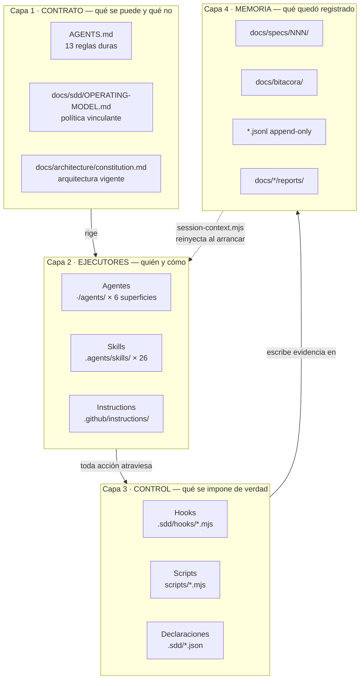

La flecha punteada de vuelta es la que hace que el sistema tenga memoria: `session-context.mjs`
lee la capa 4 al inicio de cada sesión y la devuelve al contexto del agente. Sin ella, cada
sesión empezaría de cero.

#### 4.2.2 Relación agente ↔ skill: rol frente a procedimiento

Es la distinción conceptual más importante del sistema y conviene fijarla:

| | Agente | Skill |
|---|---|---|
| **Qué es** | Un **rol** con herramientas acotadas | Un **procedimiento** con pasos |
| **Responde a** | *quién* hace el trabajo | *cómo* se hace el trabajo |
| **Se invoca con** | `@nombre` o selector de agentes | `/nombre` en el chat |
| **Se replica** | Sí, 6 formatos nativos | **No**, copia única + adaptadores |
| **Contiene** | Herramientas, delegación, handoffs, territorio | Puerta de entrada, pasos, lista de comprobación |

Un mismo agente ejecuta skills distintas según la fase, y una misma skill puede ejecutarla más de
un agente. `implementer` ejecuta `/sdd-implement`, pero delega en `frontend-expert` que ejecuta
`/front`. La skill lleva el método; el agente lleva los permisos.

#### 4.2.3 Cómo se relacionan las seis superficies de IDE

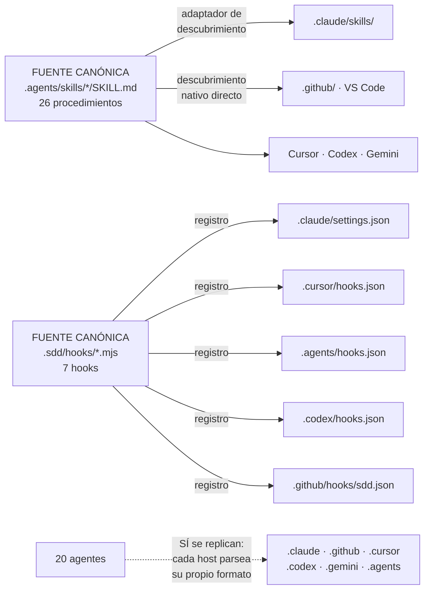

La asimetría —skills única copia, agentes seis copias— tiene un coste: mantener la paridad de
agentes es trabajo. Por eso `check-sdd.mjs` **falla** si falta un envoltorio en cualquier
superficie. Un agente sin envoltorio no existe en ese IDE, y un contrato que solo se cumple en
algunos IDE no es un contrato.

#### 4.2.4 Ficheros críticos y qué pasa si se rompen

| Fichero | Si desaparece o se corrompe |
|---|---|
| `AGENTS.md` | Los agentes pierden las reglas duras. El sistema sigue "funcionando" pero sin contrato: es el peor fallo posible porque es silencioso |
| `.sdd/hooks/guard-write.mjs` | Desaparece la protección de secretos y de la bitácora de ejecución. Un agente podría reescribir su propio registro |
| `.sdd/checks.json` | `run --fast` y `run --slow` no tienen nada que ejecutar. Los gates pasan vacíos |
| `docs/architecture/constitution.md` | No hay arquitectura vigente. Cada spec decide la suya |
| `execution-log.jsonl` | Se pierde la evidencia de delegación. La trazabilidad degrada a `declared-direct` |
| `scripts/check-sdd.mjs` | Nadie verifica el contrato de 20 agentes y 26 skills |

#### 4.2.5 Ficheros que se versionan y ficheros que no

| Se versiona | No se versiona |
|---|---|
| Código, tests, agentes, skills, reglas, hooks | `.env`, `.env.*` *(salvo `.env.example`)* |
| Specs, evidencias, `execution-log.jsonl` | `.sdd/state/` — estado local de la máquina |
| `.sdd/checks.json`, `docs.json`, `territories.json` | `.sdd/conflicts/` — propuestas de fusión |
| `.sdd/installed.json` — qué versión se instaló | `.claude/settings.local.json`, `.claude/.cache/` |
| Documentación oficial de `docs/` | `.cursor/local/` |

La regla es directa: **se versiona el contrato y la evidencia; no se versiona el estado local ni
ningún secreto**.

#### 4.2.6 Flujo de vida de un fichero de spec

Este es el recorrido concreto que hace un artefacto a través de las fases y las capas:

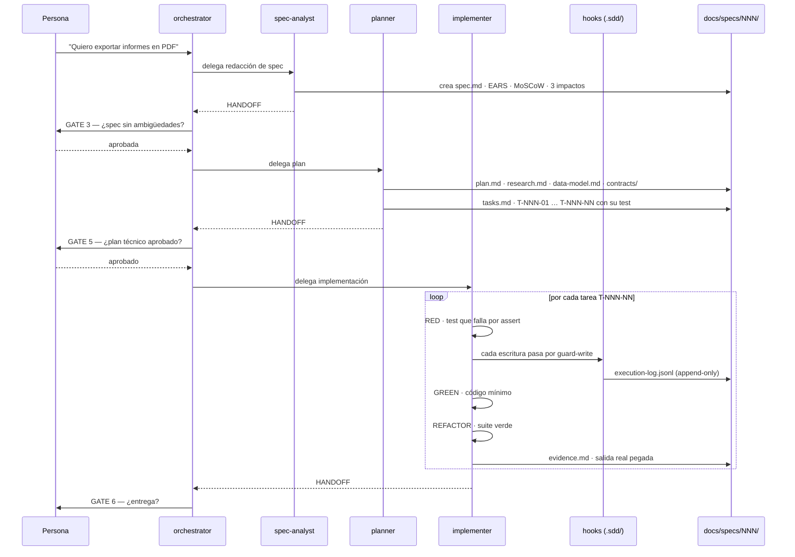

#### 4.2.7 Los tres ficheros JSON de declaración

Son el mecanismo con el que el sistema es agnóstico de stack sin ser vago:

| Fichero | Declara | Por qué existe |
|---|---|---|
| `.sdd/checks.json` | Qué comando ejecuta cada uno de los 14 gates | El sistema no presupone Jest, pytest ni Maven. Tampoco los inventa: lo no declarado va a `unconfigured` y es **visible** |
| `.sdd/docs.json` | Qué superficies de documentación existen realmente | OpenAPI, Storybook y TypeDoc son *opt-in*. Generar documentación de algo que no existe produce ruido |
| `.sdd/territories.json` | Qué rutas puede tocar cada agente | El aislamiento se aplica donde el *host* lo permite y **siempre** se verifica en CI |

Ejemplo real del propio repositorio plantilla, que es Node.js sin framework de test y verifica
su comportamiento con scripts propios:

```json
{
  "version": 1,
  "checks": {
    "sdd":      { "command": "node scripts/check-sdd.mjs",           "required": true, "speed": "fast" },
    "lint":     { "command": "npm run lint",                          "required": true, "speed": "fast" },
    "test":     { "command": "npm run test",                          "required": true, "speed": "fast" },
    "build":    { "command": "npm run build",                         "required": true, "speed": "fast" },
    "security": { "command": "node scripts/scan-secrets.mjs --json",  "required": true, "speed": "slow" },
    "e2e":      { "command": "npm run e2e",                           "required": true, "speed": "slow" }
  },
  "unconfigured": ["typecheck", "smells", "coverage", "visual",
                   "a11y", "deps-audit", "docs", "mutation"]
}
```

Cuatro gates son rápidos y caben antes de cada commit; `security` y `e2e` son lentos y se
reservan para antes del push. Que aparezcan ocho gates en `unconfigured` **es información, no un
fallo oculto**: el sistema dice exactamente lo que no está comprobando, y §10 de
`docs/quality/TEST-STRATEGY.md` recoge el motivo material de cada ausencia.

---

## 5. Catálogo de agentes

### 5.1 Modelo de delegación y handoff

Antes de la tabla hace falta fijar la diferencia entre los dos mecanismos, porque el sistema los
trata como cosas distintas y la confusión entre ambos es la fuente de error más común.

| | **Delegación** | **Handoff** |
|---|---|---|
| **Qué es** | Un agente **crea un subagente** que trabaja aislado y **devuelve el control** | Un agente **termina su fase** y propone el siguiente agente |
| **Dirección** | **Bidireccional** — ida y vuelta obligatoria | **Unidireccional** — no hay retorno |
| **Se declara en** | Campo `agents:` del *frontmatter* | Campo `handoffs:` del *frontmatter* |
| **Quién puede** | **Solo 3 agentes**: `orchestrator`, `planner`, `implementer` | Cualquiera |
| **Evidencia** | `SubagentStart`/`SubagentStop` en `execution-log.jsonl`, escrito por el *host* | El bloque `### HANDOFF` en la respuesta |
| **Límite** | **Profundidad máxima 2 saltos** | Sin límite, pero cada salto es una fase |

Las tres reglas estructurales que gobiernan el modelo:

1. **Solo tres agentes delegan.** Los diecisiete restantes son terminales: hacen su trabajo y
   devuelven el control. Esto impide cadenas incontroladas de subagentes.
2. **Profundidad máxima de dos saltos.** `orchestrator → implementer → backend-expert` es
   legal. Un cuarto nivel no.
3. **Los especialistas nunca encadenan otro especialista.** `frontend-expert` no puede llamar a
   `database-expert`; devuelve el control a quien lo invocó y este decide.

Conviene deshacer aquí una lectura errónea fácil de hacer: los botones de `handoffs` **no son un
directorio de agentes**. El `orchestrator` declara ocho botones que apuntan a solo cinco agentes
distintos, porque un mismo agente atiende encargos diferentes según la fase —`spec-analyst`
aparece tres veces (requisitos, baseline de producto y spec de funcionalidad) y `docs-writer`
dos (materializar el HANDOFF de seguridad y atender una petición docs-only)—. El botón nombra el
**trabajo**, no al destinatario. Los 20 agentes del catálogo se alcanzan desde el selector del
chat; la lista de handoffs solo recoge las transiciones que el `orchestrator` sabe proponer.

**Auditores sin escritura.** Cuatro agentes carecen de `edit/editFiles` en su declaración de
herramientas: `orchestrator`, `code-reviewer`, `security-auditor` y `research-analyst`. No es una
convención de estilo: el *host* aplica la restricción. La consecuencia práctica es que **quien
audita no puede corregir**, así que su hallazgo tiene que pasar por un HANDOFF y ser
materializado por otro agente. Nadie audita su propio trabajo.

### 5.2 Formato obligatorio del HANDOFF

Toda fase cierra con este bloque, definido en `AGENTS.md`:

```markdown
### HANDOFF
- Agente origen:
- Fase completada:
- Fuentes consultadas:
- Artefactos:
- Requisitos / casos cubiertos:
- Discrepancias:
- Decisiones tomadas:
- Supuestos:
- Bloqueos:
- Siguiente agente sugerido:
- Comando / contexto durable:
```

Los tres campos que hacen que el sistema funcione cuando el *host* **no** soporta delegación
automática son los tres últimos. `Comando / contexto durable` obliga a decir dónde está escrito
lo que la siguiente fase debe releer. Si un IDE no encadena agentes, una persona puede continuar
manualmente sin perder nada, porque el estado vive en ficheros y no en la memoria del chat.

### 5.3 Tabla maestra de los 20 agentes

> **Cómo leer la columna «Delega en»:** solo tres agentes tienen contenido. Es correcto y es el
> diseño. **Escritura**: *auditor* significa que el perfil carece de herramienta de edición.

| # | Agente | Descripción y función principal | Delega en | Handoff a | Skills que usa | Escritura | Pilar que sostiene |
|---:|---|---|---|---|---|:---:|---|
| 1 | **`orchestrator`** | Router SDD e intake de solo lectura. Clasifica la petición, detecta el estado durable de producto, coordina PRD y diseño opcional, para en el gate humano y lleva a la fase correcta. **Punto de entrada por defecto.** | `spec-analyst`, `ux-designer`, `architect`, `planner`, `implementer`, `code-reviewer`, `security-auditor`, `docs-writer`, `release-manager`, `research-analyst` | `spec-analyst`, `ux-designer`, `architect`, `planner`, `docs-writer` | `/sdd-start`, `/sdd-status`, `/sdd-intake` | auditor | SDD |
| 2 | **`spec-analyst`** | Normaliza PRD y fuentes durante intake, integra discrepancias y convierte producto aprobado en specs EARS con criterios testables. **Sin decisiones técnicas ni delegación autónoma.** | — | `orchestrator`, `spec-analyst`, `ux-designer`, `planner` | `/sdd-intake`, `/sdd-specify`, `/sdd-clarify` | sí | SDD |
| 3 | **`ux-designer`** | Revisa diseño opcional durante intake y convierte specs aprobadas en flujos, estados y accesibilidad durante `/sdd-design`. **Nunca encadena otro agente.** | — | `orchestrator`, `spec-analyst`, `planner` | `/sdd-design`, `/design-sync` | sí | Calidad *(usabilidad)* |
| 4 | **`architect`** | Elige arquitectura y stack, produce la constitución del proyecto y los ADR. Interviene en proyectos nuevos y en cambios que tocan fronteras. | — | `spec-analyst` | `/sdd-init`, `/adr`, `/onboard` | sí | SDD |
| 5 | **`planner`** | Convierte una spec aprobada en plan técnico, modelo de datos, contratos y backlog de tareas atómicas **con test asociado**. | `api-designer`, `database-expert`, `ux-designer`, `research-analyst`, `architect`, `security-auditor`, `frontend-expert`, `backend-expert`, `devops-expert`, `test-engineer`, `docs-writer` | `implementer`, `security-auditor`, `docs-writer` | `/sdd-plan`, `/sdd-tasks` | sí | SDD + TDD |
| 6 | **`implementer`** | Ejecuta las tareas de `tasks.md` con **TDD estricto rojo-verde-refactor**, una a una, mostrando la salida real de los tests. | `backend-expert`, `frontend-expert`, `database-expert`, `test-engineer`, `refactor-specialist`, `api-designer`, `performance-optimizer`, `devops-expert`, `docs-writer` | `code-reviewer`, `docs-writer` | `/sdd-implement`, `/tdd`, `/middle`, `/front`, `/bbdd` | sí | **TDD** |
| 7 | **`backend-expert`** | Backend y capa media: dominio, casos de uso, servicios de aplicación, integraciones con terceros, colas y trabajos en segundo plano, transacciones, caché y resiliencia. | — | `implementer` | `/middle`, `/tdd` | sí | TDD |
| 8 | **`frontend-expert`** | Frontend: componentes, gestión de estado, rendimiento de UI, accesibilidad, formularios, routing y consumo de APIs. Trabaja contra los diseños de Figma o Stitch cuando existen. | — | `implementer` | `/front`, `/design-sync`, `/tdd` | sí | TDD + Calidad |
| 9 | **`database-expert`** | Bases de datos: modelado, migraciones, índices, consultas lentas, integridad, particionado, RLS y políticas de acceso. **Nunca ejecuta cambios destructivos sin confirmación humana.** | — | `implementer` | `/bbdd`, `/tdd` | sí | TDD + Seguridad |
| 10 | **`api-designer`** | Diseñador de contratos de API. Se usa **antes** de implementar cualquier endpoint, evento o tipo compartido. Produce OpenAPI, GraphQL o esquemas de evento en `contracts/`. *Contract-first.* | — | `implementer` | `/middle` | sí | SDD |
| 11 | **`test-engineer`** | Testing y TDD: estrategia de test de una spec, tests difíciles (integración, contrato, E2E, concurrencia), fixtures y dobles, y auditoría de la calidad de la suite. **Proactivo** ante tests frágiles, lentos o que no prueban nada. | — | `implementer` | `/tdd`, `/sdd-implement` | sí | **TDD** |
| 12 | **`refactor-specialist`** | Auditor de principios de diseño y patrones. Actúa en la **fase REFACTOR** del TDD, cuando el código huele mal, al decidir qué patrón aplicar, o antes de un PR para verificar SOLID/DRY/KISS/YAGNI. | — | `implementer` | `/tdd` | sí *(solo refactor)* | Calidad |
| 13 | **`code-reviewer`** | Revisa el diff antes del PR: corrección, trazabilidad con la spec, SOLID, patrones, tests, legibilidad, operación y usabilidad. **Audita usabilidad porque nadie audita su propio diseño.** | — | `security-auditor`, `release-manager` | `/sdd-verify` | **auditor** | **Calidad** |
| 14 | **`security-auditor`** | Auditoría de solo lectura con **OWASP Top 10:2025, ASVS 5.0.0 y OWASP Agentic**. Se usa al planificar o verificar auth, datos personales, pagos, ficheros o integraciones. | — | — *(devuelve informe)* | `/security-scan` | **auditor** | **Seguridad** |
| 15 | **`performance-optimizer`** | Rendimiento: objetivo de latencia incumplido, consulta lenta, consumo de memoria alto o bundle grande. **Trabaja siempre con medición previa.** | — | `implementer` | `/middle`, `/front`, `/bbdd` | sí | Calidad |
| 16 | **`devops-expert`** | CI/CD, contenedores, entornos, infraestructura como código y observabilidad. Monta el pipeline, define entornos, prepara despliegues y configura monitorización y alertas. **Nunca aplica cambios en producción sin confirmación humana.** | — | `release-manager` | `/observability`, `/respond-incident` | sí | Calidad + Seguridad |
| 17 | **`docs-writer`** | Redactor técnico: README, guías de uso, documentación de API para consumidores, onboarding de desarrolladores y coherencia de `docs/`. | — | — *(devuelve el control)* | `/docs-sync`, `/onboard` | sí | Calidad |
| 18 | **`bitacora-keeper`** | Guardián de la memoria del proyecto. Registra decisiones, alternativas descartadas, deuda aceptada e incidentes en `docs/bitacora/`. **Proactivo** ante cualquier decisión técnica. Responde a *"¿por qué hicimos X?"*. | — | — | `/bitacora`, `/adr` | sí | SDD |
| 19 | **`release-manager`** | Responsable de entrega: PR, CHANGELOG, trazabilidad y verificación final de gates en `/sdd-ship`. **Nunca hace push ni merge sin permiso humano explícito.** | — | — | `/sdd-ship`, `/sdd-verify` | sí | Calidad |
| 20 | **`research-analyst`** | Investigador de código y de tecnología: entender un repo existente, localizar dónde vive una funcionalidad, triage de un bug, o evaluar librerías y enfoques antes de decidir. **Solo lectura.** | — | — *(devuelve el control)* | `/onboard`, `/sdd-refresh` | **auditor** | SDD |

### 5.4 Los 20 agentes por nivel

| Nivel | Agentes | Característica común |
|---|---|---|
| **Orquestación** | `orchestrator` | Único router. Delega en 10. No escribe |
| **Fase del circuito** | `spec-analyst`, `ux-designer`, `architect`, `planner`, `implementer` | Cada uno posee una fase SDD y sus artefactos |
| **Especialista de terreno** | `backend-expert`, `frontend-expert`, `database-expert`, `api-designer`, `test-engineer`, `refactor-specialist`, `performance-optimizer`, `devops-expert` | Terminales. Devuelven el control siempre |
| **Auditor de solo lectura** | `code-reviewer`, `security-auditor`, `research-analyst` | Sin escritura. Producen informe, no corrección |
| **Soporte transversal** | `docs-writer`, `bitacora-keeper`, `release-manager` | Intervienen en cualquier fase |

### 5.5 Grafo de delegación

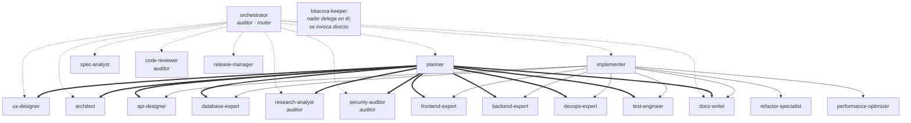

Todas las flechas del grafo son **bidireccionales en la práctica**: el subagente devuelve el
control al agente que lo creó. El diagrama las dibuja en un sentido por legibilidad; el fichero
Excalidraw del capítulo 6 sí las representa con doble punta.

### 5.6 Grafo de handoff

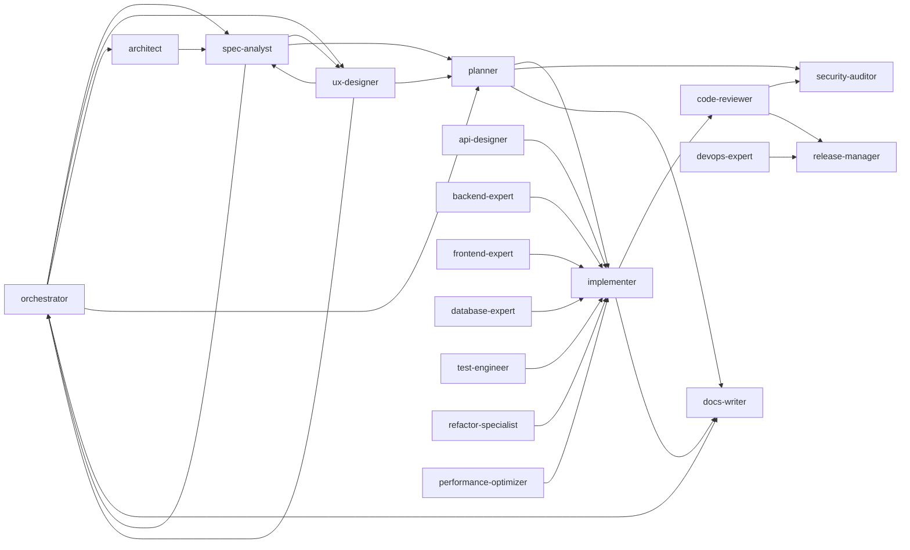

Se aprecian tres propiedades del diseño:

- **`implementer` es el sumidero de los especialistas.** Los siete especialistas de terreno
  hacen handoff a él. Es el punto único donde converge el trabajo de implementación.
- **`code-reviewer` es el cuello de botella de calidad.** Todo camino hacia `release-manager`
  pasa por revisión y, opcionalmente, por auditoría de seguridad.
- **`spec-analyst` y `ux-designer` devuelven a `orchestrator` durante intake.** Es el único ciclo
  del grafo, y es intencionado: intake alterna entre producto y diseño bajo coordinación.

---

## 6. Diagramas Excalidraw

### 6.1 Ficheros entregados

| Fichero | Elementos | Contenido |
|---|---:|---|
| [`01-agentes-delegacion-handoff.excalidraw`](01-agentes-delegacion-handoff.excalidraw) | 149 | Los 20 agentes con sus relaciones de **delegación** y **handoff**. Es la representación visual de la tabla del capítulo 5 |
| [`02-skills-por-agente.excalidraw`](02-skills-por-agente.excalidraw) | 161 | Las 26 skills agrupadas por familia, el agente que ejecuta cada una y el script determinista que invoca |
| [`03-circuito-sdd-hooks-gates.excalidraw`](03-circuito-sdd-hooks-gates.excalidraw) | 130 | El circuito SDD completo con los **6 gates humanos**, los **7 hooks** y bandas de color por pilar |

Se abren en [excalidraw.com](https://excalidraw.com) con *File → Open*, o directamente en VS Code
con la extensión de Excalidraw. Los tres se generan de forma **determinista**: geometría
calculada, identificadores estables y flechas ligadas a sus nodos —al mover un agente, sus
flechas se recalculan solas—.

**El fichero `01` se organiza en dos paneles superpuestos verticalmente.** Dibujar las 30
relaciones de delegación y las 30 de handoff sobre un mismo grafo produce un diagrama
ilegible; separarlas es una decisión de legibilidad, no una simplificación:

| Panel | Contenido | Por qué está separado |
|---|---|---|
| **A · Delegación** | `orchestrator`, `planner` e `implementer` —los únicos tres que delegan— con sus destinos | La delegación es un árbol de profundidad 2. Se lee de izquierda a derecha |
| **B · Handoff** | Los 20 agentes con las flechas de fin de fase | El handoff es un grafo con un ciclo intencionado y dos sumideros. Necesita otro trazado |

### 6.2 Convención visual — leyenda

Esta leyenda se aplica a los tres ficheros y responde al requisito de **una figura por tipo de
elemento**:

| Elemento | Figura | Relleno | Borde |
|---|---|---|---|
| **Agente de orquestación** | Rectángulo redondeado | Rojo suave `#ffc9c9` | Sólido, **grueso** |
| **Agente de fase** | Rectángulo redondeado | Azul `#a5d8ff` | Sólido |
| **Agente especialista** | Rectángulo redondeado | Verde `#b2f2bb` | Sólido |
| **Agente auditor** *(sin escritura)* | Rectángulo redondeado | Gris `#e9ecef` | **Discontinuo** |
| **Agente de soporte** | Rectángulo redondeado | Amarillo `#ffec99` | Sólido |
| **Skill** | **Elipse** | Violeta `#eebefa` | Sólido |
| **Hook** | **Rombo** | Rojo `#ffc9c9` | Sólido |
| **Gate humano** | Rectángulo **recto** | Amarillo `#ffec99` | Sólido, **muy grueso** |
| **Script determinista** | Rectángulo **recto** | Cian `#99e9f2` | Sólido |

El borde discontinuo de los auditores no es estético: **es la marca de que ese agente no tiene
herramienta de escritura**. Se distingue de un vistazo quién puede modificar el repositorio y
quién solo puede informar.

Y para las relaciones, respondiendo al requisito de **tipo de relación**:

| Relación | Trazo | Dirección | Significado |
|---|---|---|---|
| **Delegación** | Línea **continua** | **↔ Bidireccional** *(doble punta)* | El agente crea un subagente **y este devuelve el control** |
| **Handoff** | Línea **discontinua** | **→ Unidireccional** | Fin de fase; se propone el siguiente agente. **No hay retorno** |
| **Uso de skill** | Línea **punteada fina** | **→ Unidireccional** | El agente ejecuta el procedimiento |
| **Control de hook** | Línea **continua roja** | **→ Unidireccional** | El hook intercepta la acción antes de que ocurra |

La distinción entre punta doble y punta simple es **semánticamente relevante**, no decorativa:
la delegación **obliga** al retorno del control —está en las reglas del sistema— mientras que un
handoff cierra la fase y no vuelve.

### 6.3 Correspondencia entre la tabla y el diagrama

Cada columna de la tabla maestra del capítulo 5 tiene su equivalente gráfico. La tabla y el
diagrama son **la misma información en dos formatos**, no dos fuentes que puedan divergir:

| Columna de la tabla 5.3 | Representación en Excalidraw | Fichero |
|---|---|:---:|
| *Agente* | Nodo etiquetado con su nombre exacto | `01` |
| *Nivel* | Color de relleno del nodo | `01` |
| *Delega en* | Flecha continua azul de **doble punta**, panel A | `01` |
| *Handoff a* | Flecha discontinua verde de **una punta**, panel B | `01` |
| *Escritura: auditor* | Relleno gris y **borde discontinuo** | `01` |
| *Skills que usa* | Flecha punteada violeta hacia la elipse de la skill | `02` |
| *Script determinista* | Rectángulo cian a la derecha de cada skill | `02` |
| *Pilar que sostiene* | Banda de fondo coloreada | `03` |

Dos observaciones que el diagrama hace evidentes y la tabla no:

1. **La delegación es un árbol de tres raíces, no una malla.** Solo tres nodos tienen flechas de
   salida en el panel A. Los especialistas son hojas.
2. **`implementer` es el sumidero del grafo de handoff.** Siete especialistas apuntan a él y él
   apunta a `code-reviewer`. Es el punto por el que pasa todo el trabajo antes de ser revisado.

---

## 7. Catálogo de skills

### 7.1 Qué es una skill en este sistema

Una skill es un **procedimiento reutilizable**, no un prompt. Su fichero `SKILL.md` tiene una
estructura fija: una **puerta de entrada** (qué debe existir antes de empezar), unos **pasos**, y
una **lista de comprobación** de salida. Se invoca con `/nombre` en el chat.

Tres propiedades que las distinguen de un prompt guardado:

1. **Copia única.** Viven en `.agents/skills/*/SKILL.md`. El resto de superficies adapta o
   descubre; nadie duplica. Un procedimiento duplicado se desincroniza.
2. **Autocontenidas.** No enlazan con `../../../docs/…`. Una skill importada suelta en otro
   repositorio sigue funcionando.
3. **Sin comandos paralelos.** Está prohibido crear `.github/prompts/` o `.cursor/commands/` con
   el mismo nombre: aparecerían duplicadas en el selector del IDE. De hecho, 22 rutas de ese tipo
   figuran como **retiradas** en el manifiesto del instalador.

### 7.2 Tabla maestra de las 26 skills

Las skills se agrupan en cuatro familias según su función en el circuito.

#### Familia A — Circuito SDD (11 skills)

Son las fases del método. Se ejecutan en orden y cada una tiene su gate.

| Skill | Definición | Agentes que la pueden usar | Scripts deterministas que invoca | Artefactos que produce | Pilar |
|---|---|---|---|---|---|
| **`/sdd-start`** | Punto de entrada del circuito. Clasifica la petición, detecta fuentes de producto/diseño y el estado durable, y lleva a la fase correcta. Úsala cuando no sepas por dónde empezar. | `orchestrator` | `sdd-project.mjs product-status --json` | — *(solo enruta)* | SDD |
| **`/sdd-intake`** | Normaliza el baseline global de producto antes de arquitectura o specs. Acepta PRD en texto, ruta, carpeta o URL, y diseño opcional Figma/Stitch/boceto. Exige aprobación humana. **No genera código.** | `orchestrator` *(coordina)*, `spec-analyst`, `ux-designer` | `sdd-project.mjs approve-product --approved-by "<persona>" --json` | `docs/product/{VISION,PRD,USE-CASES,FEATURE-MAP,SOURCES}.md` | SDD |
| **`/sdd-init`** | Arranca un proyecto **nuevo** con el baseline de producto aprobado. Define arquitectura y stack, crea la constitución, el ADR-0001 y el esqueleto de carpetas. **Solo greenfield.** | `architect` | `check-sdd.mjs --strict`, `sdd-project.mjs product-status --json` | `docs/architecture/constitution.md`, `adr/ADR-0001-*.md` | SDD |
| **`/sdd-specify`** | Crea la especificación de una funcionalidad nueva. Convierte la idea en requisitos **EARS** con criterios de aceptación testables. **Sin decisiones técnicas.** | `spec-analyst` | `sdd-project.mjs new-spec <slug> --json` | `docs/specs/NNN-slug/spec.md` | **SDD** |
| **`/sdd-clarify`** | Resuelve las ambigüedades de una spec. Recorre los marcadores `[NEEDS CLARIFICATION]`, pregunta con opciones concretas y actualiza la spec. **Gate obligatorio antes de planificar.** | `spec-analyst` | — | `spec.md` actualizada, sin marcadores | SDD |
| **`/sdd-design`** | Convierte la spec en el documento de diseño: flujo de pantallas, estados, componentes y accesibilidad, **antes** de decidir arquitectura. Se salta si no hay interfaz. | `ux-designer` | `sdd-project.mjs scaffold --spec NNN --phase design --json` | `design.md`, `docs/design/flows/`, `wireframes/` | Calidad *(a11y)* |
| **`/sdd-plan`** | Convierte una spec aprobada en plan técnico, modelo de datos, contratos e investigación. **Aquí se decide el CÓMO**, conforme a la arquitectura vigente. | `planner` | `sdd-project.mjs scaffold --spec NNN --phase plan --json`, `trace-status --spec NNN --json` | `plan.md`, `research.md`, `data-model.md`, `contracts/` | SDD |
| **`/sdd-tasks`** | Trocea el plan en tareas **atómicas y ordenadas**, cada una con su test asociado y su trazabilidad a la spec. | `planner` | `sdd-project.mjs scaffold --spec NNN --phase tasks --json`, `trace-status --spec NNN --json` | `tasks.md` con `T-NNN-NN` | SDD + TDD |
| **`/sdd-implement`** | Ejecuta las tareas de `tasks.md` en **ciclo TDD estricto rojo-verde-refactor**, una a una, mostrando la salida real de los tests. | `implementer`, `test-engineer` | `sdd-project.mjs run --fast` | Código, tests, `evidence.md` | **TDD** |
| **`/sdd-verify`** | Verifica el trabajo antes de entregar. Ejecuta **todos** los gates: tests, cobertura, lint, revisión de código, principios de diseño y auditoría de seguridad. | `code-reviewer`, `release-manager` | `check-sdd.mjs --json --strict --spec NNN`, `sdd-project.mjs run --slow --json`, `scaffold --phase verify`, `trace-status` | `docs/quality/reports/…` | **Calidad** |
| **`/sdd-ship`** | Prepara la entrega: verificación final de gates, PR con trazabilidad, CHANGELOG, bitácora y plan de reversión. **No hace push ni merge sin permiso explícito.** | `release-manager` | `check-sdd.mjs --strict`, `run --fast`, `run --slow` | PR, `CHANGELOG.md`, entrada de bitácora | Calidad |

#### Familia B — Implementación por terreno (4 skills)

Cada una lleva su puerta de entrada, su ciclo TDD y su lista de comprobación específica.

| Skill | Definición | Agentes que la pueden usar | Scripts deterministas | Artefactos | Pilar |
|---|---|---|---|---|---|
| **`/tdd`** | Ejecuta un ciclo TDD rojo-verde-refactor **sobre un comportamiento concreto**, mostrando la salida real de los tests en cada paso. Es la unidad mínima del pilar TDD. | `implementer`, `test-engineer`, `backend-expert`, `frontend-expert`, `database-expert`, `refactor-specialist` | — *(usa el runner del proyecto)* | Test + código + salida RED/GREEN | **TDD** |
| **`/middle`** | Tarea de capa media o backend: dominio, casos de uso, servicios, integraciones, colas, transacciones. Aplica SOLID, patrones y **TDD estricto**. | `backend-expert`, `implementer`, `api-designer`, `performance-optimizer` | — | Código de dominio y aplicación + tests | TDD |
| **`/front`** | Tarea de frontend: componentes, estado, formularios, routing, consumo de API, accesibilidad y rendimiento de UI. Aplica el documento de diseño, patrones de front y TDD. | `frontend-expert`, `implementer`, `performance-optimizer` | — | Componentes + tests + evidencia a11y | TDD + Calidad |
| **`/bbdd`** | Tarea de base de datos: modelado, migraciones, índices, integridad, consultas, RLS y políticas de acceso. Patrones de datos y **despliegue reversible**. | `database-expert`, `implementer`, `performance-optimizer` | — | Migraciones + tests de esquema | TDD + Seguridad |

#### Familia C — Gobierno y verificación (5 skills)

| Skill | Definición | Agentes que la pueden usar | Scripts deterministas | Artefactos | Pilar |
|---|---|---|---|---|---|
| **`/security-scan`** | Audita contra **OWASP Top 10:2025 y ASVS 5.0.0** al planificar o verificar cambios sensibles y antes de release. Tres modos: `plan`, `verify`, `complete`. El auditor es **solo lectura** y devuelve HANDOFF. | `security-auditor` | *(consume el gate `security` de `run --slow`: `scan-secrets.mjs --json`)* | `docs/security/reports/…` con GO/NO-GO | **Seguridad** |
| **`/adr`** | Crea un **Architecture Decision Record** en formato **MADR**. Se usa cuando se toma una decisión con consecuencias estructurales duraderas. | `architect`, `bitacora-keeper` | `sdd-project.mjs new-adr <titulo-kebab> --json` | `docs/architecture/adr/ADR-NNNN-*.md` | SDD |
| **`/bitacora`** | Registra decisión, cambio, deuda técnica, incidente o aprendizaje. También responde a *"¿por qué hicimos X?"*. | `bitacora-keeper` *(y cualquier agente tras una decisión)* | — | `docs/bitacora/DECISIONS.md` | SDD |
| **`/docs-sync`** | Sincroniza documentación **sin cambiar comportamiento**. Modos `bootstrap`, `update`, `update --spec NNN`, `audit`. **Si la petición cambia código, contrato, arquitectura, seguridad o persistencia, se detiene y escala al circuito SDD/TDD.** | `docs-writer` | `check-sdd.mjs --json` | `README`, guías, `docs/` coherente | Calidad |
| **`/sdd-status`** | Muestra en qué punto del circuito está el proyecto, qué specs hay abiertas, qué tareas quedan y cuál es el siguiente paso. | `orchestrator` *(y cualquiera)* | `sdd-project.mjs status --json` | — *(informe en pantalla)* | SDD |

#### Familia D — Soporte y operación (6 skills)

| Skill | Definición | Agentes que la pueden usar | Scripts deterministas | Artefactos | Pilar |
|---|---|---|---|---|---|
| **`/onboard`** | Documenta un repositorio **existente** que aún no tiene el circuito SDD. Reconstruye la arquitectura real, crea la constitución y deja el proyecto listo para trabajar con specs. | `research-analyst`, `architect`, `docs-writer` | — | `constitution.md`, `AGENTS.md` actualizado, mapa del repo | SDD |
| **`/design-sync`** | Sincroniza el diseño con el código. Lee tokens, componentes y estados desde **Figma (Dev Mode) o Google Stitch por MCP** y los contrasta con el design system implementado. | `ux-designer`, `frontend-expert` | — | Informe de deriva de tokens y componentes | Calidad |
| **`/observability`** | Instrumenta la observabilidad de producto: captura y clasificación de errores, salud de la versión, rastro de eventos de negocio, umbrales de alerta y playbooks. | `devops-expert` | — | `docs/ops/OBSERVABILITY.md`, alertas | Calidad |
| **`/respond-incident`** | Responde a un incidente en producción: contener, recuperar, comunicar y aprender. **Se usa cuando algo está fallando AHORA para usuarios reales.** | `devops-expert`, `orchestrator` | — | `docs/ops/runbooks/`, post-mortem en bitácora | Seguridad + Calidad |
| **`/sdd-refresh`** | Revalida el baseline del ecosistema —estándares SDD, formatos de agentes de cada IDE, arquitectura, seguridad y MCP— **contra fuentes oficiales**, y migra la plantilla de forma controlada. | `research-analyst` | — | `docs/research/baseline-YYYY-MM-DD.md` | SDD |
| **`/skill-creator`** | Crea, modifica y mide skills. Incluye ejecución de evaluaciones, benchmark con análisis de varianza y optimización de la descripción para mejorar la precisión de activación. | *(mantenimiento del ecosistema)* | — | Nueva `SKILL.md` + eval | Calidad |

> **Recuento:** familia A 11 + familia B 4 + familia C 5 + familia D 6 = **26 skills**,
> exactamente las que verifica `node scripts/check-sdd.mjs`.

### 7.3 Los scripts deterministas y para qué sirven

Este es el detalle que responde a *"qué scripts deterministas tiene y para qué sirven"*. La
tabla siguiente invierte la relación: parte del script y muestra quién lo llama.

| Script | Para qué sirve | Skills que lo invocan | Pilar |
|---|---|---|---|
| **`check-sdd.mjs`** | Verifica **estructura y coherencia**: que existan los artefactos obligatorios, que la trazabilidad no tenga eslabones rotos, y que el contrato de **20 agentes y 26 skills** se cumpla en las seis superficies. Con `--strict`, exige el nivel de entrega. | `/sdd-init`, `/sdd-verify`, `/sdd-ship`, `/docs-sync` | SDD + Calidad |
| **`sdd-project.mjs new-spec <slug>`** | Crea el esqueleto completo de `docs/specs/NNN-slug/` con numeración correlativa correcta. Evita colisiones de numeración y ficheros olvidados. | `/sdd-specify` | SDD |
| **`sdd-project.mjs new-adr <titulo>`** | Crea un ADR numerado en formato MADR con la plantilla rellena. | `/adr` | SDD |
| **`sdd-project.mjs scaffold --spec NNN --phase <fase>`** | Genera los artefactos de una fase concreta —`design`, `plan`, `tasks`, `verify`— sin gastar tokens del modelo en producir *boilerplate*. | `/sdd-design`, `/sdd-plan`, `/sdd-tasks`, `/sdd-verify` | SDD |
| **`sdd-project.mjs trace-status --spec NNN --json`** | Devuelve la **cadena de trazabilidad completa** y señala los eslabones rotos: requisitos sin criterio, criterios sin tarea, tareas sin test, tests sin evidencia. | `/sdd-plan`, `/sdd-tasks`, `/sdd-verify` | **SDD** |
| **`sdd-project.mjs run --fast`** | Ejecuta los gates rápidos: `sdd`, `lint`, `test`, `typecheck`, `build`, `smells`. **Antes de cada commit** (regla dura 10). | `/sdd-implement`, `/sdd-ship` | **Calidad + TDD** |
| **`sdd-project.mjs run --slow`** | Ejecuta los gates lentos: `security`, `coverage`, `e2e`, `visual`, `a11y`, `deps-audit`, `docs`, `mutation`. **Antes de cada push.** | `/sdd-verify`, `/sdd-ship` | **Calidad + Seguridad** |
| **`sdd-project.mjs status --json`** | Instantánea del estado SDD: specs, fases, tareas pendientes, spec activa, ambigüedad de spec activa. | `/sdd-status` | SDD |
| **`sdd-project.mjs product-status --json`** | Estado del baseline de producto: si existe, si está aprobado, quién lo aprobó y cuándo. | `/sdd-start`, `/sdd-init` | SDD |
| **`sdd-project.mjs approve-product --approved-by "<persona>"`** | Registra la aprobación humana del **gate 1**. La aprobación queda **con nombre y fecha**, no como una afirmación del modelo. | `/sdd-intake` | **SDD** |
| **`sdd-project.mjs docs-status` / `approve-docs`** | Equivalente para el contrato de documentación viva. | `/docs-sync` | Calidad |
| **`sdd-project.mjs detect --json`** | Detecta el stack del proyecto para proponer los comandos de gate. **Propone; no activa nada solo.** | *(instalación y `/onboard`)* | Calidad |
| **`sdd-project.mjs configure`** | Escribe `.sdd/checks.json` con los comandos de gate confirmados. | *(tras `/sdd-init` u `/onboard`)* | Calidad |
| **`sdd-project.mjs debt`** | Informe de deuda técnica declarada. | *(consulta)* | Calidad |
| **`sdd-project.mjs trace-correct`** | Corrige una atribución histórica errónea **de forma append-only**. Los JSONL nunca se editan a mano. | *(mantenimiento)* | SDD |
| **`sdd-project.mjs skills-export`** | Exporta el catálogo de skills en formato consumible. Útil para verificar el recuento. | *(verificación)* | SDD |
| **`sdd-project.mjs generate`** | Ejecuta generadores deterministas declarados en `.sdd/generators.json`. **Vacío por defecto**: nunca se activa un generador por detección. | *(opcional)* | Calidad |
| **`scan-secrets.mjs --json`** | Detección de secretos en el árbol. Es el gate `security` del propio repositorio plantilla. | *(gate `security`)* | **Seguridad** |
| **`skills-sync.mjs`** | Sincroniza las skills canónicas con sus adaptadores. Impide la deriva entre `.agents/skills/` y `.claude/skills/`. | *(mantenimiento)* | Calidad |
| **`test-hooks.mjs`** | Prueba el contrato de los hooks contra los payloads de los **seis hosts**. Verifica que `deny`, `ask` y `allow` se resuelven correctamente en cada uno. | *(verificación)* | **Seguridad** |
| **`install.mjs`** | Instalador: `init`, `update`, `check`, `global`. | *(instalación)* | — |

### 7.4 Skills sin script determinista: por qué

Once skills no invocan ningún script. No es una carencia: es coherente con la separación
probabilístico/determinista del capítulo 1.

| Grupo | Skills | Motivo |
|---|---|---|
| **Método puro** | `/tdd`, `/middle`, `/front`, `/bbdd` | El ciclo TDD lo ejecuta el runner del **proyecto destino**, que el sistema no conoce. La skill lleva el método; el comando lo declara `.sdd/checks.json` |
| **Juicio irreducible** | `/sdd-clarify`, `/security-scan`, `/design-sync` | Detectar una ambigüedad o una vulnerabilidad lógica no es una comprobación de estructura. Un script diría que el fichero existe, no que el requisito es ambiguo |
| **Redacción** | `/bitacora`, `/observability`, `/respond-incident`, `/onboard`, `/skill-creator` | Producen prosa razonada. Automatizar la redacción produciría ruido, no trazabilidad |

---

## 8. Workflows principales

### 8.1 Mapa de decisión: por dónde entrar

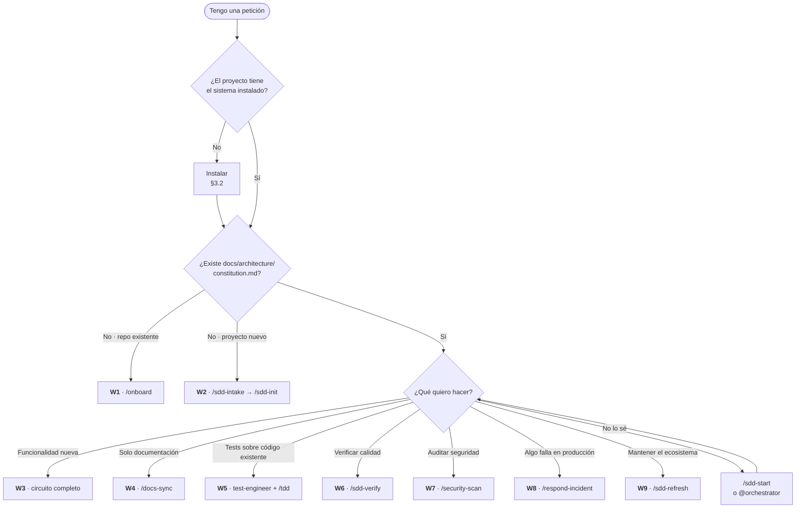

> **La observación del enunciado es correcta y es la regla del sistema:** en un proyecto
> existente, lo primero es **siempre** reconstruir la documentación y actualizar `AGENTS.md`.
> Sin arquitectura documentada no hay contra qué validar una spec, y sin `AGENTS.md` poblado los
> agentes no saben qué es este proyecto. Ese es el **W1**, y es prerrequisito de todos los demás.

---

### 8.2 W1 — Instalar sobre un proyecto existente y generar documentación

**Cuándo:** repositorio con código que aún no tiene el circuito SDD.
**Objetivo:** reconstruir la arquitectura *real* —la que está en el código, no la que alguien
imaginó—, poblar `AGENTS.md` y dejar el proyecto listo para trabajar con specs.
**Pilares:** SDD dominante; Calidad y Seguridad al declarar gates y superficie de ataque.

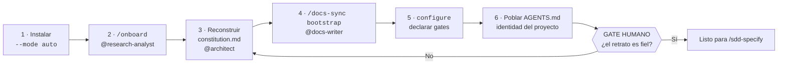

| Paso | Comando o agente | Artefacto resultante |
|---|---|---|
| 1 | `npx --yes github:jechamo/Estructura_inicial_claude#v0.7.0 init "." --mode auto --dry-run`, luego sin `--dry-run` | Estructura instalada, contexto preservado |
| 2 | `/onboard` con `@research-analyst` | Mapa real del repositorio: capas, fronteras, dependencias |
| 3 | `@architect` | `docs/architecture/constitution.md` + `ADR-0001` que documenta la arquitectura *ya existente* |
| 4 | `/docs-sync bootstrap` con `@docs-writer` | Baseline verificable de `docs/`, `README` corregido |
| 5 | `node scripts/sdd-project.mjs detect --json` → `configure` | `.sdd/checks.json` con los gates reales del stack |
| 6 | `@docs-writer` | `AGENTS.md`: identidad, stack, arquitectura, bitácora |
| 7 | `node scripts/check-sdd.mjs` | Verificación: 20 agentes, 26 skills, estructura correcta |

**Advertencia de método.** `/onboard` documenta lo que **hay**, no lo que debería haber. Si el
código tiene lógica de negocio en los controladores, la constitución lo registra como estado
actual y la mejora se planifica como spec propia. Documentar una arquitectura que no existe
produce una constitución que nadie cumple y contra la que nadie puede validar.

---

### 8.3 W2 — Proyecto nuevo desde PRD o diseño

**Cuándo:** greenfield, con o sin PRD y con o sin diseño previo.
**Pilares:** SDD dominante; los cuatro se instrumentan aquí para todo el proyecto.

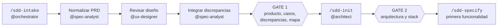

| Paso | Skill · Agente | Artefacto |
|---|---|---|
| 1 | `/sdd-intake` · `@orchestrator` coordina | — |
| 2 | `@spec-analyst` | `docs/product/{VISION,PRD,USE-CASES,SOURCES}.md` |
| 3 | `@ux-designer` *(si hay diseño)* | `docs/design/DIRECCION-VISUAL.md` |
| 4 | `@spec-analyst` | `docs/product/FEATURE-MAP.md`, discrepancias `DISC-NNN` |
| 5 | **Gate 1** — `node scripts/sdd-project.mjs approve-product --approved-by "<persona>"` | Aprobación con nombre y fecha |
| 6 | `/sdd-init` · `@architect` | `constitution.md`, `ADR-0001`, esqueleto |
| 7 | **Gate 2** — aprobación humana | — |
| 8 | `node scripts/sdd-project.mjs configure` | `.sdd/checks.json` |

**El orden importa y es una regla dura (nº 2):** *un proyecto nuevo define y aprueba producto
antes de decidir arquitectura*. Elegir el stack antes de saber qué se construye es la forma más
cara de equivocarse.

---

### 8.4 W3 — Nueva funcionalidad en un proyecto instalado ★ *workflow canónico*

**Cuándo:** el caso habitual. Es el circuito completo y **el único donde los cuatro pilares
aparecen de principio a fin**.

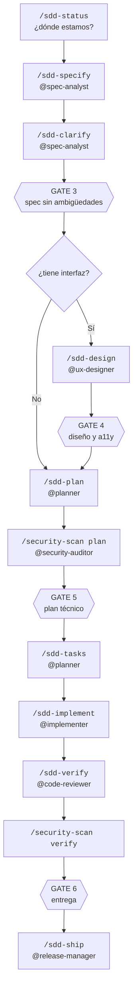

**Detalle por fase, con los cuatro pilares señalados:**

| # | Fase | Agente | Qué produce | SDD | TDD | Cal. | Seg. |
|---:|---|---|---|:---:|:---:|:---:|:---:|
| 0 | `/sdd-status` | cualquiera | Instantánea: specs abiertas, tareas pendientes | ● | | | |
| 1 | `/sdd-specify` | `spec-analyst` | `spec.md` con EARS, MoSCoW y **los tres impactos declarados** | ●●● | | ● | ●● |
| 2 | `/sdd-clarify` | `spec-analyst` | Spec sin `[NEEDS CLARIFICATION]` | ●●● | | | ● |
| — | **Gate 3** | humano | Aprobación explícita | ●●● | | | |
| 3 | `/sdd-design` | `ux-designer` | Flujos, estados, controles `UX-*`, WCAG 2.2 AA | ●● | | ●● | |
| — | **Gate 4** | humano | Aprobación del diseño | | | ●● | |
| 4 | `/sdd-plan` | `planner` | `plan.md`, `data-model.md`, `contracts/`, **estrategia de test** | ●●● | ●● | ●● | ●●● |
| — | | `security-auditor` | `/security-scan plan` → controles `SEC-*` exigidos | | | | ●●● |
| — | **Gate 5** | humano | Aprobación del plan | ●●● | | | |
| 5 | `/sdd-tasks` | `planner` | `tasks.md`: `T-NNN-NN` **atómicas, cada una con su test** | ●●● | ●●● | ●● | ●● |
| 6 | `/sdd-implement` | `implementer` → especialistas | Código + tests + `evidence.md`. **RED→GREEN→REFACTOR por tarea** | ●● | ●●● | ●● | ●● |
| 7 | `/sdd-verify` | `code-reviewer` *(sin escritura)* | `run --slow`, informe de calidad, `trace-status` | ●● | ●● | ●●● | ●●● |
| — | **Gate 6** | humano | Aprobación de entrega | ●●● | | ●●● | ●●● |
| 8 | `/sdd-ship` | `release-manager` | PR, CHANGELOG, bitácora, plan de reversión | ●●● | ● | ●●● | ●●● |

**El bucle interno de la fase 6** es donde vive el pilar TDD y merece detalle:

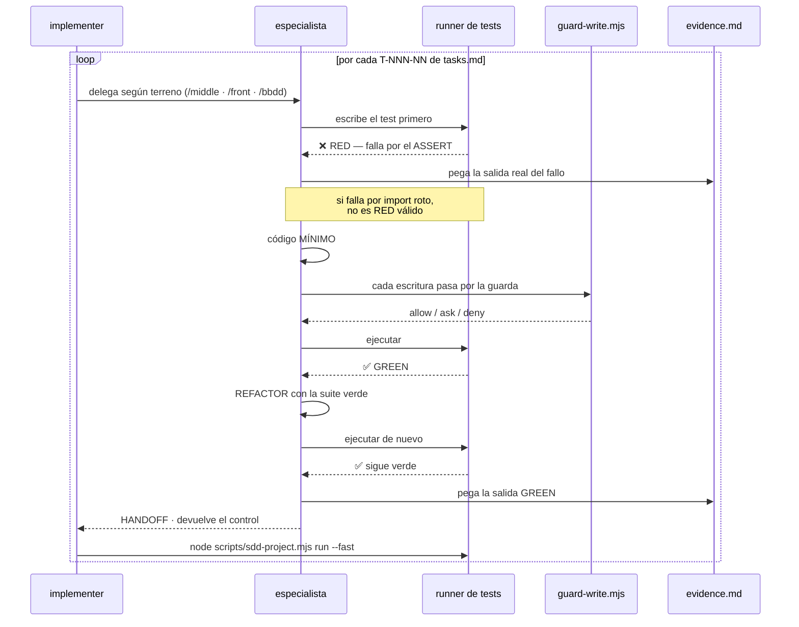

---

### 8.5 W4 — Documentación sin cambio de comportamiento

**Cuándo:** corregir un README, documentar un contrato ya existente, reconstruir un baseline
verificable o auditar deriva documental.
**Clave:** este workflow **no tiene spec funcional ni TDD de aplicación**. Es la excepción
deliberada a la regla dura 1.

| Modo | Comando | Uso |
|---|---|---|
| `bootstrap` | `/docs-sync bootstrap` | Primera vez: reconstruye el baseline completo |
| `update` | `/docs-sync update` | Sincronización general |
| `update --spec NNN` | `/docs-sync update --spec 042` | Documentación de una spec concreta |
| `audit` | `/docs-sync audit` | Solo detectar deriva, sin escribir |

**El límite es duro y la skill lo aplica:** si durante `/docs-sync` se descubre que hay que
cambiar código, contrato, arquitectura, seguridad o persistencia, **la skill se detiene y
devuelve el control al circuito SDD/TDD**. La documentación no es una puerta trasera para
colar cambios de comportamiento sin spec.

---

### 8.6 W5 — Generar tests sobre código existente ★ *pilar TDD*

**Cuándo:** el proyecto tiene código sin cobertura suficiente. Situación muy común tras un `/onboard`.

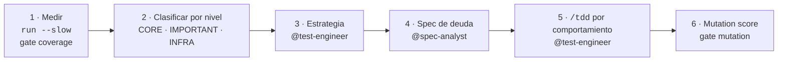

| Paso | Qué se hace | Por qué |
|---|---|---|
| 1 | Medir la cobertura actual y **anotarla** | Sin línea base no hay mejora demostrable |
| 2 | Clasificar el código en CORE / IMPORTANT / INFRASTRUCTURE | El objetivo no es un número global: es **100 % en CORE** |
| 3 | `@test-engineer` diseña la estrategia y la registra en `TEST-STRATEGY.md` | Escribir tests sin estrategia produce cobertura de lo fácil |
| 4 | `@spec-analyst` crea una spec de deuda técnica | Regla dura 1: incluso esto necesita spec y tareas trazables |
| 5 | `/tdd` comportamiento a comportamiento, con **batería adversarial de 18 casos** | Un test por camino feliz no prueba nada |
| 6 | Ejecutar el gate `mutation` | La cobertura dice qué se ejecuta; la mutación dice qué se **comprueba** |

**Matiz honesto sobre TDD retroactivo.** Escribir tests sobre código existente **no es TDD**: es
caracterización. El código ya condiciona el test. El sistema lo reconoce y aplica una estrategia
distinta: primero un test de caracterización que fija el comportamiento actual, luego refactor
protegido, y solo entonces TDD real para el comportamiento nuevo. Llamarlo TDD sería mentir.

---

### 8.7 W6 — Verificar errores y calidad ★ *pilar Calidad*

**Cuándo:** antes de un PR, tras una tanda de cambios, o periódicamente.

| Paso | Comando | Qué comprueba |
|---|---|---|
| 1 | `node scripts/check-sdd.mjs --strict` | Estructura, coherencia, contrato 20/26 |
| 2 | `node scripts/sdd-project.mjs run --fast` | `sdd`, `lint`, `test`, `typecheck`, `build`, `smells` |
| 3 | `node scripts/sdd-project.mjs run --slow` | `security`, `coverage`, `e2e`, `visual`, `a11y`, `deps-audit`, `docs`, `mutation` |
| 4 | `node scripts/sdd-project.mjs trace-status --spec NNN --json` | Eslabones rotos de la trazabilidad |
| 5 | `/sdd-verify` con `@code-reviewer` | Revisión de diseño, SOLID, legibilidad, usabilidad |
| 6 | `node scripts/sdd-project.mjs debt` | Deuda declarada |

**Cómo se informa un gate que no se pudo ejecutar.** Esta es la parte que distingue el sistema:

| Estado | Se escribe como |
|---|---|
| Ejecutado y correcto | `🟢 PASS` + comando + salida |
| Ejecutado y fallido | `🔴 FAIL` + comando + salida + plan |
| **No ejecutado** | `⚪ NO EJECUTADO` + **motivo** + **riesgo asumido** + **siguiente paso** |
| No aplicable | `— no aplica · <motivo>` |

Omitir un gate de la tabla **no es una opción**. La regla dura 7 lo dice: *"pasa" sin ejecución
real no es un resultado; "no ejecutado" sí, con riesgo y siguiente paso*.

---

### 8.8 W7 — Auditoría de seguridad ★ *pilar Seguridad*

**Cuándo:** al planificar o verificar cambios que tocan autenticación, datos personales, pagos,
ficheros o integraciones. Y siempre antes de un release.

| Modo | Momento | Agente | Produce |
|---|---|---|---|
| `/security-scan plan` | Durante `/sdd-plan` | `@security-auditor` | Modelo de amenazas de la spec + controles `SEC-*` exigidos |
| `/security-scan verify` | Durante `/sdd-verify` | `@security-auditor` | Comprobación control a control con evidencia |
| `/security-scan complete` | Antes de release | `@security-auditor` | Auditoría completa del ámbito |

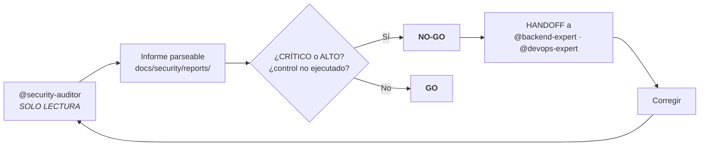

**El auditor no corrige.** No tiene `edit/editFiles`. Devuelve un HANDOFF y otro agente
materializa. La separación entre detectar y corregir es estructural, y es lo que hace que el
informe sea creíble.

**Condición de `GO`, sin ambigüedad posible:** informe parseable, **cero hallazgos CRÍTICO o
ALTO**, y **cero controles no ejecutados**. Un control sin evidencia bloquea igual que una
vulnerabilidad confirmada.

---

### 8.9 W8 — Incidente en producción

**Cuándo:** algo está fallando **ahora** para usuarios reales. Este workflow **rompe el circuito
deliberadamente**: contener primero, documentar después.

| Fase | Acción | Agente |
|---|---|---|
| 1 · **Contener** | Detener el daño: rollback, feature flag, degradación controlada | `@devops-expert` |
| 2 · **Recuperar** | Restablecer el servicio | `@devops-expert` |
| 3 · **Comunicar** | Estado a afectados y a la organización | humano |
| 4 · **Aprender** | Post-mortem **sin culpables** en `docs/bitacora/` | `@bitacora-keeper` |
| 5 · **Prevenir** | Spec para la corrección de fondo, con su ciclo completo | `@spec-analyst` |

La fase 5 es la que cierra el bucle con el resto del sistema: el parche de emergencia es deuda
declarada, y la corrección definitiva vuelve al circuito normal con su spec, su TDD y sus gates.

---

### 8.10 W9 — Mantenimiento del ecosistema

**Cuándo:** periódicamente, o cuando un IDE cambia su formato de agentes.

| Paso | Comando | Qué hace |
|---|---|---|
| 1 | `/sdd-refresh` con `@research-analyst` | Revalida estándares SDD, formatos por IDE, arquitectura, seguridad y MCP **contra fuentes oficiales** |
| 2 | `node scripts/skills-sync.mjs` | Sincroniza skills canónicas con adaptadores |
| 3 | `node scripts/test-hooks.mjs` | Verifica el contrato de hooks en los seis hosts |
| 4 | `node scripts/check-sdd.mjs --strict` | Contrato 20 agentes / 26 skills |
| 5 | `/adr` con `@architect` | ADR si el refresh implica una decisión estructural |

### 8.11 Resumen de workflows y pilares

| Workflow | Entrada | Pilar dominante | Gates humanos |
|---|---|---|---|
| **W1** Onboard | `/onboard` | SDD | 1 informal |
| **W2** Proyecto nuevo | `/sdd-intake` | SDD | 2 (gates 1 y 2) |
| **W3** Funcionalidad ★ | `/sdd-specify` | **los cuatro** | 4 (gates 3–6) |
| **W4** Documentación | `/docs-sync` | Calidad | 1 |
| **W5** Tests | `@test-engineer` | **TDD** | 1 |
| **W6** Verificación | `/sdd-verify` | **Calidad** | 1 |
| **W7** Seguridad | `/security-scan` | **Seguridad** | 1 (GO/NO-GO) |
| **W8** Incidente | `/respond-incident` | Seguridad + Calidad | continuo |
| **W9** Mantenimiento | `/sdd-refresh` | SDD | 1 |

---

## 9. Prompts tipo por workflow

### 9.1 Cuándo el orquestador **no** es la mejor entrada

El enunciado plantea la duda correctamente: *"entiendo que el orquestador podría ser siempre ya
que delega, pero podría ser que no"*. Efectivamente, **no siempre**.

| Situación | Entrada recomendada | Por qué |
|---|---|---|
| No sé en qué fase estoy | `@orchestrator` o `/sdd-start` | Es exactamente su función: clasificar y enrutar |
| Petición ambigua o mixta | `@orchestrator` | Detecta el estado durable antes de actuar |
| Tarea **ya clasificada** | El agente de esa fase | El orquestador añade un salto sin aportar información |
| **Auditoría de solo lectura** | `@code-reviewer` o `@security-auditor` | Pasar por el orquestador diluye la independencia del auditor |
| Trabajo **puramente editorial** | `@docs-writer` con `/docs-sync` | No hay fase SDD que enrutar |
| **Especialista de terreno concreto** | `@backend-expert`, `@frontend-expert`, `@database-expert` | Si ya sabes el terreno, la delegación intermedia es coste sin beneficio |
| **Incidente en producción** | `@devops-expert` | El tiempo importa; enrutar cuesta minutos que no hay |

**Regla práctica:** el orquestador aporta valor cuando hay **incertidumbre sobre la fase**. Si
sabes la fase, entra directo. Un salto de delegación tiene coste en tokens, en latencia y en
pérdida de contexto.

**Además, el orquestador no escribe.** Es auditor. Si la tarea es escribir algo concreto, el
orquestador tendrá que delegar de todos modos.

---

### 9.2 Prompts para W1 — Onboard de proyecto existente

> **9.2.a · Reconstruir la arquitectura real** — `@research-analyst` → `@architect`

```text
/onboard

Este repositorio ya tiene código en producción y no tiene el circuito SDD.
Reconstruye la arquitectura REAL a partir del código, no la ideal:

1. Identifica las capas que existen de verdad y sus fronteras.
2. Detecta dónde se violan esas fronteras (lógica de negocio en controladores,
   acceso a datos desde la UI, dependencias hacia fuera del dominio).
3. Lista las dependencias externas y para qué se usa cada una.
4. Localiza dónde vive cada funcionalidad principal.

Produce docs/architecture/constitution.md describiendo el ESTADO ACTUAL, y un
ADR-0001 que documente por qué la arquitectura es la que es.

NO propongas mejoras en este paso. Si detectas problemas, lístalos aparte como
candidatos a spec futura con su riesgo.
```

> **9.2.b · Poblar `AGENTS.md`** — `@docs-writer`

```text
/docs-sync bootstrap

Actualiza AGENTS.md con la identidad real de este proyecto, respetando los
bloques gestionados <!-- sdd:start --> / <!-- sdd:end -->:

- Nombre, tipo y estado del proyecto
- Stack real, con versiones
- Enlace a docs/architecture/constitution.md
- Enlace a docs/bitacora/DECISIONS.md
- Cualquier convención propia que hayas detectado en el código

No inventes nada que no esté en el repositorio. Si un dato no lo puedes
verificar, márcalo como [PENDIENTE] en lugar de suponerlo.
```

> **9.2.c · Declarar los gates de calidad** — `@devops-expert`

```text
Ejecuta:
  node scripts/sdd-project.mjs detect --json

Con el resultado, propón el contenido de .sdd/checks.json indicando para cada
uno de los 14 gates el comando real de este proyecto y su velocidad
(fast antes de commit / slow antes de push).

Un gate que este proyecto no tiene se declara en "unconfigured": NO lo inventes
ni pongas un comando que no exista. Explícame qué implica dejarlo sin configurar.
```

---

### 9.3 Prompts para W3 — Nueva funcionalidad ★

> **9.3.a · Especificar** — `@spec-analyst`

```text
/sdd-specify

Funcionalidad: <describe QUÉ debe hacer, no cómo>

Requisitos:
- Escribe cada requisito funcional en sintaxis EARS, usando solo los cuatro
  patrones: ubicuo, CUANDO, MIENTRAS, SI/ENTONCES.
- Cada requisito lleva al menos un criterio de aceptación testable.
- Prioriza MoSCoW sobre ESFUERZO estimado, no sobre número de requisitos.
  Los Must no pueden superar el 60 % del esfuerzo.
- Declara los tres impactos obligatorios: seguridad, usabilidad y documentación.
  Si alguno es "no-aplica", escribe el motivo.
- Marca con [NEEDS CLARIFICATION] todo lo que no puedas decidir sin preguntarme.

NO tomes decisiones técnicas. Nada de librerías, esquemas ni arquitectura.
```

> **9.3.b · Clarificar** — `@spec-analyst`

```text
/sdd-clarify

Recorre los marcadores [NEEDS CLARIFICATION] de docs/specs/NNN-slug/spec.md.

Para cada uno:
- Formula la pregunta de forma concreta.
- Ofréceme 2-3 opciones con su consecuencia práctica.
- Indica cuál recomiendas y por qué.

Pregúntame de una en una. No supongas ninguna respuesta.
Cuando no quede ningún marcador, actualiza la spec y para en el gate.
```

> **9.3.c · Planificar** — `@planner`

```text
/sdd-plan --spec NNN

Convierte la spec aprobada en plan técnico conforme a
docs/architecture/constitution.md. Si algo del plan exige salirse de la
arquitectura vigente, PARA y propón un ADR: no la cambies por tu cuenta.

Necesito:
- plan.md con la arquitectura de la solución y sus fronteras
- research.md con las alternativas evaluadas y por qué se descartaron
- data-model.md con entidades e invariantes
- contracts/ con el contrato de API antes de implementar nada
- La estrategia de test: qué se prueba unitario, qué de integración, qué E2E,
  y qué código es CORE (100 % cobertura) frente a IMPORTANT (80 %)

Delega en @security-auditor con /security-scan plan para los controles SEC-*.
```

> **9.3.d · Trocear en tareas** — `@planner`

```text
/sdd-tasks --spec NNN

Trocea el plan en tareas atómicas. Cada tarea T-NNN-NN debe:
- Ser completable en un ciclo TDD
- Declarar el test que la demuestra
- Enlazar con su criterio de aceptación CA-NN
- Marcarse [P] solo si es paralelizable con ficheros REALMENTE disjuntos

Al terminar ejecuta:
  node scripts/sdd-project.mjs trace-status --spec NNN --json
y muéstrame los eslabones rotos si los hay.
```

> **9.3.e · Implementar** — `@implementer` ★ *pilar TDD*

```text
/sdd-implement --spec NNN --task T-NNN-01

Ciclo TDD estricto. Para esta tarea, y solo esta:

1. RED — Escribe el test primero. Ejecútalo. PEGA LA SALIDA REAL.
   El test debe fallar por el ASSERT, no por un import roto ni un error de
   sintaxis. Si falla por otra cosa, arréglalo y vuelve a ejecutar.

2. GREEN — Código MÍNIMO que hace pasar el test. Ejecuta. PEGA LA SALIDA REAL.
   No te adelantes a requisitos futuros.

3. REFACTOR — Mejora el diseño con la suite verde. Ejecuta de nuevo y pega
   la salida.

Antes de dar la tarea por hecha:
  node scripts/sdd-project.mjs run --fast

Registra todo en docs/specs/NNN-slug/evidence.md.
No pases a la siguiente tarea sin que te lo pida.
```

---

### 9.4 Prompts para el pilar TDD

> **9.4.a · Ciclo sobre un comportamiento concreto** — `@test-engineer` o especialista

```text
/tdd

Comportamiento: <describe UN comportamiento observable>

Reglas del ciclo:
- Un solo Act por test. Un solo motivo de fallo.
- Nombre: debe_<comportamiento>_cuando_<condición>
- Prohibido .only y .skip
- Triangulación: si con un test puedo falsear la implementación, escribe el
  segundo. Si con dos aún puedo, escribe el tercero.

Pega la salida real en RED y en GREEN. Una afirmación sin salida no es evidencia.
```

> **9.4.b · Auditar una suite existente** — `@test-engineer`

```text
Audita la calidad de la suite de tests de <ruta>.

Busca específicamente:
- Tests que pasan siempre (sin assert real, o con assert trivial)
- Tests acoplados a la implementación en lugar de al comportamiento
- Tests que dependen del orden de ejecución
- Tests frágiles o intermitentes
- .only o .skip olvidados
- Múltiples Act en un mismo test
- Código CORE sin cobertura

Para cada hallazgo: fichero, línea, por qué es un problema, y cómo se arregla.
No arregles nada todavía: primero quiero ver el diagnóstico completo.
```

> **9.4.c · Batería adversarial** — `@test-engineer`

```text
Aplica la batería adversarial de 18 casos a <componente>.

Comprueba sistemáticamente: nulo, vacío, cero, negativo, límite inferior,
límite superior, desbordamiento, unicode, cadena muy larga, duplicado, orden
inverso, concurrencia, timeout, fallo de red, respuesta parcial, permiso
denegado, entrada maliciosa y estado corrupto previo.

Para cada caso: si YA está cubierto, dime en qué test. Si no, escribe el test
en ciclo TDD. Si el caso no aplica, di por qué; no lo omitas de la tabla.
```

---

### 9.5 Prompts para el pilar Calidad

> **9.5.a · Verificación completa** — `@code-reviewer`

```text
/sdd-verify --spec NNN

Ejecuta TODOS los gates y muéstrame la salida real de cada uno:

  node scripts/check-sdd.mjs --strict
  node scripts/sdd-project.mjs run --fast
  node scripts/sdd-project.mjs run --slow
  node scripts/sdd-project.mjs trace-status --spec NNN --json

Preséntalo como tabla: gate | comando | estado | salida.

Un gate que no puedas ejecutar se declara NO EJECUTADO con su motivo, su riesgo
asumido y el siguiente paso. NO lo omitas de la tabla y no digas que "pasa"
sin haberlo ejecutado.

Revisa además: trazabilidad con la spec, SOLID, patrones, legibilidad,
operabilidad y usabilidad.
```

> **9.5.b · Revisión de diseño antes de PR** — `@refactor-specialist`

```text
Revisa el diff de esta rama contra SOLID, DRY, KISS y YAGNI.

Busca: duplicación de CONOCIMIENTO (no de líneas), clases con más de una razón
para cambiar, condicionales anidados que esconden un polimorfismo, abstracciones
creadas para un solo uso, y dependencias del dominio hacia la infraestructura.

Para cada hallazgo: severidad, fichero, línea, principio violado y refactor
propuesto. Si un "olor" está justificado, dilo y explica por qué.
```

> **9.5.c · Declarar deuda técnica** — `@bitacora-keeper`

```text
/bitacora

Registra esta deuda técnica:
- Qué se hizo y por qué se hizo así
- Qué habría sido lo correcto
- Qué riesgo se asume mientras siga
- Qué la dispararía como prioritaria
- Coste estimado de pagarla

Añádela a docs/quality/TECH-DEBT.md y a docs/bitacora/DECISIONS.md.
La deuda declarada es aceptable; la deuda oculta no.
```

---

### 9.6 Prompts para el pilar Seguridad

> **9.6.a · Auditoría al planificar** — `@security-auditor`

```text
/security-scan plan --spec NNN

Esta spec toca <auth | datos personales | pagos | ficheros | integraciones>.

Contra OWASP Top 10:2025 y ASVS 5.0.0 nivel L2:
1. Modelo de amenazas de ESTA funcionalidad (no genérico).
2. Controles SEC-* exigidos, cada uno con su referencia ASVS.
3. Para cada control: qué tarea lo implementa y qué test lo demuestra.

Eres SOLO LECTURA. No modifiques nada. Devuelve HANDOFF con el informe.
```

> **9.6.b · Verificación control a control** — `@security-auditor`

```text
/security-scan verify --spec NNN

Verifica cada control SEC-* declarado en el plan.

Por control: identificador, referencia ASVS, estado (IMPLEMENTADO /
NO IMPLEMENTADO / NO EJECUTADO), evidencia concreta (fichero, línea, test).

Veredicto final GO o NO-GO. Recuerda la condición: GO exige CERO hallazgos
CRÍTICO o ALTO y CERO controles no ejecutados. Un control sin evidencia
bloquea igual que una vulnerabilidad.

Escribe el informe en docs/security/reports/YYYY-MM-DD-NNN-slug.md.
```

> **9.6.c · Auditoría antes de release** — `@security-auditor`

```text
/security-scan complete

Auditoría completa antes de publicar. Cubre:
- Los 10 riesgos de OWASP Top 10:2025, uno a uno
- Superficie de ataque: endpoints, ficheros, dependencias, variables de entorno
- Gestión de secretos: ejecuta node scripts/scan-secrets.mjs --json
- Autorización: confirma que se decide en SERVIDOR, nunca en cliente
- Consultas parametrizadas en todo acceso a datos
- Validación en la frontera de entrada
- Riesgos agénticos: qué puede hacer un agente con las herramientas concedidas

Informe parseable con severidad por hallazgo y veredicto GO / NO-GO.
```

---

### 9.7 Prompts para W4, W6, W8 y W9

> **W4 · Auditar deriva documental** — `@docs-writer`

```text
/docs-sync audit

Detecta la deriva entre la documentación y el código real. NO escribas nada
todavía: quiero ver primero el diagnóstico.

Por hallazgo: documento afectado, qué afirma, qué dice el código, y severidad.

Si detectas que corregir la documentación exigiría cambiar comportamiento,
contrato, arquitectura, seguridad o persistencia: PARA y dímelo. Eso necesita
spec y no es trabajo de /docs-sync.
```

> **W6 · Diagnóstico rápido de estado** — cualquier agente

```text
/sdd-status

Ejecuta node scripts/sdd-project.mjs status --json y dime en lenguaje claro:
- En qué fase del circuito está el proyecto
- Qué specs hay abiertas y en qué fase está cada una
- Cuántas tareas quedan y cuáles están bloqueadas
- Qué gates están sin configurar en .sdd/checks.json y qué implica
- Cuál es el siguiente paso concreto y con qué agente
```

> **W8 · Incidente en producción** — `@devops-expert`

```text
/respond-incident

INCIDENTE ACTIVO. Síntoma: <qué está fallando>
Impacto: <cuántos usuarios, desde cuándo>

Prioridad absoluta: CONTENER. En este orden:
1. Cómo detengo el daño AHORA (rollback, feature flag, degradación)
2. Cómo recupero el servicio
3. Qué comunico y a quién

Documentación después, no antes. No arregles la causa raíz todavía.
Nada de cambios en producción sin que yo lo confirme explícitamente.
```

> **W9 · Revalidar el ecosistema** — `@research-analyst`

```text
/sdd-refresh

Revalida el baseline contra FUENTES OFICIALES, con enlace y fecha de consulta:
- Estándares SDD y su evolución
- Formato de agentes de cada IDE: Claude Code, Copilot, Cursor, Codex, Gemini
- OWASP Top 10 y ASVS: ¿sigue vigente la versión que citamos?
- WCAG: ¿sigue vigente 2.2 AA?
- Especificación MCP

Por cada desviación: qué cambió, qué impacto tiene aquí, y qué migración exige.
Escribe docs/research/baseline-YYYY-MM-DD.md.
Eres solo lectura: no migres nada todavía.
```

---

### 9.8 Tabla resumen: prompt → agente → skill

| Escenario | Agente | Skill | ¿Vale el orquestador? |
|---|---|---|---|
| No sé por dónde empezar | `@orchestrator` | `/sdd-start` | **Sí, es su función** |
| Onboard de repo existente | `@research-analyst` → `@architect` | `/onboard` | Sí, pero añade un salto |
| Poblar `AGENTS.md` | `@docs-writer` | `/docs-sync bootstrap` | No aporta |
| Proyecto nuevo con PRD | `@orchestrator` | `/sdd-intake` | **Sí, coordina intake** |
| Especificar funcionalidad | `@spec-analyst` | `/sdd-specify` | Opcional |
| Clarificar ambigüedades | `@spec-analyst` | `/sdd-clarify` | No aporta |
| Diseñar pantallas | `@ux-designer` | `/sdd-design` | No aporta |
| Planificar | `@planner` | `/sdd-plan` | Opcional |
| Trocear en tareas | `@planner` | `/sdd-tasks` | No aporta |
| Implementar con TDD | `@implementer` | `/sdd-implement` | Opcional |
| Comportamiento suelto | `@test-engineer` | `/tdd` | No aporta |
| Auditar suite de tests | `@test-engineer` | `/tdd` | No aporta |
| Verificar calidad | `@code-reviewer` | `/sdd-verify` | **No — diluye independencia** |
| Revisar diseño y patrones | `@refactor-specialist` | `/tdd` *(REFACTOR)* | No aporta |
| Auditar seguridad | `@security-auditor` | `/security-scan` | **No — diluye independencia** |
| Documentación | `@docs-writer` | `/docs-sync` | No aporta |
| Entregar | `@release-manager` | `/sdd-ship` | Opcional |
| Incidente en producción | `@devops-expert` | `/respond-incident` | **No — cuesta tiempo** |
| Registrar decisión | `@bitacora-keeper` | `/bitacora` · `/adr` | No aporta |
| Revalidar ecosistema | `@research-analyst` | `/sdd-refresh` | No aporta |

### 9.9 Cuatro errores frecuentes al escribir prompts para este sistema

| Error | Por qué falla | Formulación correcta |
|---|---|---|
| *"Implementa el login"* | No hay spec. Viola la regla dura 1 y el agente debe rechazarlo | *"/sdd-specify — funcionalidad de autenticación…"* |
| *"Escribe el código y luego los tests"* | Invierte el ciclo TDD. El test resultante describe la implementación | *"/tdd — ciclo estricto, pega la salida RED"* |
| *"Revisa tu propio trabajo"* | Nadie audita lo que escribió. El sesgo es estructural, no de voluntad | *"@code-reviewer, revisa el diff"* |
| *"Confirma que los tests pasan"* | Invita a afirmar sin ejecutar | *"Ejecuta run --fast y pega la salida real"* |

---

## 10. Consideraciones, evaluación crítica y trabajo futuro

### 10.1 Decisiones de diseño y su justificación

| # | Decisión | Alternativa descartada | Por qué |
|---|---|---|---|
| 1 | **Agentes replicados (×6), skills copia única** | Replicar todo, o unificar todo | Los *hosts* parsean el formato de agente; las skills son prosa. Replicar skills produce deriva; no replicar agentes produce agentes que no existen en ese IDE |
| 2 | **Verificación en Node.js, no en el prompt** | Confiar la verificación al modelo | Un script tiene código de salida. Un modelo tiene opinión. La afirmación *"todo correcto"* de un modelo no es falsable |
| 3 | **Cero dependencias de runtime** | Usar Zod, chalk, commander | Instalable con `npx` sobre cualquier repositorio sin contaminar su árbol de dependencias ni su superficie de ataque |
| 4 | **Tres decisiones de guarda (`deny`/`ask`/`allow`)** | Solo permitir o bloquear | Bloquear un `terraform apply` legítimo frustra al usuario hasta que desactiva la guarda; dejarlo pasar sin preguntar arruina un entorno |
| 5 | **Gates declarados, nunca presupuestos** | Detectar el stack y ejecutar automáticamente | Ejecutar un comando no aprobado es una vulnerabilidad. `detect` **propone**; `configure` requiere confirmación |
| 6 | **Auditores sin herramienta de escritura** | Un agente que revisa y corrige | Quien escribió el código revisa contra su intención, no contra el requisito. El sesgo es estructural |
| 7 | **JSONL *append-only* protegido por hook** | Log editable por el agente | Si el agente puede editar su registro, el registro no prueba nada |
| 8 | **MCP siempre *opt-in*** | MCP activo por defecto | Un servidor MCP es código de terceros con acceso al contexto del agente |
| 9 | **El instalador no cambia permisos** | Hacer ejecutables los *git hooks* automáticamente | Modificar permisos sin avisar es exactamente el comportamiento que un usuario no debería tolerar de una herramienta |
| 10 | **`docs-sync` sin spec ni TDD** | Exigir spec para todo | Corregir una errata del README no necesita un ciclo TDD. Pero la skill se detiene si descubre que hay que cambiar comportamiento |

### 10.2 Limitaciones reconocidas

Un TFM honesto declara lo que su artefacto **no** consigue.

#### L1 · La trazabilidad de delegación depende del *host*

`subagent-log.mjs` registra `SubagentStart` y `SubagentStop` **solo si el *host* emite esos
eventos**. Donde no los emite, la trazabilidad degrada a `declared-direct`: el agente declara que
hizo el trabajo sin delegar. El sistema lo marca explícitamente con tres estados:

| Estado | Significado |
|---|---|
| `observed` | Un hook vio realmente inicio y fin del subagente. **Es evidencia** |
| `declared-direct` | El agente activo hizo el trabajo sin delegar. Es una declaración, no una prueba |
| `unverified` | Solo se admite con motivo explícito |

Es una limitación real del ecosistema de IDEs, no un fallo de diseño; pero es una limitación.

#### L2 · Codex no soporta tres decisiones de guarda

Codex convierte `ask` en `deny` y exige reintento humano. La consecuencia es una fricción mayor
en ese *host*: una acción que en Claude Code se escala al usuario, en Codex se bloquea y hay que
reintentarla. La seguridad se mantiene; la ergonomía no.

#### L3 · Los territorios no son un aislamiento real

`.sdd/territories.json` declara qué rutas puede tocar cada agente, pero **se aplica donde el
*host* lo permite**. En hosts sin soporte, es una convención. Por eso el sistema exige que se
**verifique siempre en CI**: la declaración no basta, la comprobación posterior sí.

#### L4 · El repositorio plantilla ejecuta seis gates y deja ocho declarados como ausentes

Escribir esta memoria destapó que el repositorio declaraba solo dos gates —`sdd` y `security`— y
dejaba doce en `unconfigured` sin motivo escrito, lo que equivalía a exigir a los proyectos algo
que el propio artefacto no demostraba. La spec `012` corrigió el desequilibrio: hoy se ejecutan
seis gates —`sdd`, `lint`, `test`, `build`, `security` y `e2e`—, de los cuales cuatro son rápidos
y caben antes de cada commit.

La limitación no desaparece, cambia de forma: siguen sin configurarse ocho gates —`typecheck`,
`smells`, `coverage`, `visual`, `a11y`, `deps-audit`, `docs` y `mutation`—. Lo que sí cambia es
que **cada ausencia tiene ahora un motivo material por escrito** en §10 de
`docs/quality/TEST-STRATEGY.md`, y un test comprueba que ninguna se quede sin justificar. Los
motivos son de dos clases: los que no aplican al artefacto (`visual` y `a11y` sobre un sistema
sin interfaz gráfica) y los que exigirían dependencias externas contra la regla de cero
dependencias de runtime (`smells`, `mutation`). La diferencia entre "no lo hago" y "no lo hago
por esto" es precisamente lo que el sistema exige a los demás.

#### L5 · TDD retroactivo no es TDD

En un proyecto existente, escribir tests sobre código ya escrito es **caracterización**, no
desarrollo dirigido por test. El sistema aplica una estrategia diferenciada (§8.6), pero la
propiedad fundamental del TDD —que el test defina el comportamiento antes de que exista— es
irrecuperable para código heredado.

#### L6 · El coste en tokens es real y no se ha eliminado

El circuito completo de una funcionalidad genera muchos artefactos. La spec `011` del propio
repositorio existe precisamente para atacar esto: mover a scripts deterministas todo lo que no
requiere juicio del modelo (`scaffold`, `status`, `trace-status`, `new-spec`, `new-adr`). Es una
mitigación medida en `docs/quality/benchmarks/011/`, no una solución cerrada.

#### L7 · Los gates humanos son un cuello de botella deliberado

Seis puntos de parada por funcionalidad. Para un cambio trivial, el circuito completo es
desproporcionado. El sistema no ofrece hoy un "circuito ligero" formalizado para cambios de bajo
riesgo, y esa es una carencia identificada.

#### L8 · El sistema no impide que una persona lo desactive

`SDD_GATES=off` desactiva los gates contextuales. Las prohibiciones incondicionales —secretos,
material criptográfico, comandos destructivos— siguen activas, pero un usuario decidido puede
reducir el control. Ningún sistema de este tipo puede protegerse de su propio operador.

### 10.3 Evaluación crítica: qué funciona y qué cuesta

| Aspecto | Valoración |
|---|---|
| **Lo que mejor funciona** | La separación probabilístico/determinista. Es lo que convierte "creo que está bien" en un código de salida |
| | Los auditores sin escritura. Es un mecanismo estructural, no una recomendación |
| | Los tres impactos obligatorios por spec. Obligar a *pronunciarse* sobre seguridad, usabilidad y documentación cambia el resultado incluso cuando la respuesta es "no aplica" |
| | El JSONL protegido por hook. Es la única evidencia de delegación que no depende de la narración del modelo |
| **Lo que más cuesta** | Mantener la paridad de 20 agentes en 6 formatos. Es trabajo repetitivo mitigado por `check-sdd.mjs`, no eliminado |
| | La disciplina de pegar salidas reales. El modelo tiende a resumir; hay que insistir |
| | El volumen documental. Doce specs producen mucho artefacto y la navegación se resiente |
| **Lo que sigue sin resolverse** | El coste en tokens del circuito completo |
| | La ausencia de un circuito ligero para cambios triviales |
| | La dependencia del *host* para la evidencia de delegación |

### 10.4 Aportaciones metodológicas

Al margen de la implementación, el trabajo deja cuatro contribuciones reutilizables:

1. **La distinción explícita entre delegación y handoff**, con dirección semántica distinta
   (bidireccional frente a unidireccional) y límite de profundidad. Es un modelo de coordinación
   multiagente aplicable a otros sistemas.
2. **La tesis de que la verificación no puede ser probabilística.** Un sistema agéntico auditable
   necesita que sus afirmaciones críticas las produzca un proceso determinista externo al modelo.
3. **La categoría "no ejecutado" como resultado de primera clase.** Distinguir entre "pasó",
   "falló" y "no se comprobó" es más informativo que forzar un binario, y desincentiva la
   afirmación cómoda.
4. **Los tres impactos obligatorios como forzador de decisión.** Obligar a declarar `no-aplica`
   *con motivo* convierte una omisión invisible en una decisión trazable.

### 10.5 Trabajo futuro

| Prioridad | Línea | Descripción |
|---|---|---|
| **Alta** | Circuito ligero | Formalizar un camino reducido para cambios de bajo riesgo, con gates proporcionados, sin abandonar la trazabilidad |
| **Alta** | Métricas de efectividad | Medir tasa de defectos, tiempo por fase y coste en tokens **con** y **sin** el sistema. Hoy no hay grupo de control |
| **Media** | Trazabilidad independiente del *host* | Explorar un mecanismo de evidencia de delegación que no dependa de que el IDE emita eventos |
| **Media** | Territorios verificados | Convertir `territories.json` de convención en comprobación de CI obligatoria en todos los hosts |
| **Media** | Gates propios del repositorio | Cerrar las ocho ausencias que quedan tras la spec `012`, empezando por `coverage`, sin romper la regla de cero dependencias |
| **Baja** | Generadores deterministas | Ampliar `generators.json` para reducir aún más el coste de artefactos repetitivos |
| **Baja** | Internacionalización | El sistema está en español. Una versión en inglés ampliaría su alcance |

### 10.6 Consideraciones para el tribunal

**Qué demostrar en la defensa, en este orden:**

1. **Instalación limpia en vivo.** `--dry-run`, luego real, luego `check-sdd.mjs`. Ver aparecer
   `20 agente(s) · 26 skill(s)` es la demostración más directa de que el contrato existe.
2. **Una guarda bloqueando de verdad.** Enviar un payload con `git push --force` a
   `guard-bash.mjs` y ver `"permissionDecision":"ask"`. Es la prueba de que el control es
   determinista y no una instrucción en el prompt.
3. **Un gate ausente con su motivo escrito.** Mostrar `unconfigured` en `.sdd/checks.json` junto
   a §10 de `docs/quality/TEST-STRATEGY.md`, donde cada ausencia tiene una razón material, y
   ejecutar `run --fast` para ver pasar los seis gates que sí existen. Es la tesis de la memoria
   en una pantalla: el sistema prefiere declarar lo que no comprueba antes que fingirlo, y se lo
   aplica a sí mismo.
4. **La cadena de trazabilidad.** `trace-status --spec NNN --json` sobre una spec real y recorrer
   `RF → CA → T → test → evidencia`.

**El argumento central, en una frase:** el valor del sistema no está en que la IA escriba código
—eso ya lo hace—, sino en que **produce las condiciones bajo las cuales ese código puede ser
verificado por alguien que no lo escribió**.

**La pregunta previsible:** *"¿no es demasiado proceso?"* La respuesta honesta es que **sí lo es
para un script de cincuenta líneas, y no lo es para un sistema con varias personas y varios
meses de vida**. La limitación L7 lo reconoce y el trabajo futuro lo aborda. Defender que el
circuito completo es proporcionado siempre sería defender algo que la evidencia no sostiene.

---

## 11. Cobertura del ciclo de vida del software

Los capítulos anteriores describen el sistema desde dentro: qué hace cada agente, qué verifica
cada script, cómo encajan los cuatro pilares. Este capítulo lo mira desde fuera y responde a una
pregunta distinta: **¿qué partes del desarrollo de software quedan efectivamente cubiertas por
este artefacto, y con qué grado de exigencia?**

La respuesta importa porque la propuesta de valor del sistema no es escribir código —eso ya lo
hace cualquier modelo—, sino **cubrir con control determinista las fases del ciclo de vida donde
la asistencia por IA es más frágil**: la que precede al código (requisitos, arquitectura) y la
que lo sigue (verificación, seguridad, entrega).

Se usa una escala de tres niveles, deliberadamente conservadora:

| Nivel | Significado |
|:---:|---|
| **●●●** | **Cubierto y verificado.** Existe un script que falla si la práctica no se cumple. No depende del criterio del modelo ni de la disciplina de la persona |
| **●●** | **Cubierto y guiado.** Existe artefacto, checklist o agente que lo exige y lo documenta, pero la comprobación final es humana o del *host* |
| **●** | **Reconocido.** El sistema nombra la práctica y obliga a pronunciarse sobre ella, incluso para declarar que no aplica; no la comprueba |
| **—** | **Fuera de alcance.** Declarado como tal, no omitido |

---

### 11.1 Vista general

| Área del ciclo de vida | Nivel | Mecanismo principal | Dónde vive |
|---|:---:|---|---|
| Análisis de requisitos y especificación | ●●● | Requisitos EARS + cadena de trazabilidad verificada | [`docs/specs/`](../specs/), `check-sdd.mjs --strict` |
| Spec Driven Development (circuito completo) | ●●● | 10 fases con gate humano y estado durable | `/sdd-intake` … `/sdd-ship`, `.sdd/installed.json` |
| TDD | ●●● | Salida RED y GREEN pegadas como evidencia obligatoria | [`docs/quality/TEST-STRATEGY.md`](../quality/TEST-STRATEGY.md), `run --fast` |
| Calidad del código: SOLID, DRY, KISS, YAGNI, patrones | ●● | Agente auditor + instrucciones por glob + fase REFACTOR | `refactor-specialist`, `.github/instructions/` |
| Seguridad aplicada (OWASP Top 10:2025, ASVS 5.0.0) | ●●● | Matriz de controles enlazada a tareas + guardas de ejecución | `security-auditor`, `guard-*.mjs`, `scan-secrets.mjs` |
| Calidad medible: gates, cobertura, complejidad | ●●● | 14 gates declarados, ejecutados o justificados por escrito | `.sdd/checks.json`, §10 de `TEST-STRATEGY.md` |
| UI, usabilidad y accesibilidad (WCAG 2.2 AA) | ●● | Matriz UX obligatoria con decisión explícita por control | `/sdd-design`, `A11Y-CHECKLIST.md`, `plan.md` §5 |
| Arquitectura y decisiones | ●● | Constitución vinculante + ADR en formato MADR | `constitution.md`, `docs/architecture/adr/` |
| Documentación viva | ●●● | Contrato documental con hash y detección de deriva | `.sdd/docs.json`, `docs-status`, `/docs-sync` |
| Observabilidad | ●● | Skill de instrumentación + runbooks + umbrales | `/observability`, `docs/ops/` |
| CI/CD e infraestructura | ●● | Workflow de gates + matriz estricta por spec | `.github/workflows/quality-gates.yml` |
| Paradigmas de programación | ● | Se decide en la constitución; el sistema no impone ninguno | `constitution.md` |
| Cloud, contenedores, bases de datos vectoriales | — | Fuera de alcance: el sistema es agnóstico de infraestructura | — |

---

### 11.2 Calidad del código: buenas prácticas, principios y patrones

Es el área donde el sistema hace la concesión más honesta: **no existe un verificador
determinista de SOLID**, y pretender lo contrario sería el tipo de afirmación que esta memoria
evita. Lo que sí existe es un andamiaje que hace muy caro saltárselo sin que se note.

| Práctica | Cómo se sostiene | Nivel |
|---|---|:---:|
| **SOLID** (SRP, OCP, LSP, ISP, DIP) | El agente `refactor-specialist` audita el diff en la fase REFACTOR del ciclo TDD y antes del PR. La regla de dependencias hacia dentro (DIP) sí es verificable: el dominio no puede importar infraestructura | ●● |
| **DRY, KISS, YAGNI** | Regla dura de la constitución: *no añadir abstracción sin dos usos reales*. `code-reviewer` la evalúa sobre el diff, no sobre el proyecto entero | ●● |
| **Patrones de diseño** | [`docs/architecture/PATTERNS.md`](../architecture/PATTERNS.md) fija el catálogo permitido y, más importante, **cuándo NO usarlos**. La elección se justifica en el `plan.md` de la spec, no en el momento de escribir | ●● |
| **Antipatrones y *code smells*** | El auditor los nombra explícitamente (clase dios, condicional anidado, obsesión primitiva, envidia de característica). La duplicación de conocimiento —no de líneas— es el disparador documentado | ●● |
| **Deuda técnica** | [`docs/quality/TECH-DEBT.md`](../quality/TECH-DEBT.md) la registra con motivo, coste estimado y fecha. La deuda **aceptada y escrita** no bloquea; la deuda silenciosa sí, porque `check-sdd --strict` exige que toda desviación tenga entrada | ●●● |
| **Estilo y forma del código** | `check-syntax.mjs` verifica sintaxis y formato (`crlf`, línea final, espacios finales, tabuladores) sobre todos los `.mjs` versionados, sin dependencias externas | ●●● |

La decisión de fondo es la separación descrita en §1.3: **lo que es decidible por regla se
automatiza; lo que exige juicio se delega a un agente que solo lee y devuelve un informe.**
`refactor-specialist` y `code-reviewer` no tienen permiso de escritura. Emiten veredicto; la
corrección la aplica quien sí lo tiene, y queda en el diff.

**Lo que NO se cubre:** no hay análisis estático de complejidad ciclomática ni detección
automática de duplicación. Ambos figuran en `unconfigured` (`smells`, `coverage`) con motivo
material escrito, precisamente porque añadirlos rompería la regla de cero dependencias.

---

### 11.3 SDD — de la idea al requisito verificable

Es el área más cubierta del sistema, y la que justifica su existencia.

| Elemento | Mecanismo |
|---|---|
| **Toma de requisitos** | `/sdd-intake` normaliza PRD, requisitos sueltos, carpetas, URLs o un diseño Figma/Stitch en un baseline trazable, con las discrepancias registradas como `DISC-NNN` en lugar de resueltas en silencio |
| **Notación de requisitos** | **EARS** (*Easy Approach to Requirements Syntax*): cada RF se redacta como `CUANDO <condición>, el sistema DEBE <comportamiento>`. Esto no es cosmético: un requisito EARS es directamente convertible en criterio de aceptación testable |
| **Verificación y validación** | Distinción explícita entre ambas. La validación es el **gate humano** (`approve-product`, estado `approved` firmado con nombre y fecha en `.sdd/installed.json`); la verificación es `check-sdd.mjs --strict` |
| **Trazabilidad** | Cadena `PRD-RF → OBJ → UC → RF → CA → T-NNN-MM → test → evidencia`. `trace-status --spec NNN --json` devuelve `complete: true/false` y enumera huérfanos y no resueltos. Un eslabón roto es un fallo de build, no una advertencia |
| **Ambigüedad** | Los marcadores `[NEEDS CLARIFICATION]` bloquean el paso a planificación. `/sdd-clarify` es un gate, no una sugerencia |
| **Modelado** | El `plan.md` incluye modelo de datos y contratos; `api-designer` produce OpenAPI o esquemas de evento **antes** de implementar (*contract-first*) |

El punto no trivial: **el sistema separa el QUÉ del CÓMO por construcción**. `spec.md` no admite
decisiones técnicas —el agente `spec-analyst` no tiene permiso para tomarlas— y `plan.md` no
admite requisitos nuevos. Esa separación es la que permite que un requisito sobreviva a un cambio
de stack.

---

### 11.4 TDD y estrategia de pruebas

| Elemento | Mecanismo | Nivel |
|---|---|:---:|
| **Ciclo rojo-verde-refactor** | `/tdd` y `/sdd-implement` ejecutan una tarea a la vez y exigen **pegar la salida real del test fallando antes de escribir el código**. Sin salida RED, la tarea no puede marcarse `hecho` | ●●● |
| **Un test por tarea** | `/sdd-tasks` no admite una tarea sin test asociado; `check-sdd --strict` lo verifica y falla si una tarea `hecho` no nombra su test ni el criterio que cubre | ●●● |
| **Evidencia de ejecución** | `evidence.md` exige, por tarea, un resultado con vocabulario cerrado (`PASS`, `verde`, `N/M`, emoji) y una marca de procedencia (`declared-direct` o `unverified` con motivo). El objetivo es impedir la frase *"los tests pasan"* sin nada detrás | ●●● |
| **Mapa de pruebas** | [`docs/quality/TEST-STRATEGY.md`](../quality/TEST-STRATEGY.md) distingue unitarios, integración, contrato y E2E, y qué nivel corresponde a qué capa | ●● |
| **Tests difíciles** | El agente `test-engineer` cubre concurrencia, dobles, fixtures y contratos, y audita la suite buscando tests frágiles o que no prueban nada | ●● |
| **Refactor seguro** | La fase REFACTOR solo se entra con la suite en verde; es la precondición documentada | ●●● |

El propio repositorio se somete a esto: la suite `test-hooks.mjs` (85 comprobaciones) y
`test-install.mjs` (>300) no prueban intenciones, prueban decisiones. Un test típico envía a
`guard-bash.mjs` el payload de un `git push --force` y verifica que la respuesta sea exactamente
`"permissionDecision":"ask"`.

**Lo que NO se cubre:** no hay umbral de cobertura obligatorio. El gate `coverage` está
declarado como ausente con su motivo, porque medir cobertura exigiría una herramienta externa. La
memoria prefiere decirlo a exhibir un porcentaje que nadie calcula.

---

### 11.5 Seguridad

Es, junto con SDD, el área con control determinista más fuerte, y por una razón concreta: **un
agente con permiso de escritura y acceso a shell es una superficie de ataque nueva**, no un
editor con autocompletado.

| Capa | Mecanismo | Nivel |
|---|---|:---:|
| **Estándares** | OWASP Top 10:2025 y ASVS 5.0.0 nivel L2, fijados en `.sdd/installed.json` y no negociables por el modelo | ●●● |
| **Impacto declarado por spec** | Toda spec posterior al umbral debe declarar impacto de seguridad. Omitirlo bloquea `check-sdd --strict`; declararlo `no aplica` con motivo, no | ●●● |
| **Matriz de controles** | Cada control `SEC-NNN` se enlaza a `ASVS V.x.y`, a una amenaza OWASP, a una tarea y a un test. Un control sin evidencia verde bloquea el GO | ●●● |
| **Auditoría** | `security-auditor` es **solo lectura**: audita y devuelve un informe `GO`/`NO-GO` parseable. No puede arreglar lo que audita, que es justo lo que se le pide a un auditor | ●●● |
| **Secretos y variables de entorno** | `scan-secrets.mjs` como gate; `guard-write.mjs` bloquea toda escritura sobre `.env` y permite `.env.example`; leer `.env` desde shell está bloqueado | ●●● |
| **Ejecución peligrosa** | `guard-bash.mjs` bloquea `rm -rf /`, `DELETE` sin `WHERE`, `curl \| sh`; escala a humano `git push`, `terraform apply` e instalación de skills de terceros | ●●● |
| **Codificación segura** | [`.github/instructions/security.instructions.md`](../../.github/instructions/security.instructions.md) se aplica por glob a todo el código ejecutable: consultas parametrizadas, validación en la frontera, autorización en servidor, cero secretos en el repo | ●● |
| **AuthN/AuthZ con tokens** | [`docs/security/AUTH-TOKENS.md`](../security/AUTH-TOKENS.md) recoge el patrón de referencia, producto de la spec `007` | ●● |
| **Superficie propia de la IA** | [`docs/security/MCP-SECURITY.md`](../security/MCP-SECURITY.md) y OWASP Agentic: MCP siempre *opt-in*, territorios por agente, escalado al humano ante cualquier fichero del ecosistema | ●●● |

La diferencia práctica frente a poner estas reglas en el *prompt*: **una guarda es un proceso que
devuelve un código de salida**. No se convence, no se olvida entre turnos y no depende de que el
modelo haya leído bien las instrucciones. Con `SDD_GATES=off` puede desactivarse el bloqueo por
territorio —el escape tiene que existir—, pero `.env` sigue bloqueado incluso entonces, y hay un
test que lo comprueba.

---

### 11.6 Calidad medible: gates, métricas y observabilidad

| Elemento | Mecanismo | Nivel |
|---|---|:---:|
| **Quality gates** | 14 gates canónicos declarados en `.sdd/checks.json`. `run --fast` antes de commit, `run --slow` antes de push. El sistema **nunca inventa** el comando: si no está declarado, va a `unconfigured` y es visible | ●●● |
| **Gate ausente justificado** | §10 de `TEST-STRATEGY.md` exige un motivo material por cada ausencia. Un test rechaza motivos que contengan `pendiente`, `tbd` o `todo`: *"aún no"* no es una razón | ●●● |
| **Sello de gates** | Los hooks de commit y push verifican un sello criptográfico que incluye los bytes del diff y de los ficheros no rastreados. Cambiar contenido manteniendo el estado git invalida el sello | ●●● |
| **Definition of Done** | [`docs/quality/DEFINITION-OF-DONE.md`](../quality/DEFINITION-OF-DONE.md) es la lista que `/sdd-verify` recorre; no es aspiracional | ●● |
| **Métricas** | [`docs/quality/METRICS.md`](../quality/METRICS.md) define el conjunto mínimo que importa, frente a la tentación de medir todo | ●● |
| **Observabilidad** | La skill `/observability` instrumenta captura de errores, salud de versión, eventos de negocio, umbrales de alerta y *playbook*; [`docs/ops/runbooks/`](../ops/runbooks/) recoge la respuesta operativa | ●● |
| **Incidentes** | `/respond-incident` separa contener, recuperar, comunicar y aprender, y termina en la bitácora | ●● |
| **Resumen ejecutivo** | [`docs/quality/_TEMPLATE.executive-summary.md`](../quality/_TEMPLATE.executive-summary.md) traduce el estado técnico a lenguaje de decisión | ●● |

El propio repositorio ejecuta seis de los catorce gates (`sdd`, `lint`, `test`, `build`,
`security`, `e2e`) y declara los ocho restantes como ausentes con su razón. Esa proporción es
información deliberada: **el sistema prefiere publicar lo que no comprueba antes que aparentar
una cobertura que no tiene**.

---

### 11.7 UI, usabilidad y accesibilidad

El sistema es un CLI, de modo que la cobertura aquí es **metodológica**: no puede demostrarse
sobre sí mismo con una interfaz, pero sí impone el circuito a los proyectos que lo instalan.

| Elemento | Mecanismo | Nivel |
|---|---|:---:|
| **Diseño antes de arquitectura** | `/sdd-design` produce flujo de pantallas, estados (vacío, carga, error, éxito, sin permiso) y componentes **antes** de decidir el CÓMO técnico. Se salta explícitamente si la funcionalidad no tiene interfaz | ●● |
| **Matriz UX obligatoria** | §5 del `plan.md` exige una fila por control `UX-A11Y`, `UX-COPY`, `UX-FORM` con decisión `sí`/`no` **y motivo**. Declarar `no aplica` es válido; omitir la fila, no | ●●● |
| **WCAG 2.2 AA** | Nivel fijado en `.sdd/installed.json`. [`docs/design/A11Y-CHECKLIST.md`](../design/A11Y-CHECKLIST.md) cubre foco visible, contraste, orden de lectura, navegación por teclado y objetivos táctiles | ●● |
| **Heurísticas de Nielsen** | [`docs/design/USABILITY-CHECKLIST.md`](../design/USABILITY-CHECKLIST.md) con las diez heurísticas como criterio de revisión, no como decoración | ●● |
| **Formularios** | Instrucción por glob sobre `tsx`, `jsx`, `vue`, `svelte`, `astro`, `html`, `css`, `scss`: etiquetas asociadas, errores junto al campo, validación que no castiga mientras se escribe | ●● |
| **Microcopy** | Regla aplicada al propio CLI en la spec `012` (controles `UX-COPY-001` y `UX-COPY-002`): todo error nombra causa y siguiente acción; `--help` publica todos los subcomandos —reconocer en lugar de recordar, heurística H6— | ●●● |
| **Sincronización con diseño** | `/design-sync` contrasta tokens, componentes y estados de Figma Dev Mode o Google Stitch contra el *design system* implementado | ●● |

La spec `012` es el ejemplo de la exigencia: al ser un CLI, `UX-A11Y-001` y `UX-FORM-001` se
declararon `no aplica` con motivo escrito —no hay foco, contraste ni formulario que auditar—,
mientras que los dos controles de microcopy sí se implementaron y se probaron. **El sistema no
permite ignorar la usabilidad; permite descartarla razonando por qué.**

---

### 11.8 Arquitectura y decisiones

| Elemento | Mecanismo | Nivel |
|---|---|:---:|
| **Elección de estilo** | [`docs/architecture/DECISION-GUIDE.md`](../architecture/DECISION-GUIDE.md) compara monolito modular, hexagonal, Clean, microservicios y *event-driven* con criterios de decisión, no con preferencias | ●● |
| **Constitución** | [`docs/architecture/constitution.md`](../architecture/constitution.md) es **vinculante**: fija arquitectura, stack y fronteras. Ningún agente puede desviarse de ella sin un ADR nuevo, y `guard-write.mjs` escala al humano cualquier intento de tocarla | ●●● |
| **ADR** | Formato **MADR** en [`docs/architecture/adr/`](../architecture/adr/): contexto, opciones consideradas, decisión, consecuencias. La skill `/adr` se dispara ante toda decisión con consecuencia estructural duradera | ●● |
| **Dependencias hacia dentro** | Regla dura: el dominio no conoce la infraestructura. `.github/instructions/domain.instructions.md` la aplica por glob a `**/domain/**`, `**/application/**` y `**/core/**` | ●● |
| **Contract-first** | `api-designer` produce el contrato —OpenAPI, GraphQL o esquema de evento— antes de que exista una sola línea de implementación | ●● |
| **Sistemas distribuidos** | `PATTERNS.md` recoge Outbox, idempotencia, comunicación síncrona frente a asíncrona y diseño de flujos de eventos | ●● |
| **El porqué, conservado** | [`docs/bitacora/DECISIONS.md`](../bitacora/DECISIONS.md) registra decisión, alternativas descartadas e impacto. `bitacora-keeper` responde literalmente a *"¿por qué hicimos X?"* meses después | ●●● |

Este último punto es el que resuelve el problema más caro de trabajar con IA a lo largo del
tiempo: **el contexto de una decisión no vive en el historial del chat, que se pierde, sino en un
fichero versionado**. Un agente que retoma el trabajo tres meses después lee la bitácora, no la
conversación.

---

### 11.9 Lo que queda fuera, dicho a las claras

Coherentemente con el capítulo 10, conviene enumerar lo que este sistema **no** cubre, para que
la tabla de §11.1 no se lea como una reclamación de completitud:

| Área del temario | Situación |
|---|---|
| **Cloud, contenedores, Kubernetes, IaC** | Fuera de alcance por diseño. El sistema es agnóstico de infraestructura: declara el gate `build` y no presupone qué lo ejecuta |
| **Bases de datos vectoriales, RAG, LLMOps** | No aplica al artefacto. `database-expert` cubre modelado, migraciones, índices y RLS, no *embeddings* |
| **Complejidad ciclomática y cobertura** | Gates `smells` y `coverage` declarados como ausentes, con motivo: exigirían dependencias externas |
| **Eficacia medida frente a un grupo de control** | No hay medición comparada de defectos, tiempo por fase ni coste en tokens con y sin el sistema. Es la limitación L1 y la primera línea del trabajo futuro |
| **Rendimiento de UI real** | `performance-optimizer` exige medición previa, pero el repositorio no tiene interfaz sobre la que demostrarlo |
| **Paradigma de programación** | El sistema no impone ninguno; lo decide la constitución de cada proyecto |

**Síntesis para la defensa:** de las siete áreas sobre las que se pidió énfasis, tres alcanzan
verificación determinista de extremo a extremo —**SDD, TDD y Seguridad**—, una la alcanza casi
por completo —**Calidad medible**, con dos ausencias justificadas por escrito— y tres se sostienen
sobre artefacto obligatorio con juicio humano o de agente auditor —**buenas prácticas y patrones,
UI y accesibilidad, arquitectura y decisiones**—. La frontera entre unos y otros no es arbitraria:
coincide exactamente con la línea trazada en §1.3 entre **lo decidible por regla y lo que exige
criterio**.

---

## Anexo A — Árbol del repositorio plantilla

Diferencias entre el **repositorio plantilla** (el que se desarrolla) y una **instalación**
(lo que recibe un proyecto):

| Elemento | Plantilla | Instalación |
|---|:---:|:---:|
| `scripts/install.mjs` | ✅ | ❌ *(es el instalador)* |
| `scripts/test-install.mjs` | ✅ | ❌ *(prueba el instalador)* |
| `scripts/lib/manifiesto.mjs` | ✅ | ✅ |
| `docs/specs/001…012` | ✅ *(evolución propia)* | ❌ *(solo `_TEMPLATE/`)* |
| `docs/agents/ORIGEN-Y-EVOLUCION.md` | ✅ | ❌ |
| `docs/TFM/` | ✅ *(esta memoria)* | ❌ |
| `docs/research/baseline-*.md` | ✅ | Solo con `--con-baseline` |
| 20 agentes × 6 superficies | ✅ | ✅ |
| 26 skills | ✅ | ✅ |
| 7 hooks | ✅ | ✅ *(salvo `--no-hooks`)* |

Las doce specs del repositorio plantilla documentan su propia construcción:

| Spec | Qué resolvió |
|---|---|
| `001-agentes-codex` | Adaptadores de agentes para Codex |
| `002-portabilidad-instalador-universal` | Instalador multiplataforma |
| `003-skills-portables-estandar` | Skills autocontenidas y portables |
| `004-eliminar-duplicados-ide` | Retirada de prompts y comandos duplicados |
| `005-intake-prd-diseno-universal` | Fase de intake de producto y diseño |
| `006-calidad-integrada` | Los 14 gates y `.sdd/checks.json` |
| `007-seguridad-jwt-owasp-2025` | Actualización a OWASP Top 10:2025 |
| `008-documentacion-viva-portable` | `/docs-sync` y el contrato de documentación |
| `009-usabilidad-integrada` | Regla dura 13, controles `UX-*`, WCAG 2.2 AA |
| `010-trazabilidad-release-latest` | Vía móvil frente a vía reproducible; tags inmutables |
| `011-automatizacion-determinista-tokens` | `scaffold`, `status`, `trace-status`, `generate` |
| `012-autocumplimiento-cli-y-gates` | El CLI responde sin instalación registrada, publica su ayuda y el repositorio ejecuta sus propios gates |

---

## Anexo B — Referencia completa de la CLI

### B.1 `install.mjs`

| Comando | Sintaxis | Efecto |
|---|---|---|
| `init` | `sdd init <destino> [opciones]` | Instalación nueva |
| `update` | `sdd update <destino>` | Actualiza gestionados, preserva modificados |
| `check` | `sdd check <destino>` | Informa sin escribir |
| `global` | `sdd global [--dry-run]` | Capa global opcional de usuario |

| Opción | Efecto |
|---|---|
| `--mode auto\|greenfield\|brownfield` | Estrategia frente a contexto existente |
| `--dry-run` | Simula sin escribir nada |
| `--si` / `-y` | Acepta confirmaciones *(CI)* |
| `--no-hooks` | No instala hooks compartidos |
| `--con-baseline` | Incluye documentación de baseline |
| `--with-mcp <lista>` | Activa solo los MCP indicados |
| `--json` | Salida en JSON |

### B.2 `sdd-project.mjs` — los 18 subcomandos

| Subcomando | Qué hace | Pilar |
|---|---|---|
| `status` | Instantánea del estado SDD *(comando por defecto)* | SDD |
| `detect` | Detecta el stack del proyecto | Calidad |
| `inventory` | Inventario de agentes, skills y artefactos | SDD |
| `configure` | Escribe `.sdd/checks.json` | Calidad |
| `run --fast \| --slow \| --ci` | Ejecuta los gates declarados | **Calidad** |
| `debt` | Informe de deuda técnica | Calidad |
| `verify` | Verificación agregada | Calidad |
| `new-spec <slug>` | Crea `docs/specs/NNN-slug/` | SDD |
| `new-adr <titulo>` | Crea un ADR en formato MADR | SDD |
| `scaffold --spec NNN --phase <fase>` | Genera artefactos de una fase | SDD |
| `trace-status --spec NNN` | Cadena de trazabilidad y eslabones rotos | **SDD** |
| `trace-correct` | Corrige atribución histórica *(append-only)* | SDD |
| `generate` | Ejecuta generadores de `.sdd/generators.json` | Calidad |
| `product-status` | Estado del baseline de producto | SDD |
| `approve-product --approved-by "<persona>"` | Registra el **gate 1** con nombre y fecha | **SDD** |
| `docs-status` | Estado del contrato de documentación | Calidad |
| `approve-docs` | Aprueba el contrato de documentación | Calidad |
| `skills-export` | Exporta el catálogo de skills | SDD |

Todos aceptan `--json`, y `--help`, `-h` o el subcomando `help` imprimen la lista completa con
su descripción. Cuando se pidió `--json` y algo falla, el error también sale en JSON por
`stderr`, para que un agente no tenga que interpretar prosa para saber qué ocurrió.

### B.3 Scripts independientes

| Script | Uso |
|---|---|
| `check-sdd.mjs [--strict] [--json] [--spec NNN]` | Estructura, coherencia y contrato 20/26 |
| `check-syntax.mjs [--json] [--selftest]` | Sintaxis y formato de los `.mjs` versionados. Gate `lint` |
| `scan-secrets.mjs [--json]` | Detección de secretos. Gate `security` |
| `skills-sync.mjs` | Sincroniza skills canónicas con adaptadores |
| `test-hooks.mjs` | Contrato de hooks en los 6 hosts |
| `test-install.mjs` | Prueba del instalador *(solo en la plantilla)* |

---

## Anexo C — Contrato de hooks

### C.1 Los siete hooks

| Fichero | Evento | Qué hace | Decisión |
|---|---|---|---|
| `session-context.mjs` | `SessionStart` | Inyecta arquitectura, spec activa, tareas y últimas decisiones | — |
| `sdd-router.mjs` | `UserPromptSubmit` | Detecta la intención y recuerda la fase SDD correcta | — |
| `guard-write.mjs` | `PreToolUse` *(Edit, Write, MultiEdit, NotebookEdit)* | `.env`, secretos, artefactos generados, *lockfiles*, bitácora de ejecución → `deny`. Agentes, skills, hooks, constitución, `.mcp.json` → `ask` | `deny` / `ask` / `allow` |
| `guard-bash.mjs` | `PreToolUse` *(Bash)* | Destructivo sin retorno → `deny`. Push, commit, IaC, kubectl, publicación → `ask` | `deny` / `ask` / `allow` |
| `format-and-lint.mjs` | `PostToolUse` *(Edit, Write, MultiEdit)* | Formatea y linta el fichero tocado con la herramienta que detecte | Devuelve el error al agente |
| `subagent-log.mjs` | `SubagentStart` · `SubagentStop` | Registra qué subagente arrancó y terminó en `execution-log.jsonl` | — |
| `session-log.mjs` | `Stop` | Registra la sesión en `docs/bitacora/sessions/YYYY-MM.md` | — |

`_lib.mjs` no es un hook: normaliza los payloads de los seis *hosts* mediante `toolCall()`.

### C.2 Protocolo

**Por código de salida** — hooks informativos:

| Código | Efecto |
|---|---|
| `0` | Permite. En `SessionStart` y `UserPromptSubmit`, lo escrito en *stdout* se añade al contexto |
| `2` | **Bloquea.** Lo escrito en *stderr* lo ve el agente para corregirse |
| otro | Error del hook; no bloquea nada |

**Por JSON en *stdout*** — el que usan las guardas, porque permite **tres** decisiones:

```json
{"hookSpecificOutput":{"hookEventName":"PreToolUse","permissionDecision":"ask","permissionDecisionReason":"..."}}
```

### C.3 Portabilidad entre *hosts*

| Host | Payload | Respuesta |
|---|---|---|
| Claude Code, Copilot | `{ tool_name, tool_input }` | `hookSpecificOutput.permissionDecision` |
| Antigravity | `{ toolCall: { name, args } }` | `{ decision, reason }` con `force_ask` |
| Cursor | Payload plano del evento | `{ continue, permission, agentMessage }` |
| Codex | Payload de hook de proyecto | `hookSpecificOutput`; **`ask` se convierte en `deny`** y exige reintento humano |

Las rutas y comandos se extraen recursivamente por nombre de clave (`path`, `file`, `target`,
`command`, …), de modo que los hooks no dependen del nombre exacto que cada IDE dé a su
herramienta de escritura.

### C.4 Prueba manual

```bash
echo '{"tool_name":"Bash","tool_input":{"command":"git push --force"}}' | node .sdd/hooks/guard-bash.mjs
```

Debe devolver `"permissionDecision":"ask"`. Con un comando destructivo, `"deny"`; con
`npm test`, `"allow"`.

> **Nota práctica:** si se prueba desde el propio agente y el comando de prueba contiene el
> patrón peligroso, la guarda bloquea **el propio comando de prueba**. Es señal de que funciona.

### C.5 Desactivación temporal

```bash
SDD_GATES=off
```

Desactiva los gates **contextuales** —territorios, escalado de política—. Las prohibiciones
incondicionales —`.env`, credenciales, material criptográfico, comandos destructivos— **siguen
activas**.

---

## Anexo D — Matriz de compatibilidad por IDE

| Capacidad | Claude Code | Copilot / VS Code | Cursor | Codex | Gemini | Antigravity |
|---|:---:|:---:|:---:|:---:|:---:|:---:|
| 20 agentes | ✅ | ✅ | ✅ | ✅ | ✅ | ✅ |
| 26 skills | ✅ | ✅ | ✅ | ✅ | ✅ | ✅ |
| Formato de agente | `.md` + YAML | `.agent.md` + `handoffs:` | `.md` + YAML | `.toml` | `.md` + YAML | `.md` + YAML |
| Delegación automática | ✅ | ✅ | parcial | parcial | parcial | parcial |
| Botones de handoff | — | ✅ | — | — | — | — |
| Hooks | ✅ | ✅ | ✅ | ✅ | — | ✅ |
| Decisión `ask` | ✅ | ✅ | ✅ | ⚠️ → `deny` | — | ✅ |
| Eventos de subagente | ✅ | parcial | — | — | — | — |
| Instrucciones por *glob* | — | ✅ | ✅ *(`.mdc`)* | — | — | — |
| Registro de hooks | `.claude/settings.json` | `.github/hooks/sdd.json` | `.cursor/hooks.json` | `.codex/hooks.json` | — | `.agents/hooks.json` |

Donde una capacidad no existe, el sistema **degrada de forma declarada**: la trazabilidad pasa a
`declared-direct` y se documenta. No se simula una capacidad ausente.

---

## Anexo E — Catálogo de IDs de trazabilidad

| Familia | Formato | Vive en | Significado |
|---|---|---|---|
| `OBJ-NNN` | `OBJ-001` | `docs/product/VISION.md` | Objetivo de producto |
| `PRD-RF-NNN` | `PRD-RF-012` | `docs/product/PRD.md` | Requisito funcional de producto |
| `SRC-NNN` | `SRC-003` | `docs/product/SOURCES.md` | Fuente consultada |
| `UC-NNN` | `UC-007` | `docs/product/USE-CASES.md` | Caso de uso |
| `DISC-NNN` | `DISC-002` | `docs/product/` | Discrepancia detectada en intake |
| `RF-NN` | `RF-03` | `docs/specs/NNN/spec.md` | Requisito funcional de la spec, en EARS |
| `CA-NN` | `CA-05` | `docs/specs/NNN/spec.md` | Criterio de aceptación testable |
| `T-NNN-NN` | `T-042-07` | `docs/specs/NNN/tasks.md` | Tarea atómica |
| `SEC-*` | `SEC-AUTH-01` | `spec.md` + informe de seguridad | Control de seguridad |
| `UX-*` | `UX-A11Y-03` | `spec.md` + informe de usabilidad | Control de usabilidad |
| `DOC-*` | `DOC-API` | `spec.md` + `.sdd/docs.json` | Superficie de documentación |
| `DEC-*` | `DEC-014` | `docs/bitacora/DECISIONS.md` | Decisión registrada |
| `ADR-NNNN` | `ADR-0003` | `docs/architecture/adr/` | Architecture Decision Record (MADR) |

**La cadena completa, sin eslabones sueltos:**

```text
OBJ-001 → PRD-RF-012 → UC-007 → RF-03 → CA-05 → T-042-07 → test → evidencia
                          ↑                          ↓
                       SRC-003            SEC-AUTH-01 · UX-A11Y-03 · DOC-API
```

**Formato de commit** — Conventional Commits con el identificador de spec:

```text
feat(042): validar el token antes de resolver la sesión — task T-042-07
```

**Verificación:** `node scripts/sdd-project.mjs trace-status --spec NNN --json`

---

## Anexo F — Glosario y bibliografía

### F.1 Glosario

| Término | Definición |
|---|---|
| **Agente** | Perfil de rol con herramientas acotadas, delegación declarada y destinos de handoff |
| **ADR** | *Architecture Decision Record*. Registro de una decisión estructural, en formato MADR |
| **ASVS** | *Application Security Verification Standard* de OWASP. El sistema exige nivel L2 |
| **Bloque gestionado** | Región delimitada por `<!-- sdd:start -->` y `<!-- sdd:end -->` que el instalador actualiza sin tocar el texto de alrededor |
| **Brownfield** | Instalación sobre un repositorio con código y documentación existentes |
| **Delegación** | Creación de un subagente aislado que **devuelve el control**. Bidireccional |
| **EARS** | *Easy Approach to Requirements Syntax*. Cuatro patrones fijos de requisito |
| **Gate** | Punto de verificación. Humano (aprobación) o automático (comando con código de salida) |
| **Greenfield** | Instalación sobre un directorio vacío o proyecto nuevo |
| **HANDOFF** | Bloque estructurado que cierra una fase y propone la siguiente. Unidireccional |
| **Hook** | Script determinista que el *host* ejecuta en un evento, fuera del control del modelo |
| **MADR** | *Markdown Any Decision Records*. Formato de ADR |
| **MCP** | *Model Context Protocol*. Protocolo de servidores de contexto. Siempre *opt-in* |
| **MoSCoW** | Priorización *Must/Should/Could/Won't*. Aquí sobre **esfuerzo**, no sobre número |
| **Mutation score** | Porcentaje de mutaciones del código que los tests **detectan** |
| **SDD** | *Spec-Driven Development*. Método donde la spec aprobada precede al código |
| **Skill** | Procedimiento reutilizable invocable con `/nombre`. Copia única |
| **Territorio** | Conjunto de rutas que un agente puede tocar, declarado en `.sdd/territories.json` |
| **Triangulación** | Regla TDD: un test permite falsear, dos fuerzan a generalizar, tres confirman |
| **WCAG 2.2 AA** | Nivel de accesibilidad exigido. Suelo, no techo |

### F.2 Estándares aplicados

| Estándar | Versión | Dónde se aplica |
|---|---|---|
| OWASP Top 10 | **2025** | `/security-scan`, `security.instructions.md` |
| OWASP ASVS | **5.0.0**, nivel L2 | Controles `SEC-*` |
| OWASP Agentic Security | vigente | Riesgos específicos de sistemas agénticos |
| WCAG | **2.2 nivel AA** | Controles `UX-*`, `A11Y-CHECKLIST.md` |
| Heurísticas de Nielsen | 10 | `USABILITY-CHECKLIST.md` |
| EARS | — | Sintaxis de requisitos en `spec.md` |
| MADR | — | Formato de ADR |
| MoSCoW | — | Priorización, sobre esfuerzo |
| Semantic Versioning | 2.0.0 | Versionado del sistema |
| Keep a Changelog | 1.1.0 | `CHANGELOG.md` |
| Conventional Commits | 1.0.0 | Mensajes de commit con id de spec |
| Model Context Protocol | vigente | Integraciones MCP *opt-in* |

### F.3 Documentación interna de referencia

| Documento | Contenido |
|---|---|
| [`AGENTS.md`](../../AGENTS.md) | Router operativo y las 13 reglas duras |
| [`docs/sdd/OPERATING-MODEL.md`](../sdd/OPERATING-MODEL.md) | Política vinculante completa |
| [`docs/architecture/constitution.md`](../architecture/constitution.md) | Arquitectura vigente |
| [`docs/guides/INSTALACION.md`](../guides/INSTALACION.md) | Instalación detallada |
| [`docs/guides/COMO-TRABAJAR-CON-LOS-AGENTES.md`](../guides/COMO-TRABAJAR-CON-LOS-AGENTES.md) | Guía de uso diario |
| [`docs/agents/CATALOG.md`](../agents/CATALOG.md) | Catálogo de los 20 perfiles |
| [`docs/integrations/IDE-COMPATIBILITY.md`](../integrations/IDE-COMPATIBILITY.md) | Matriz por IDE |
| [`docs/quality/TEST-STRATEGY.md`](../quality/TEST-STRATEGY.md) | Estrategia de test |
| [`docs/quality/DEFINITION-OF-DONE.md`](../quality/DEFINITION-OF-DONE.md) | Definition of Done |
| [`docs/security/SECURITY-CHECKLIST.md`](../security/SECURITY-CHECKLIST.md) | Controles de seguridad |
| [`docs/security/MCP-SECURITY.md`](../security/MCP-SECURITY.md) | Seguridad de servidores MCP |
| [`docs/design/A11Y-CHECKLIST.md`](../design/A11Y-CHECKLIST.md) | Accesibilidad WCAG 2.2 AA |
| [`.sdd/hooks/README.md`](../../.sdd/hooks/README.md) | Contrato y protocolo de hooks |

---

### Nota de reproducibilidad

Todas las cifras de esta memoria proceden de ejecuciones reales sobre el repositorio, no de
estimaciones. Se pueden reproducir con:

```powershell
node scripts/check-sdd.mjs                # 20 agentes · 26 skills · 12 specs · 82 tareas
node scripts/sdd-project.mjs status --json
node scripts/sdd-project.mjs skills-export --json
node scripts/sdd-project.mjs run --fast   # 4 gates rápidos en verde
node scripts/test-hooks.mjs
```

Y la instalación de referencia de 309 ficheros con:

```powershell
node scripts/install.mjs init "<destino-vacío>" --mode greenfield --si
```

Una advertencia honesta sobre esta memoria: **describirla cambió el objeto descrito**. Escribir
el capítulo 10 obligó a comprobar afirmaciones que se daban por buenas, y varias no lo eran —el
recuento de gates, el estado del baseline de producto, el comportamiento de la CLI sin
instalación registrada—. La spec `012` recoge las correcciones. Las cifras de arriba son las
posteriores a ese arreglo; una copia del repositorio anterior a la spec `012` devolvería otras.


