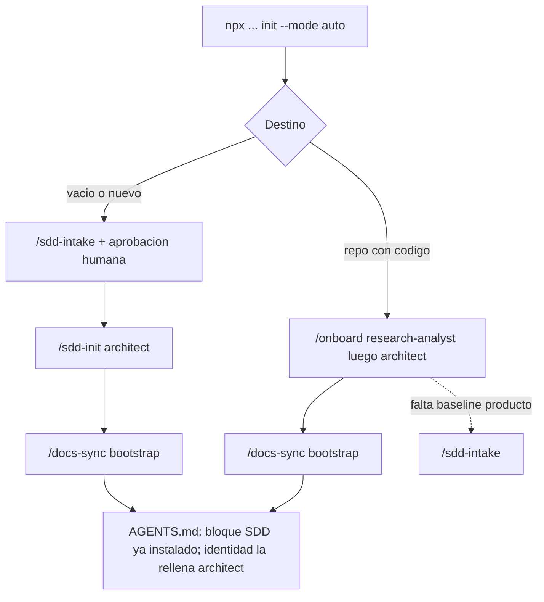

# Memoria del Trabajo de Fin de Máster

## Ecosistema portable de agentes Spec-Driven Development (SDD)

| Campo | Valor |
|---|---|
| Título | Ecosistema portable de agentes SDD/TDD para desarrollo asistido por IA |
| Artefacto de software | Repositorio plantilla `Estructura_inicial_claude` (kit instalable) |
| Versión documentada | 0.8.0 (`package.json`) |
| Fecha | 2026-08-16 |
| Idioma | Español |
| Diagrama asociado | [`catalogo-agentes.excalidraw`](./catalogo-agentes.excalidraw) |

> Este documento es la **memoria académica** de la plantilla. No se instala en proyectos destino
> (`docs/tfm/` está excluido del instalador). Las fuentes operativas canónicas siguen siendo
> `AGENTS.md`, `docs/sdd/OPERATING-MODEL.md` y las guías de `docs/guides/`.

---

## Resumen

Este trabajo presenta un **kit portable** que convierte un repositorio de software —nuevo o
existente— en un entorno de desarrollo asistido por agentes de IA gobernado por
**Spec-Driven Development (SDD)** y **Test-Driven Development (TDD)**. El sistema incluye
**20 agentes especializados**, **26 skills** (procedimientos escritos en el estándar Agent Skills),
**hooks deterministas** y un **CLI en Node.js ≥ 18 sin dependencias de runtime**.

La tesis operativa es: *el artefacto de verdad es la especificación; el código es su
compilación*. Ninguna línea de producción se escribe sin una spec aprobada. La verificación
relevante (estructura, trazabilidad, secretos, gates) no se delega al modelo: la ejecutan
scripts y hooks fuera del chat.

El kit se instala con `npx` desde GitHub, preserva el contexto brownfield, no activa MCP por
defecto y pausa el circuito en **seis gates humanos**. No pretende autonomía total: pretende
un bucle **humano + agente + CLI** reproducible entre Claude Code, Cursor, Copilot/VS Code,
Codex, Gemini CLI y Antigravity.

## Abstract (EN)

This dissertation documents a portable agent kit that embeds Spec-Driven Development and
strict TDD into any software repository. It ships twenty specialized agents, twenty-six Agent
Skills, host hooks, and a dependency-free Node.js CLI. Specifications are the source of truth;
deterministic checkers and hooks provide evidence the model cannot fabricate. Installation is
non-destructive, MCP is opt-in, and six human gates bound the workflow. The contribution is an
operational operating model for multi-IDE agentic development—not an unsupervised coding bot.

## Objetivos

1. Describir el problema de los agentes que se autocertifican y proponer un modelo donde la
   verificación viva fuera del modelo.
2. Documentar la instalación limpia, la estructura instalada y el contrato de agentes/skills.
3. Explicar los workflows reales (greenfield, brownfield, feature, docs-only, seguridad,
   incidente) con prompts típicos y el agente de entrada correcto.
4. Dejar explícitas las limitaciones (hosts desiguales, gates humanos, “pasa” sin ejecutar).

---

## 1. Marco teórico breve

### 1.1 Spec-Driven Development

SDD invierte el orden habitual “código primero, documentación después”. El circuito exige
artefactos durables por fase (`spec.md` → `clarifications.md` → `design.md` opcional →
`plan.md` → `tasks.md` → código + tests → verify → ship). Cada fase **lee** lo que produjo la
anterior; la memoria del sistema vive en el repositorio, no en el chat.

### 1.2 TDD como contrato de implementación

La implementación sigue el ciclo **RED → GREEN → REFACTOR** con salida real de tests pegada en
el handoff. Un veredicto “pasa” sin ejecución no es resultado válido; “no ejecutado” sí lo es,
con riesgo y siguiente paso.

### 1.3 Agent Skills como procedimiento portable

Desde diciembre de 2025, **Agent Skills** es un estándar abierto (`SKILL.md` + frontmatter).
Una skill bien escrita no se triplica por IDE. Los **perfiles de agente**, en cambio, sí
necesitan adaptadores por host (frontmatter distinto). Esta asimetría explica la arquitectura
del kit: skills canónicas en `.agents/skills/`; agentes canónicos en `.claude/agents/` (y
espejos en `.agents/agents/`) con envoltorios por superficie.

### 1.4 Separación modelo / verificación determinista

Un LLM puede narrar “*el backend-expert implementó la tarea*”. Eso demuestra lo que el modelo
**dice**, no lo que **ocurrió**. Por eso:

- Los hooks `SubagentStart`/`SubagentStop` escriben `execution-log.jsonl` (append-only).
- `scripts/check-sdd.mjs` comprueba estructura, ambigüedades, trazabilidad y contratos.
- Quien audita (`code-reviewer`, `security-auditor`) **no escribe** el código que juzga.

### 1.5 Human-in-the-loop y suelos normativos

El circuito pausa para aprobación humana en: (1) producto; (2) arquitectura/stack (solo
greenfield); (3) spec sin ambigüedades; (4) dirección visual/diseño; (5) plan técnico;
(6) entrega final. Seguridad (OWASP Top 10:2025, ASVS 5.0.0), usabilidad (WCAG 2.2 AA como
suelo) y documentación viajan como contratos en `.sdd/installed.json`.

---

## 2. Descripción del proyecto

### 2.1 Problema

Los flujos “agentic” espontáneos fallan de formas sistemáticas:

| Fallo | Consecuencia |
|---|---|
| Un solo agente planifica, implementa y se autocertifica | Bitácora que dice lo que se quiere leer |
| Arquitectura reelegida en cada feature | No hay arquitectura; hay opiniones sucesivas |
| Bitácora escrita solo por el modelo | Narración sin evidencia `observed` |
| Empezar por código sin requisitos testables | Retrabajo y deuda opaca |
| Prometer “funciona en todos los IDE” | Fricción oculta en hooks y delegación |

### 2.2 Solución

Un **ecosistema instalable** que aporta:

1. **Router operativo** (`AGENTS.md` + `OPERATING-MODEL.md`).
2. **20 agentes** en tres niveles (orquestación, fases SDD, especialistas).
3. **26 skills** con puertas de entrada, checklists y llamadas a CLI.
4. **Territorios** (`.sdd/territories.json`) + `guard-write.mjs` para no pisar el terreno ajeno.
5. **CLI determinista** (`sdd-project.mjs`, `check-sdd.mjs`, …): inventaría, numera, instancia
   plantillas y calcula cobertura; **no decide** requisitos ni veredictos de negocio.
6. **Instalador universal** greenfield/brownfield/auto, sin reset de contexto.

### 2.3 Identidad del artefacto

| Campo | Valor |
|---|---|
| Nombre | Ecosistema de agentes SDD |
| Tipo | Plantilla + CLI de instalación |
| Stack del kit | Node.js ≥ 18, sin dependencias de runtime |
| Agentes / skills | 20 / 26 |
| Hosts objetivo | Claude Code, GitHub Copilot/VS Code, Cursor, Codex, Gemini CLI, Antigravity |

### 2.4 Portabilidad honesta

Las reglas y el protocolo `### HANDOFF` son universales. La **delegación real** y los **hooks**
dependen del host. La matriz verificada/inferida está en
[`docs/integrations/IDE-COMPATIBILITY.md`](../integrations/IDE-COMPATIBILITY.md). Preferir un
hueco declarado a una afirmación cómoda forma parte del diseño.

---

## 3. Comandos de instalación limpia

Requisito: **Node.js 18+**. No se instalan dependencias npm del kit en el destino.

### 3.1 Vista previa (sin escribir)

```powershell
npx --yes github:jechamo/Estructura_inicial_claude init "C:\ruta\proyecto" --mode auto --dry-run
```

### 3.2 Instalación (rama móvil `main`)

```powershell
npx --yes github:jechamo/Estructura_inicial_claude init "C:\ruta\proyecto" --mode auto
```

### 3.3 Instalación reproducible (tag inmutable)

La versión documentada en esta memoria es **0.8.0**. Para CI o laboratorio:

```powershell
npx --yes github:jechamo/Estructura_inicial_claude#v0.8.0 init "C:\ruta\proyecto" --mode auto
```

> Nota: algunas guías del repositorio pueden citar aún `v0.6.0` como ejemplo histórico de pin.
> Para reproducir *esta* memoria, usar el tag alineado con `package.json` (0.8.0) cuando exista
> publicado, o fijar el commit SHA correspondiente.

### 3.4 Modos

| Modo | Uso |
|---|---|
| `auto` | Recomendado. Destino con contenido → brownfield; vacío → greenfield |
| `greenfield` | Proyecto nuevo / carpeta vacía |
| `brownfield` | Repo en vuelo; conserva todo el contexto |

### 3.5 MCP opt-in (desactivado por defecto)

```powershell
npx --yes github:jechamo/Estructura_inicial_claude#v0.8.0 init "C:\ruta\proyecto" `
  --mode auto --with-mcp context7,playwright
```

### 3.6 Comprobar y actualizar

```powershell
npx --yes github:jechamo/Estructura_inicial_claude#v0.8.0 check "C:\ruta\proyecto"
npx --yes github:jechamo/Estructura_inicial_claude#v0.8.0 update "C:\ruta\proyecto"
```

### 3.7 Tras instalar (gates locales)

```powershell
node scripts/check-sdd.mjs --virgin   # solo greenfield recién instalado
node scripts/check-sdd.mjs
node scripts/test-hooks.mjs
node scripts/sdd-project.mjs detect --json
node scripts/sdd-project.mjs configure --accept-detected   # aprobación explícita de checks
```

Hooks Git (opt-in; el instalador **no** muta `core.hooksPath` ni permisos):

```powershell
git config core.hooksPath .sdd/githooks
# En Unix: chmod +x .sdd/githooks/pre-commit .sdd/githooks/pre-push
```

Antes de commit: `node scripts/sdd-project.mjs run --fast`.
Antes de push: `node scripts/sdd-project.mjs run --slow`.

### 3.8 Qué **no** hace el instalador

- No hace `git add` / commit / push.
- No escribe secretos ni activa MCP sin `--with-mcp`.
- No vacía changelog, bitácora, specs, ADR ni logs existentes.
- No inventa stack, territorios de aplicación ni comandos de calidad del proyecto.

---

## 4. Estructura general de ficheros y carpetas al instalar

El árbol siguiente describe lo que **aparece en un destino** tras `init` (motor + semillas), no
la historia completa de la plantilla (specs 001–011, benchmarks, `test-install.mjs`,
`docs/tfm/`, `MAPEO-10-AGENTES.md`, etc., **no viajan**).

### 4.1 Árbol por zonas

```text
proyecto/
├── AGENTS.md                 # Contrato operativo + bloque <!-- sdd:start -->
├── CLAUDE.md / GEMINI.md     # Adaptadores de host → apuntan a AGENTS.md
├── README.md                 # Semilla bootstrap (virgen)
├── CHANGELOG.md              # Solo [Unreleased]
├── CONTRIBUTING.md, SECURITY.md, .editorconfig, .env.example, .gitignore
│
├── .agents/                  # Capa portable
│   ├── agents/               # Perfiles espejo / Antigravity
│   ├── skills/               # 26 skills canónicas (SKILL.md)
│   ├── rules/, workflows/, hooks.json
│
├── .claude/                  # Adaptadores Claude Code
│   ├── agents/               # 20 perfiles canónicos (fuente principal)
│   ├── skills/               # Adaptadores que remiten a .agents/skills/
│   └── settings.json         # Registro de hooks
│
├── .cursor/                  # Agentes, rules, hooks.json
├── .github/                  # agents, instructions, hooks, workflow sdd-gates
├── .codex/ · .gemini/ · .vscode/
│
├── .sdd/                     # Motor SDD del proyecto
│   ├── territories.json      # Propiedad de rutas (modo audit al nacer)
│   ├── checks.json           # Gates de calidad (solo sdd configurado al nacer)
│   ├── docs.json             # Contrato documental
│   ├── generators.json       # Generadores opt-in (vacío)
│   ├── installed.json        # Registro de instalación + contratos enforceFromSpec
│   ├── agent-audit.jsonl     # Auditoría sin spec activa
│   ├── hooks/                # Implementación Node de las guardas
│   ├── githooks/             # pre-commit / pre-push (opt-in)
│   └── README.md
│
├── scripts/
│   ├── check-sdd.mjs         # Validador determinista
│   ├── sdd-project.mjs       # CLI de estado, scaffold, approve, run, …
│   ├── scan-secrets.mjs
│   ├── skills-sync.mjs
│   ├── test-hooks.mjs
│   └── lib/docs-contract.mjs, jsonc.mjs
│
└── docs/
    ├── sdd/OPERATING-MODEL.md
    ├── product/              # PRD, USE-CASES, FEATURE-MAP, SOURCES, VISION
    ├── architecture/         # constitution stub, plantillas ADR, guías
    ├── specs/_TEMPLATE/      # Plantillas de fase
    ├── design/               # A11Y, USABILITY, DIRECCION-VISUAL, flows…
    ├── quality/ · security/ · bitacora/ · ops/ · guides/ · agents/CATALOG.md
    └── integrations/IDE-COMPATIBILITY.md
```

### 4.2 Qué es cada zona, cómo se relaciona y en qué flujos interviene

| Zona | Para qué sirve | Relaciones | Flujos |
|---|---|---|---|
| `AGENTS.md` + `OPERATING-MODEL.md` | Constitución operativa legible por cualquier host | Toda skill y agente remite aquí | Todos |
| `.claude/agents/` (+ espejos) | Roles, permisos, quién puede delegar | Invocados por skills y por `orchestrator` | Circuito SDD completo |
| `.agents/skills/` | Procedimientos por fase/dominio | Llamadas a `scripts/*.mjs`; producen docs en `docs/` | Por skill |
| `.sdd/hooks/` | Guardas y trazas fuera del modelo | Registrados en settings de cada host | Cada tool call / sesión |
| `.sdd/territories.json` | Quién puede escribir qué rutas | Consumido por `guard-write` | Escrita |
| `.sdd/checks.json` | Comandos lint/test/… del **proyecto** | `sdd-project.mjs run` / detect | Verify, commit, push |
| `docs/product/` | Baseline de producto aprobable | Intake → init/specify | `/sdd-intake` |
| `docs/architecture/` | Constitución y ADR | Vinculante para plan/implement | `/sdd-init`, `/onboard`, ADR |
| `docs/specs/NNN-slug/` | Memoria de una feature | Cadena spec→…→evidence + `execution-log.jsonl` | Circuito B |
| `docs/design/` | UX, a11y, usabilidad | Design + verify UX | `/sdd-design`, `/sdd-verify` |
| `docs/bitacora/` | Decisiones humanas + sesiones | `bitacora-keeper` + hooks | Continuo |
| `scripts/` | Verdad determinista | Skills y CI | Gates |

### 4.3 Virgen vs motor vs nunca viaja

| Categoría | Ejemplos |
|---|---|
| **Motor copiado** | Agentes, skills, hooks, `OPERATING-MODEL`, checklists, CLI |
| **Semillas vírgenes** | README bootstrap, CHANGELOG `[Unreleased]`, PRD pending, constitución stub, `docs.json` vacío |
| **Nunca viaja** | Specs activas de la plantilla, benchmarks, `docs/tfm/`, `MAPEO-10-AGENTES.md`, `install.mjs`, historia de bitácora de la plantilla |

### 4.4 Orden real tras instalar (corrección importante)

**No** es “siempre documentar y rellenar `AGENTS.md` primero”.



- El bloque SDD de `AGENTS.md` **ya viene** en `<!-- sdd:start -->`.
- La **tabla de identidad** la rellena `architect` en `/sdd-init` o `/onboard`.
- `/docs-sync bootstrap` inventaría documentación real; no inventa Swagger/Storybook/TypeDoc.
- Producto se aprueba **antes** de arquitectura.

---

## 5. Catálogo de agentes

Reglas transversales:

- Solo **delegán**: `orchestrator`, `planner`, `implementer`.
- Los otros 17 **devuelven el control**; no encadenan.
- Profundidad máxima: **2 saltos** entre agentes.
- Sin escritura (auditores): `orchestrator`, `code-reviewer`, `security-auditor`, `research-analyst`.

Diagrama editable: [`catalogo-agentes.excalidraw`](./catalogo-agentes.excalidraw).

### 5.1 Tabla completa

| Nombre | Descripción y función principal | Delega a | Handoff a (sucesor natural / devolución) | Skills que usa |
|---|---|---|---|---|
| **orchestrator** | Router e intake de solo lectura: clasifica, no escribe artefactos | `spec-analyst`, `ux-designer`, `architect`, `planner`, `implementer`, `code-reviewer`, `security-auditor`, `docs-writer`, `release-manager`, `research-analyst` | Agente de fase elegido; humano | `/sdd-start`, `/sdd-intake` (coordina), `/sdd-status` |
| **spec-analyst** | Requisitos EARS, MoSCoW sobre esfuerzo, cero tecnología; intake de producto | — | `orchestrator` (intake); `ux-designer` o `planner` | `/sdd-intake`, `/sdd-specify`, `/sdd-clarify` |
| **ux-designer** | Flujos, seis estados, a11y; review de diseño en intake | — | `orchestrator` (intake); `planner`; `spec-analyst` si hay requisito nuevo | `/sdd-design`, `/design-sync` |
| **architect** | Constitución, stack, ADR; greenfield `/sdd-init` y formalización en `/onboard` | — | `spec-analyst` o `planner`; quien lo llamó | `/sdd-init`, `/adr`, `/onboard` (fase formalización) |
| **planner** | Plan técnico, data-model, contracts, tasks atómicas | `api-designer`, `database-expert`, `ux-designer`, `research-analyst`, `architect`, `security-auditor`, `frontend-expert`, `backend-expert`, `devops-expert`, `test-engineer`, `docs-writer` | `implementer`; `architect` si viola constitución; `spec-analyst` si hay ambigüedad | `/sdd-plan`, `/sdd-tasks` |
| **implementer** | Ejecuta `tasks.md` en TDD; coordina especialistas | `backend-expert`, `frontend-expert`, `database-expert`, `test-engineer`, `refactor-specialist`, `api-designer`, `performance-optimizer`, `devops-expert`, `docs-writer` | `code-reviewer`; `planner` si el plan falla | `/sdd-implement`, `/tdd`, `/middle`, `/front`, `/bbdd`, `/observability` |
| **code-reviewer** | Revisión solo lectura: corrección, trazabilidad, usabilidad construida | — | `security-auditor` o `implementer` | `/sdd-verify` (eje calidad/UX) |
| **security-auditor** | OWASP/ASVS/Agentic; solo lectura | — | `release-manager` o `implementer`; informe vía `docs-writer` | `/security-scan` |
| **release-manager** | PR, CHANGELOG, DoD, reversión; sin push/merge sin permiso | — | Humano | `/sdd-ship` |
| **research-analyst** | Onboarding, triage, evaluación; solo lectura | — | Quien lo invocó (`architect`, `orchestrator`, …) | `/onboard` (fase investigación), apoyo a `/sdd-refresh` |
| **backend-expert** | Dominio, casos de uso, integraciones | — | Quien invocó (`implementer`) | `/middle` |
| **frontend-expert** | UI, estado, a11y de componentes | — | Quien invocó | `/front` |
| **database-expert** | Modelo, migraciones, RLS, índices | — | Quien invocó | `/bbdd` |
| **api-designer** | Contratos OpenAPI/GraphQL/eventos | — | Quien invocó | (consulta en `/sdd-plan`; sin skill propia con nombre) |
| **test-engineer** | Estrategia de test, contrato, E2E, mutación | — | Quien invocó | `/tdd` (apoyo) |
| **refactor-specialist** | SOLID, DRY, KISS, YAGNI, patrones | — | Quien invocó | (fase REFACTOR de `/tdd`) |
| **performance-optimizer** | Latencia/memoria/bundle con medición | — | Quien invocó | — |
| **devops-expert** | CI/CD, entornos, observabilidad, incidentes | — | Quien invocó | `/observability`, `/respond-incident` |
| **docs-writer** | README, guías, baseline documental | — | Quien invocó | `/docs-sync` |
| **bitacora-keeper** | Decisiones, deuda, “¿por qué X?” | — | Quien invocó | `/bitacora` |

### 5.2 Skills transversales de mantenimiento de la plantilla

| Skill | Agente típico | Notas |
|---|---|---|
| `/sdd-refresh` | `research-analyst` + humano | Revalidar baselines del **ecosistema**, no del producto diario |
| `/skill-creator` | Mantenimiento de skills | Vendored desde Anthropic; evals/scripts Python propios |

---

## 6. Skills: definición, agentes y scripts deterministas

Convención: el CLI **no decide**. Inventaría, numera, instancia plantillas, calcula cobertura y
ejecuta comandos ya declarados en `.sdd/checks.json`.

### 6.1 Skills del circuito y de dominio

| Skill | Definición (resumen) | Agente(s) | Scripts deterministas |
|---|---|---|---|
| **sdd-start** | Clasifica petición y estado; enruta | `orchestrator` | `sdd-project.mjs product-status --json` |
| **sdd-intake** | Baseline de producto + diseño opcional; gate humano | `orchestrator` coordina → `spec-analyst`, `ux-designer` | `approve-product --approved-by …` |
| **sdd-init** | Arquitectura greenfield, constitución, ADR-0001 | `architect` (+ `bitacora-keeper`) | `product-status`; `check-sdd.mjs --strict` |
| **onboard** | Documenta repo existente sin refactorizar | `research-analyst` → `architect` | (lectura + propuestas a territories/checks) |
| **sdd-specify** | Spec EARS + Gherkin; cero tecnología | `spec-analyst` | `new-spec <slug> --json` |
| **sdd-clarify** | Cierra `[NEEDS CLARIFICATION]` | `spec-analyst` | `check-sdd` (gate de ambigüedad) |
| **sdd-design** | Flujos, estados, a11y de la feature | `ux-designer` | `scaffold --phase design` |
| **sdd-plan** | Cómo técnico conforme a constitución | `planner` + consultas | `scaffold --phase plan`; `trace-status` |
| **sdd-tasks** | Tareas atómicas middle/front/bbdd + test | `planner` | `scaffold --phase tasks`; `trace-status` |
| **sdd-implement** | TDD por tarea | `implementer` → especialistas | `run --fast` |
| **middle / front / bbdd** | Implementación por capa | `backend-expert` / `frontend-expert` / `database-expert` | Tests del stack vía `run` / checks del proyecto |
| **tdd** | Ciclo rojo-verde-refactor explícito | `implementer`, `test-engineer`, `refactor-specialist` | Ejecución real de la suite |
| **sdd-verify** | Gates calidad + seguridad + UX | `code-reviewer` + `security-auditor` | `scaffold --phase verify`; `check-sdd --strict --spec`; `run --slow` |
| **security-scan** | Auditoría OWASP/ASVS (solo lectura) | `security-auditor` | Informes parseables; no “arregla” |
| **sdd-ship** | PR, CHANGELOG, DoD, reversión | `release-manager` | `run --fast`; `run --slow`; `check-sdd --strict` |
| **docs-sync** | Bootstrap/update/audit documental | `docs-writer` | `check-sdd --json`; `docs-status`; `approve-docs` |
| **design-sync** | Contraste Figma/Stitch ↔ código | `ux-designer` / front | MCP opt-in |
| **adr** | ADR MADR | `architect` | `new-adr <titulo>` |
| **bitacora** | Decisiones durables | `bitacora-keeper` | — |
| **observability** | Errores, salud, alertas | `devops-expert` | — |
| **respond-incident** | Contener / recuperar / aprender | `devops-expert` + `research-analyst` | — |
| **sdd-status** | Dónde está el circuito | cualquiera / orchestrator | `status --json` |
| **sdd-refresh** | Revalidar plantilla vs fuentes | mantenimiento | Baselines en `docs/research/` |
| **skill-creator** | Crear/mejorar skills + evals | mantenimiento | Scripts Python en `skill-creator/scripts/` |

### 6.2 CLI y scripts del kit

| Script / comando | Para qué sirve |
|---|---|
| `sdd-project.mjs status` | Snapshot de specs, fases, git |
| `detect` / `configure --accept-detected` | Proponer e incorporar checks del stack |
| `product-status` / `approve-product` | Gate de producto |
| `docs-status` / `approve-docs` | Gate documental |
| `new-spec` / `new-adr` | Numeración e instancia de plantillas |
| `scaffold --phase …` | Crear artefactos de fase sin inventar contenido |
| `trace-status` / `trace-correct` | Cobertura de trazas y rectificación append-only |
| `generate` | Generadores opt-in de `.sdd/generators.json` |
| `run --fast` / `run --slow` | Ejecutar checks configurados |
| `debt` | Conteo de TODO/FIXME (dato, no esfuerzo) |
| `verify` | Encapsula `check-sdd` con flags |
| `check-sdd.mjs` | Validador estructural y de contratos |
| `scan-secrets.mjs` | Patrones de secreto |
| `skills-sync.mjs --check` | Política de skills externas |
| `test-hooks.mjs` | Contratos de guardas |
| Hooks `.sdd/hooks/*.mjs` | Contexto, router, guard-write/bash, format, logs |
| `test-install.mjs` | **Solo plantilla**; no viaja al destino |

---

## 7. Principales workflows

### 7.1 Proyecto nuevo (greenfield)

1. Instalar (`init --mode auto` / greenfield).
2. `/sdd-intake` → aprobar producto (`approve-product`).
3. `/sdd-init` → constitución + ADR-0001.
4. `/docs-sync bootstrap` → aprobar docs (`approve-docs`).
5. Primera feature: `/sdd-specify` → … → `/sdd-ship`.

### 7.2 Repo existente (brownfield) — documentar y adoptar SDD

1. Instalar (`--mode auto` / brownfield): **no** pisa docs existentes.
2. `/onboard`: `CURRENT-STATE.md`, constitución de lo **real**, ADR heredado, deuda.
3. Si falta baseline de producto → `/sdd-intake` (sin fabricar IDs).
4. `/docs-sync bootstrap` (estado `legacy-pending` hasta aprobación).
5. `detect` + `configure` de checks reales del stack.
6. A partir de ahí: features por circuito B.

### 7.3 Nueva funcionalidad en proyecto ya montado

`/sdd-specify` → `/sdd-clarify` → (`/sdd-design` si hay UI) → `/sdd-plan` → `/sdd-tasks` →
`/sdd-implement` (`/middle` · `/front` · `/bbdd`) → `/sdd-verify` → `/sdd-ship`.

Si llega un PRD global o diseño nuevo: **antes** `/sdd-intake` y una spec vertical del
`FEATURE-MAP`, no una spec monolítica.

### 7.4 Solo documentación / actualizar guías

`/docs-sync update` o `audit`. Si aparece cambio de comportamiento → volver a SDD/TDD.

### 7.5 Verificar calidad, errores y seguridad

- Calidad/usabilidad construida: `/sdd-verify` (`code-reviewer`).
- Seguridad: `/security-scan` (`security-auditor`, solo lectura).
- Estado: `/sdd-status`.

### 7.6 Incidente en producción

`/respond-incident` — **no** se entra por `/sdd-specify`. Primero contener.

### 7.7 ¿Siempre el orchestrator?

| Situación | ¿Orchestrator? |
|---|---|
| No sé la fase | **Sí** (`/sdd-start` / `/sdd-status`) |
| Intake / PRD / diseño global | **Sí** (solo él encadena intake) |
| Sé que es docs-only | Directo `docs-writer` |
| Spec clara, implementar tarea | Directo `implementer` (cadena más corta) |
| Auditar lo ya hecho | Directo `code-reviewer` / `security-auditor` |
| Incidente | Directo flujo incident |

El orchestrator **aporta** cuando hay duda de fase o hay que coordinar intake. No es obligatorio
si el usuario ya conoce el comando de fase.

---

## 8. Prompts típicos (copiables)

### 8.1 Arranque / duda de fase

**Agente:** `orchestrator` · **Skill:** `/sdd-start` o `/sdd-status`

> Estoy en este repositorio con el kit SDD instalado. Dime en qué fase estamos, qué specs hay
> abiertas y cuál es el siguiente paso concreto. No escribas código.

### 8.2 Intake desde PRD + diseño

**Agente:** `orchestrator` · **Skill:** `/sdd-intake`

> Te pego el PRD (o la ruta `docs/entrada/prd.md`) y el enlace de Figma/Stitch. Normaliza el
> baseline de producto y las discrepancias. No elijas stack ni escribas código. Cuando termines,
> pausa para mi aprobación.

### 8.3 Onboarding de repo existente

**Agente:** `orchestrator` o `research-analyst` → `architect` · **Skill:** `/onboard`

> He instalado el kit en este repo. Documenta la arquitectura real, crea la constitución y el
> ADR de arquitectura heredada. No refactorices ni inventes requisitos de producto.

### 8.4 Baseline documental

**Agente:** `docs-writer` · **Skill:** `/docs-sync bootstrap`

> Haz bootstrap del contrato documental con hechos verificables del repo. No instales Swagger ni
> Storybook. Déjalo pendiente de mi aprobación.

### 8.5 Nueva funcionalidad

**Agente:** `spec-analyst` (o `orchestrator` si dudas) · **Skill:** `/sdd-specify`

> Nueva funcionalidad: exportar facturas en PDF para el rol contable. Empieza por la spec con
> requisitos EARS y criterios Gherkin. Sin tecnología y sin código.

### 8.6 Continuar el circuito

> La spec 014 está aclarada y tiene UI. Continúa con `/sdd-design` y luego plan/tasks.
> Respeta la constitución.

> Implementa la siguiente tarea pendiente de `tasks.md` de la spec 014 con TDD estricto.
> Pega la salida real de los tests en cada paso.

### 8.7 Verificar y seguridad

**Agentes:** `code-reviewer` + `security-auditor` · **Skills:** `/sdd-verify`, `/security-scan`

> Verifica la spec 014: gates, trazabilidad y usabilidad. No arregles tú los hallazgos; devuelve
> HANDOFF.

> Audita seguridad (OWASP/ASVS) de lo implementado en la spec 014. Solo lectura; no parches.

### 8.8 Solo docs

**Agente:** `docs-writer` · **Skill:** `/docs-sync update`

> Corrige el README: la instalación real usa el tag v0.8.0 y Node 18+. No cambies comportamiento
> del código.

### 8.9 Entrega

**Agente:** `release-manager` · **Skill:** `/sdd-ship`

> Prepara la entrega de la spec 014: CHANGELOG, trazabilidad, plan de reversión y checklist de
> gates. No hagas push ni merge sin mi permiso explícito.

### 8.10 Incidente

**Agente:** `devops-expert` · **Skill:** `/respond-incident`

> Hay errores 500 en producción en el endpoint de facturas desde las 18:00. Contén el impacto,
> diagnostica con evidencia y propon recuperación. No abras una spec todavía.

---

## 9. Consideraciones, limitaciones y conclusiones

### 9.1 Consideraciones de diseño

1. **Spec como fuente de verdad** reduce improvisación del modelo.
2. **Separar juez y parte** (auditores sin escritura) evita autocertificación.
3. **Hooks y CLI** aportan evidencia `observed` / fallos reproducibles.
4. **Brownfield no destructivo** hace adoptable el kit en repos reales.
5. **MCP opt-in** limita la superficie de ataque y la sorpresa.
6. **Contratos de seguridad, usabilidad y documentación** con `enforceFromSpec` no reescriben
   la historia previa del proyecto.

### 9.2 Limitaciones honestas

- El sistema **no funciona “solo”**: necesita gates humanos y un host capaz.
- Delegación y hooks **no son idénticos** en todos los IDE.
- Sin smoke real del host, la trazabilidad degrada a `declared-direct`.
- El CLI no es sandbox del SO: confina rutas declaradas, pero el programa aprobado corre con
  permisos del usuario.
- `sdd-refresh` y `skill-creator` son de **mantenimiento de la plantilla**, no del día a día
  de un producto instalado.
- Esta memoria (`docs/tfm/`) **no viaja** a proyectos destino.

### 9.3 Trabajo futuro

- Ampliar smoke tests por host en la matriz IDE.
- Reducir deriva de ejemplos de versión (README vs `package.json`) con un único “current pin”.
- Más generadores opt-in auditados por stack, sin activación automática.

### 9.4 Conclusión

El aporte no es “más prompts”, sino un **modelo operativo instalable**: fases, territorios,
skills, verificación fuera del modelo y pausas humanas. En ese marco, un PRD o un diseño
opcional pueden arrancar un circuito agentico **gobernado**, portable entre herramientas, sin
confundir narración del chat con evidencia de ingeniería.

---

## Bibliografía y fuentes del repositorio

Fuentes primarias de este trabajo (artefactos del propio kit):

- `AGENTS.md` — Router operativo.
- `docs/sdd/OPERATING-MODEL.md` — Modelo operativo vinculante.
- `docs/agents/CATALOG.md` — Catálogo de agentes.
- `docs/guides/INSTALACION.md`, `DOCUMENTACION.md`, `COMO-TRABAJAR-CON-LOS-AGENTES.md`.
- `docs/integrations/IDE-COMPATIBILITY.md` — Matriz de hosts.
- `docs/research/baseline-2026-07-29.md`, `baseline-2026-07-30.md`, `baseline-2026-08-02.md`.
- `.agents/skills/*/SKILL.md` — Procedimientos canónicos.
- `.sdd/hooks/README.md` — Contrato de hooks.
- `package.json` — Allowlist de empaquetado y versión 0.8.0.

Estándares y referencias citadas por el kit (consultar fechas en los baselines):

- Agent Skills (estándar abierto de procedimientos para agentes).
- OWASP Top 10:2025; OWASP ASVS 5.0.0; OWASP Top 10 for Agentic Applications (cuando aplica LLM).
- WCAG 2.2 AA; heurísticas de usabilidad (Nielsen) vía checklists del repo.
- Keep a Changelog; Conventional Commits (prácticas de entrega).
- Hallazgos DORA / estudios de calidad en PRs asistidos por IA referenciados en
  `docs/agents/MAPEO-10-AGENTES.md` y baselines (contexto, no reproducidos aquí).

---

## Anexo A · Mapa rápido situación → comando

| Situación | Comando |
|---|---|
| PRD / diseño / producto | `/sdd-intake` |
| Proyecto nuevo tras producto | `/sdd-init` |
| Repo existente sin documentar | `/onboard` |
| Feature nueva | `/sdd-specify` … `/sdd-ship` |
| Docs sin cambio de comportamiento | `/docs-sync` |
| Validar | `/sdd-verify` |
| Seguridad | `/security-scan` |
| Entregar | `/sdd-ship` |
| Incidente | `/respond-incident` |
| ¿Dónde estoy? | `/sdd-status` o `orchestrator` |

---

*Fin de la memoria. Diagrama de agentes: [`catalogo-agentes.excalidraw`](./catalogo-agentes.excalidraw).*
