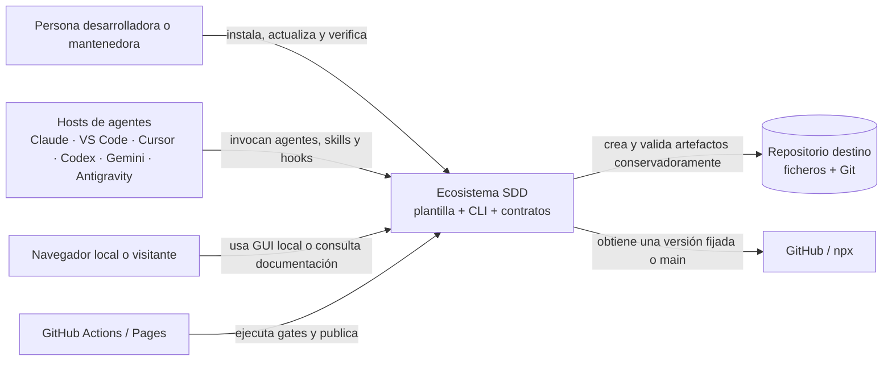
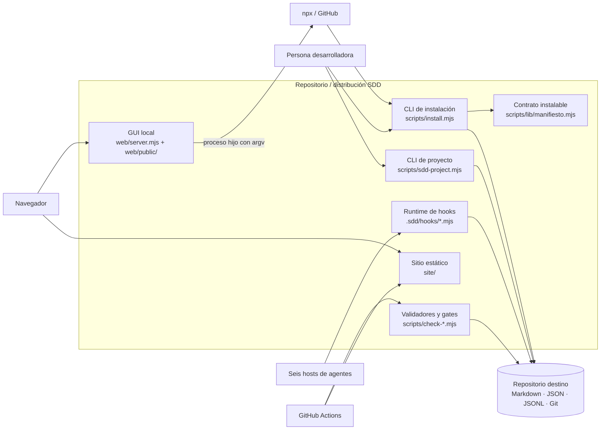

# Estado arquitectónico actual

- **Fecha de observación**: 2026-08-21
- **Tipo de análisis**: onboarding brownfield, sin refactor ni cambio de comportamiento
- **Estado de producto**: `approved` según `.sdd/installed.json`
- **Decisión arquitectónica asociada**: [`ADR-0001-arquitectura-heredada.md`](./adr/ADR-0001-arquitectura-heredada.md), propuesta pendiente de aprobación humana

Este documento describe el sistema que existe. Las afirmaciones marcadas como **observadas**
proceden del repositorio; las marcadas como **inferidas** son una lectura arquitectónica de esos
hechos y no añaden capacidades ni compromisos futuros.

## 1. Resumen ejecutivo

**Observado.** El repositorio es a la vez producto, plantilla instalable y CLI. Distribuye un
circuito SDD portable a seis entornos, se aplica sus propias guardas y gates, ofrece una GUI local
auxiliar y publica documentación estática en GitHub Pages. Es un paquete JavaScript ESM para
Node.js 18 o superior, sin dependencias de runtime ni base de datos.

**Inferido.** La arquitectura real es una **distribución monolítica organizada por superficies
técnicas**, con cuatro puntos de entrada independientes: CLI, hooks embebidos, GUI local y sitio
estático. El código es procedural y modular; no implementa una arquitectura clean o hexagonal.
Los contratos de fichero y Git sustituyen a una capa de persistencia convencional.

## 2. Producto y estado durable

### Observado

- `.sdd/installed.json` declara el modo `template` y el producto `approved`; conserva hashes de
  `PRD.md`, `USE-CASES.md`, `FEATURE-MAP.md` y `SOURCES.md`.
- `docs/product/PRD.md` define como alcance el instalador, el circuito de specs, las guardas, los
  gates y la documentación viva.
- El producto prioriza seguridad, calidad, facilidad de adopción y coste de contexto/tokens.
- Existen 16 specs. La spec 016 está aprobada y sin plan todavía.
- `T-010-05` continúa marcada `en curso` en la spec 010. El onboarding no la cierra ni reescribe
  su historia.

### Discrepancias observadas

- `USE-CASES.md`, `FEATURE-MAP.md` y `SOURCES.md` conservan encabezados `pending`, aunque el
  registro durable aprueba exactamente sus hashes. Corregir ese vocabulario requiere su propio
  tratamiento; este onboarding no lo modifica.
- `VISION.md` sigue siendo una plantilla opcional y no forma parte del baseline aprobado.
- Antes de este onboarding, `constitution.md` era una plantilla `bootstrap`, pese a que el
  producto y el código están activos.

## 3. Vista de contexto — C4 nivel 1



## 4. Vista de contenedores — C4 nivel 2



### Responsabilidades observadas

| Contenedor | Responsabilidad real | Frontera / integración |
|---|---|---|
| CLI de instalación | `init`, `update`, `check` y `global`; instala sin sobrescribir trabajo previo | argumentos CLI, filesystem, Git y manifiesto versionado |
| CLI de proyecto | scaffolding, estado, gates, trazabilidad y generadores | subcomandos síncronos y ficheros `.sdd/` |
| Hooks | guardas, routing, sesión y trazabilidad multi-host | procesos Node invocados por el host; JSON/JSONL y códigos de salida |
| Validadores | contrato SDD, sintaxis, cobertura, olores, accesibilidad y secretos | comandos deterministas, salida humana o JSON |
| GUI local | guía un preview, instalación y comprobación mediante procesos hijos | HTTP solo en loopback, token de sesión y streaming por `fetch`/SSE |
| Pages | explica el producto y genera comandos; no instala | HTML/CSS/JS estáticos publicados por Actions |
| Manifiesto | decide qué se distribuye y cómo se preserva lo existente | contrato interno compartido por instalador y tests |

## 5. Módulos funcionales reconocibles

La organización física es por tipo y superficie, no por vertical slice. Aun así, se observan
cinco responsabilidades funcionales:

| Módulo lógico inferido | Responsabilidad | Datos/contratos que gobierna | Acoplamiento observado |
|---|---|---|---|
| Distribución | instalar y actualizar la plantilla de forma conservadora | manifiesto, semillas, registro instalado | CLI + filesystem + Git |
| Circuito SDD | crear artefactos, consultar estado y ejecutar gates | specs, producto, checks, generadores | CLI síncrono + Markdown/JSON |
| Guardas y trazabilidad | prevenir acciones inválidas y registrar autoría | hooks, territorios, JSONL, estado efímero | procesos de host + filesystem |
| Publicación documental | preparar y desplegar Pages/TFM | `site/`, memoria y versión | script de preparación + Actions |
| Experiencia de instalación | acompañar la instalación en navegador | endpoints locales, token de sesión, logs de proceso | HTTP loopback + proceso `npx` |

**Inferido.** No son bounded contexts con datos propios: comparten contratos de fichero y
convenciones. Presentarlos como servicios o dominios aislados describiría una arquitectura que no
existe.

## 6. Datos, estado y consistencia

### Observado

- Markdown, JSON y JSONL versionados son la persistencia durable.
- `.sdd/state/` conserva estado efímero y `.sdd/conflicts/` preserva conflictos; no se versionan.
- Git aporta historial, diferencias, ramas, tags y base de trazabilidad.
- No hay base de datos, ORM, migraciones, cola, cron ni almacenamiento remoto propio.
- Las operaciones principales son locales y síncronas. SSE solo transporta salida desde la GUI
  local al navegador.

### Inferido

La consistencia es inmediata dentro de un checkout y depende de escrituras de fichero, locks
efímeros donde el código los implementa y la serialización que proporciona Git al registrar
cambios. No existe una frontera transaccional global entre todos los artefactos.

## 7. Estructura y dependencias reales

```text
scripts/                 CLI, validadores, pruebas y preparación de publicación
scripts/lib/             helpers y contratos compartidos
.sdd/hooks/              runtime embebido de hooks
.sdd/githooks/           puntos de entrada Git
web/server.mjs           servidor HTTP local
web/lib/                 validación y ejecución de procesos de la GUI
web/public/              frontend local nativo
site/                    Pages estática
docs/                    producto, specs, arquitectura, calidad, seguridad y TFM
.agents/ + adaptadores/  definición portable para los seis hosts
.github/workflows/       gates de la plantilla y despliegue de Pages
```

**Observado.** Las reglas de producto, la orquestación y el I/O conviven en módulos
procedurales. Existen helpers extraídos, pero no una separación sistemática
`domain/application/infrastructure`. La GUI local es la superficie con separación más clara:
HTTP → validación/runner → proceso CLI.

## 8. Stack y operación

| Área | Tecnología observada | Estado |
|---|---|---|
| Runtime | Node.js `>=18`, JavaScript ESM | contrato de `package.json` |
| Dependencias | librería estándar de Node; cero dependencias runtime/dev declaradas | restricción de producto |
| CLI | módulos `.mjs`, binario npm `sdd` | superficie primaria |
| UI local | HTTP de Node + HTML/CSS/JS nativos | auxiliar, solo loopback |
| Sitio | HTML/CSS/JS estáticos | publicación informativa |
| Datos | Markdown, JSON, JSONL y Git | persistencia local |
| CI/CD | GitHub Actions; matriz Windows/Linux y Node 18/20/22 | gates + Pages |
| Tests | arneses propios Node sobre fixtures temporales | integración/contrato predominante |

## 9. Calidad, pruebas y generación

### Observado

- La matriz de plantilla cubre Windows y Linux con Node 18, 20 y 22.
- Los tests principales son `scripts/test-hooks.mjs` y `scripts/test-install.mjs`, sin framework
  externo. La evidencia durable registra 181/181 para hooks y 422/422 para una ejecución anterior
  del instalador; esas cifras son históricas, no una ejecución de este documento.
- `.sdd/coverage.json` registra 51,3 % medido y un umbral de 48,3 % sobre las rutas declaradas.
- `typecheck`, `visual`, `deps-audit`, `docs` y `mutation` constan como no configurados.
- No se hallaron pruebas directas de `web/server.mjs`, `web/lib/runner.mjs`,
  `web/lib/validate.mjs` ni de los endpoints locales.
- `.sdd/generators.json` no declara generadores. `scripts/site-prep.mjs` sí materializa artefactos
  para Pages. `scripts/skills-sync.mjs` audita el catálogo externo y muestra comandos, pero no
  genera ni sincroniza adaptadores.

### Propuesta durable, no activada

Registrar, tras aprobación, un generador `site-publication` con:

- programa/argv: `node`, `scripts/site-prep.mjs`;
- entradas: `package.json`, `docs/TFM/MEMORIA-SISTEMA-AGENTES.md` y el logotipo fuente;
- salidas: datos/versiones del sitio, copia de la memoria, logotipo y `.nojekyll`;
- propietario sugerido: `release-manager`.

No se propone registrar `skills-sync.mjs` como generador porque el comportamiento observado no
lo respalda.

## 10. Historia y zonas calientes

**Observado.** La investigación contó 52 commits entre 2026-07-29 y 2026-08-21, con 17 días
activos. Las rutas con más cambios son `CHANGELOG.md`, `DECISIONS.md`, `check-sdd.mjs`,
`test-install.mjs`, `README.md`, `IDE-COMPATIBILITY.md` y `manifiesto.mjs`.

Los módulos más concentrados observados son `check-sdd.mjs` (2123 líneas),
`sdd-project.mjs` (1571), `test-install.mjs` (3830 en la medición de investigación) y
`test-hooks.mjs` (906). `.sdd/smells.json` ya obliga a abordar la partición de
`test-install.mjs` antes de volver a elevar su umbral.

## 11. Riesgos priorizados

La prioridad combina impacto con frecuencia de cambio observada; no representa una medida
cuantitativa inventada.

| Prioridad | Riesgo observado | Consecuencia |
|---|---|---|
| Alta | Constitución heredada sin ratificación humana | La arquitectura formal queda propuesta y el siguiente plan necesita confirmar que es vinculante |
| Alta | `web/README.md` declara la GUI fuera del circuito SDD/TDD | Precedente incompatible con la regla cero; código ejecutable sin trazabilidad funcional histórica |
| Alta | Código ejecutable sin territorios de escritura | Las guardas no materializan ownership para `scripts/`, `web/`, `site/`, tests y hooks |
| Alta | `T-010-05` sigue `en curso` | Los hooks pueden atribuir trabajo nuevo a una spec histórica |
| Alta | GUI local sin pruebas directas | Superficie que lanza procesos y ofrece modo TLS permisivo sin cobertura específica observada |
| Media | Módulos y suite concentrados | Mayor coste y riesgo en las zonas que cambian con más frecuencia |
| Media | Pages usa tags móviles de Actions | Menor reproducibilidad y exposición de supply chain respecto al workflow principal fijado por SHA |
| Media | Versión estable `0.7.0` por detrás de `main` | `sdd-light` se documenta en main/Pages, pero no existe en el último tag estable |
| Media | Baseline aprobado con encabezados `pending` | Dos fuentes durables ofrecen estados incompatibles |
| Media | TFM atribuye sincronización a `skills-sync.mjs` | La documentación describe un comportamiento que el script no realiza |
| Media | `site-prep.mjs` no está gobernado como generador | Entradas y salidas de publicación carecen de contrato determinista declarado |
| Baja | Sin lockfile ni `deps-audit` | Coherente hoy con cero dependencias; debe revisarse si entra una dependencia o acción adicional |

El backlog y sus condiciones de revisión viven en
[`docs/quality/TECH-DEBT.md`](../quality/TECH-DEBT.md).

## 12. Territorios propuestos — no activados

La configuración actual está en modo `deny`, pero solo gobierna documentación. Activar estas
rutas cambiaría la autorización efectiva y requiere aprobación humana; por eso este onboarding
solo conserva la propuesta:

| Agente | Rutas propuestas |
|---|---|
| `backend-expert` | `scripts/install.mjs`, `scripts/sdd-project.mjs`, `scripts/lib/**`, `web/server.mjs`, `web/lib/**`, `.sdd/hooks/**` |
| `frontend-expert` | `web/public/**`, `site/**` |
| `test-engineer` | `scripts/test-*.mjs`, `scripts/check-*.mjs`, `scripts/scan-secrets.mjs` |
| `devops-expert` | `.github/workflows/**`, `.sdd/githooks/**` |
| `implementer` | manifiestos y adaptadores multihost bajo `.agents/`, `.claude/`, `.codex/`, `.cursor/`, `.gemini/`, `.github/agents/` y `.vscode/` |

Antes de activarlos debe resolverse el solapamiento entre `test-engineer` y `backend-expert` en
scripts compartidos, decidir quién posee los validadores que son a la vez código de producto y
tests de contrato, y demostrar que las guardas de cada host interpretan el mapa como se espera.

## 13. Divergencia principal

El equipo ya declara el repositorio como una plantilla/CLI activa, pero su constitución y sus
territorios procedían de una instalación genérica: la primera seguía en `bootstrap` y los segundos
afirmaban que no había código de aplicación. El código demuestra lo contrario. Este onboarding
regulariza la descripción; no refactoriza el sistema ni activa permisos nuevos.
