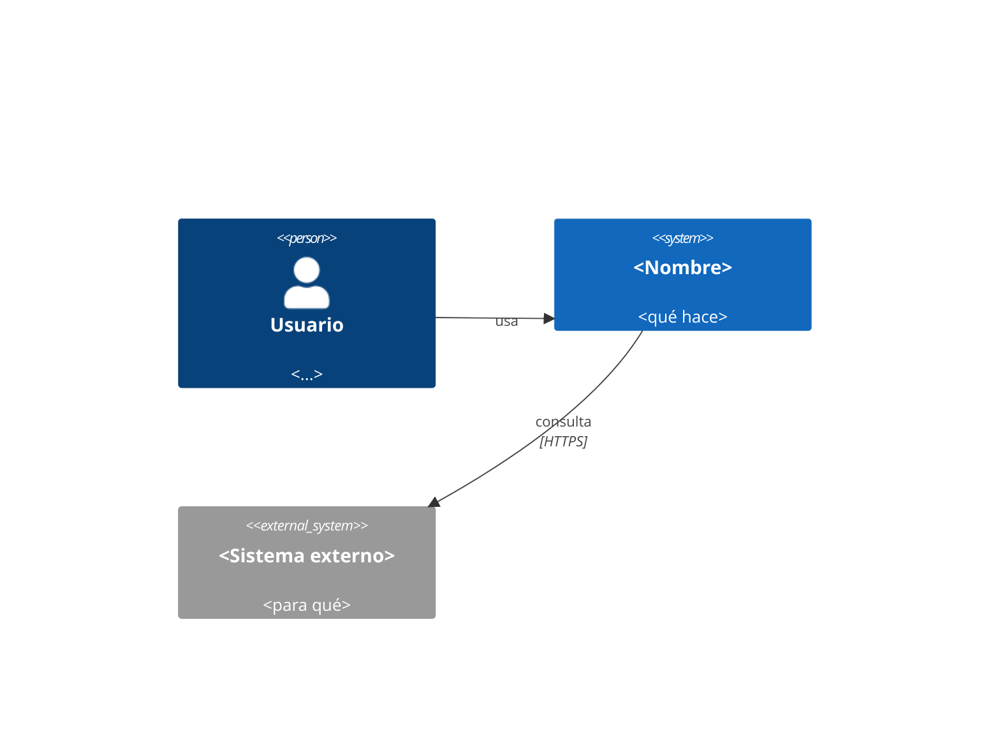
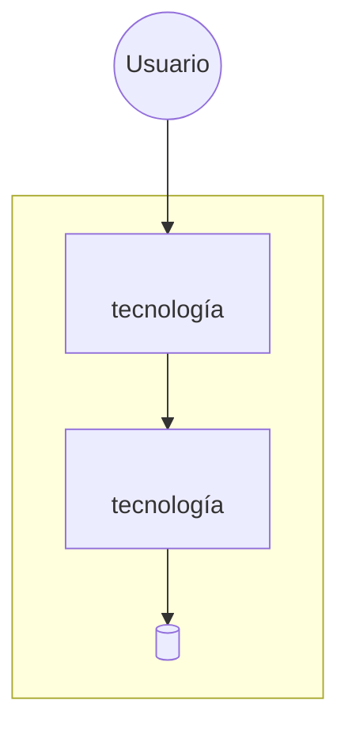

# Constitución del proyecto

> **PLANTILLA.** La rellena el agente `architect` durante `/sdd-init` (proyecto nuevo) o
> `/onboard` (repo existente). Mientras tenga marcadores `<...>`, el proyecto **no está
> inicializado**.
>
> Una vez rellenada, este documento es **vinculante** para todos los agentes y para todo el
> código. Se modifica solo mediante un ADR nuevo.

---

## 1. Identidad

| Campo | Valor |
|---|---|
| Nombre | `<...>` |
| Tipo | `<web app / API / móvil / CLI / data / librería>` |
| Estado | `bootstrap` |
| Fecha de inicialización | `<YYYY-MM-DD>` |

## 2. Arquitectura: posición por eje

> No se declara *una* etiqueta. Se declara una posición en cada eje, y cada una se justifica
> y se revisa por separado. Ver [`DECISION-GUIDE.md`](./DECISION-GUIDE.md) §2.

| Eje | Posición elegida | Por qué | Qué la haría cambiar |
|---|---|---|---|
| **Despliegue** | `<monolito / web+worker / servicios / serverless / edge>` | | |
| **Dependencias** | `<layered / hexagonal / clean / vertical slice>` | | |
| **Dominio** | `<módulos / bounded contexts / servicios>` | | |
| **Integración** | `<llamada / cola / evento / stream / batch>` | | |
| **Datos** | `<compartidos-propios / ACID-eventual / OLTP-OLAP>` | | |
| **Experiencia** | `<SSR / SPA / móvil / desktop / microfrontend>` | | |

**Resumen en una frase**: `<p. ej. monolito modular con fronteras hexagonales sobre bounded
contexts, integración síncrona salvo notificaciones por evento>`

Detalle y alternativas descartadas en `adr/ADR-0001-arquitectura-inicial.md`, que crea `/sdd-init`.

## 3. Vista de contexto (C4 nivel 1)



## 4. Vista de contenedores (C4 nivel 2)



## 5. Contextos acotados

| Contexto | Responsabilidad | Dueño de qué datos | Comunicación con otros |
|---|---|---|---|
| `<...>` | | | |

**Regla**: la comunicación entre contextos ocurre **solo** a través de su API pública o de
eventos. Nada de acceder a las tablas del vecino.

## 6. Reglas de dependencia

```
interfaces  →  application  →  domain
                    ↑
             infrastructure  (implementa los puertos de domain)
```

**Las dependencias apuntan hacia dentro. Siempre.**

| Capa | Puede importar de | **Nunca** importa de |
|---|---|---|
| `domain/` | nada externo | framework, ORM, HTTP, SDK, otras capas |
| `application/` | `domain/` | `infrastructure/`, `interfaces/` |
| `infrastructure/` | `domain/`, `application/` | `interfaces/` |
| `interfaces/` | `application/`, DTOs | `domain/` directamente (salvo tipos), `infrastructure/` |

## 7. Estructura de carpetas canónica

```
src/
├── domain/           entidades, value objects, agregados, eventos, PUERTOS
├── application/      casos de uso, DTOs, orquestación, transacciones
├── infrastructure/   adaptadores: repositorios, clientes HTTP, colas, ficheros
├── interfaces/       controladores HTTP, CLI, consumidores, cron, UI
└── shared/           tipos y utilidades genuinamente transversales (mantener MÍNIMO)
tests/
├── unit/
├── integration/
├── contract/
└── e2e/
```

> `shared/` es donde muere la arquitectura. Si crece, algo está mal repartido.

## 8. Stack

| Capa | Tecnología | Versión | Por qué |
|---|---|---|---|
| Lenguaje | `<...>` | | |
| Framework | `<...>` | | |
| Base de datos | `<...>` | | |
| Tests | `<...>` | | |
| Lint / formato | `<...>` | | |
| CI/CD | `<...>` | | |

## 9. Estándares transversales

| Aspecto | Decisión |
|---|---|
| Gestión de errores | `<Result/Either · excepciones tipadas>` |
| Formato de error de API | RFC 9457 (Problem Details) |
| Logs | JSON estructurado, con `traceId`, sin PII |
| Configuración | Variables de entorno validadas con esquema al arrancar |
| Validación de entrada | `<zod / pydantic / ...>` en la frontera |
| Autenticación | `<...>` |
| Autorización | Comprobada en servidor, en cada caso de uso |
| Identificadores | `<uuid v7 / ...>` |
| Fechas | `timestamptz`, ISO 8601 UTC |
| Dinero | `numeric` / decimal en string. **Nunca float** |
| Internacionalización | `<...>` |
| Estilo de API | `<REST + OpenAPI 3.1 / GraphQL / gRPC>` |

## 10. Objetivos de calidad

| Métrica | Objetivo |
|---|---|
| Cobertura dominio/aplicación | ≥ 80 % (punto de partida; ajústalo por riesgo y justifícalo aquí) |
| Zonas críticas sin probar | 0 — este es el umbral que importa de verdad |
| Duración de la suite en CI | < 10 min |
| Nivel ASVS objetivo | `<L2 por defecto en app expuesta · L1 interna sin PII · L3 crítico>` |
| Accesibilidad | WCAG 2.2 AA |
| p95 de latencia de API | `< ___ ms` |
| Core Web Vitals | LCP < 2.5 s · INP < 200 ms · CLS < 0.1 |

## 11. Prohibiciones

- Lógica de negocio en controladores, componentes de UI o triggers de BD.
- Importar infraestructura desde el dominio.
- SQL concatenado.
- Secretos en el repositorio.
- Singleton mutable global, God Object, Service Locator, herencia de 3+ niveles.
- `utils/` como cajón de sastre.
- Añadir una dependencia sin justificarla en `research.md`.
- `<prohibiciones específicas de este proyecto>`

## 12. Cómo se modifica esta constitución

1. Se escribe un ADR nuevo con el cambio propuesto, sus alternativas y sus consecuencias.
2. Lo revisa un humano.
3. Si se acepta, se actualiza este documento **y** se registra en `docs/bitacora/DECISIONS.md`.

Ninguna decisión arquitectónica vive solo en el chat.

---

## ADRs vigentes

> Los crea `/sdd-init` a partir de [`adr/ADR-0000-plantilla.md`](./adr/ADR-0000-plantilla.md).
> Añade aquí una fila por cada ADR aceptado, con su enlace.

| ADR | Título | Estado |
|---|---|---|
| `ADR-0001-arquitectura-inicial.md` | Arquitectura inicial | pendiente |
| `ADR-0002-stack-tecnologico.md` | Stack tecnológico | pendiente |
