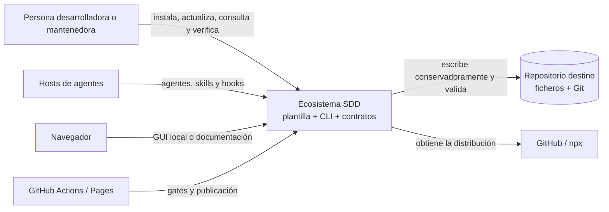
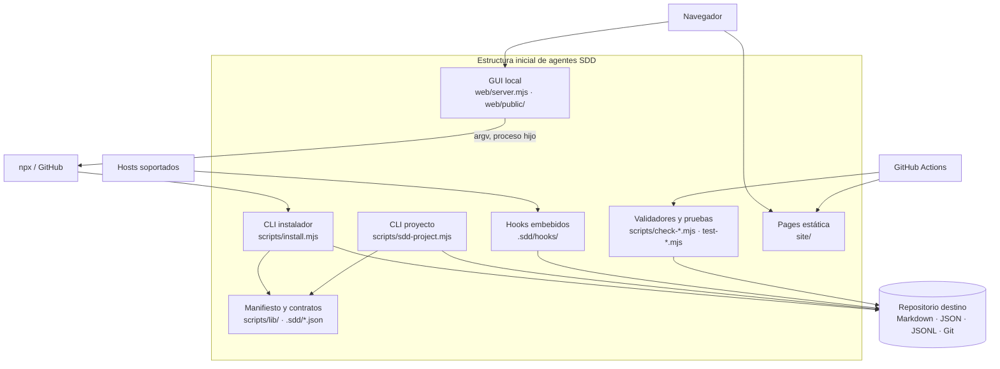

# Constitución arquitectónica del ecosistema SDD

> **Estado**: aprobada y vinculante desde 2026-08-21.
> **Aprobada por**: Jesus Chamorro (usuario), mediante la confirmación literal «aprobado continua».
>
> Describe y gobierna la arquitectura heredada que existe. No autoriza un refactor ni convierte
> deuda conocida en arquitectura deseada. El ADR-0001 aprobado la hace vinculante para todo
> cambio posterior; ningún plan puede asumir decisiones distintas en silencio.

---

## 1. Identidad

| Campo | Valor |
|---|---|
| Nombre | Estructura inicial de agentes SDD |
| Tipo | plantilla instalable y CLI de proyecto |
| Estado | activo · arquitectura heredada formalizada |
| Fecha de regularización | 2026-08-21 |
| Aprobación arquitectónica | Jesus Chamorro · 2026-08-21 |
| Producto | ecosistema portable de agentes, skills, guardas, gates y documentación viva |
| Estado de producto | `approved` en `.sdd/installed.json` |

La identidad operativa ya coincide con la tabla de `AGENTS.md`; no se modifica esa tabla durante
este onboarding.

## 2. Posición arquitectónica por eje

| Eje | Posición heredada | Justificación observada | Disparador de revisión |
|---|---|---|---|
| **Despliegue** | distribución monolítica con cuatro entrypoints | un paquete/repo contiene CLI, hooks, GUI local y sitio estático; no hay servicios persistentes | dividir paquete, desplegar un servicio remoto o necesitar escalado/fallo independiente |
| **Dependencias** | módulos procedurales por superficie técnica | política e I/O conviven en módulos grandes; hay helpers, no inversión sistemática de dependencias | refactor estructural aprobado que separe contratos y adaptadores |
| **Dominio** | cinco módulos funcionales dentro del mismo producto | distribución, circuito SDD, guardas/trazabilidad, publicación y experiencia de instalación comparten contratos de fichero | ownership y contratos independientes con necesidad real de evolución separada |
| **Integración** | llamadas síncronas, procesos hijos, filesystem y Git | CLI y hooks se ejecutan como procesos; la GUI lanza `npx`; SSE solo transmite salida local | añadir colas, eventos, webhooks externos o trabajo duradero asíncrono |
| **Datos** | ficheros compartidos con historial Git | Markdown/JSON/JSONL son el estado durable; `.sdd/state/` y `.sdd/conflicts/` son locales | introducir base de datos, almacenamiento remoto o consistencia multiusuario |
| **Experiencia** | CLI primaria, GUI local auxiliar y Pages informativa | las tres superficies existen y tienen ciclos operativos distintos | convertir la GUI en producto multiusuario o Pages en aplicación dinámica |
| **Organización interna** | por tipo y superficie técnica | `scripts/`, `.sdd/hooks/`, `web/` y `site/` agrupan tecnología, no verticales | una spec de refactor demuestra menor coste de cambio con otra organización |

**Resumen vinculante**: distribución monolítica Node.js, procedural y modular,
con cuatro entrypoints, contratos persistidos en ficheros/Git e integración local síncrona.

La decisión y sus alternativas están en
[`ADR-0001-arquitectura-heredada.md`](./adr/ADR-0001-arquitectura-heredada.md). La evidencia
observada está en [`CURRENT-STATE.md`](./CURRENT-STATE.md).

## 3. Vista de contexto — C4 nivel 1



## 4. Vista de contenedores — C4 nivel 2



## 5. Fronteras funcionales heredadas

| Frontera | Responsabilidad | Estado/datos que gobierna | Comunicación permitida |
|---|---|---|---|
| Distribución | instalar, actualizar y conservar trabajo previo | manifiesto, semillas, `.sdd/installed.json` | filesystem, Git y CLI |
| Circuito SDD | scaffolding, estado, gates y generadores | producto, specs, checks y configuración `.sdd/` | subcomandos y contratos de fichero |
| Guardas y trazabilidad | bloquear, enrutar y registrar acciones | hooks, territorios, JSONL y estado efímero | protocolo del host, filesystem y códigos de salida |
| Publicación | preparar y publicar documentación | `site/`, versión y memoria copiada | script local y GitHub Actions |
| Experiencia de instalación | acompañar preview, instalación y check | sesión local, token y salida de proceso | HTTP loopback, `fetch`/SSE y proceso hijo |

Estas fronteras son **módulos lógicos**, no servicios ni bounded contexts autónomos. Comparten
contratos y datos versionados. Solo se podrá declarar independencia mayor después de probarla con
tests de contrato y documentarla en un ADR.

## 6. Reglas de dependencia y contratos

La arquitectura heredada no cumple el diagrama clean de la plantilla original. Las reglas reales
que pasan a gobernar nuevos cambios son:

1. `package.json`, `scripts/lib/manifiesto.mjs`, los esquemas `.sdd/*.json`, los formatos de
   agentes/skills y los artefactos SDD son contratos versionados. Cambiarlos exige spec, tests de
   contrato y evidencia de instalación.
2. La librería estándar de Node es la única dependencia de runtime permitida por defecto. Añadir
   una dependencia, framework o servicio requiere investigación y ADR.
3. Los hooks se ejecutan como procesos embebidos y no dependen de la GUI ni de Pages.
4. La GUI local delega la instalación en el CLI mediante un proceso hijo con argv; no replica la
   política del instalador ni accede a un shell por concatenación de texto.
5. Pages es estática e informativa. No instala, no escribe en repositorios y no se convierte en
   fuente normativa del contrato.
6. El instalador preserva ficheros existentes y trata la ruta destino como dato no confiable. El
   manifiesto decide explícitamente qué se distribuye y excluye superficies propias de la
   plantilla como `web/`, `site/`, historia y pruebas internas.
7. Toda escritura versionada mantiene trazabilidad SDD; `.sdd/state/` y `.sdd/conflicts/` no se
   convierten en fuentes durables de producto.
8. Las fronteras nuevas usan contratos explícitos y pruebas de contrato. No se introduce acceso
   lateral implícito entre módulos.

## 7. Estructura de carpetas canónica heredada

```text
scripts/
├── install.mjs             CLI de distribución
├── sdd-project.mjs         CLI de estado y proyecto
├── check-*.mjs             validadores deterministas
├── test-*.mjs              arneses de integración/contrato
├── site-prep.mjs           preparación de Pages
└── lib/                    contratos y helpers compartidos

.sdd/
├── hooks/                  runtime de hooks portable
├── githooks/               puntos de entrada Git
├── *.json                  configuración versionada
├── state/                  estado efímero no versionado
└── conflicts/              conflictos preservados no versionados

web/
├── server.mjs              HTTP local
├── lib/                    validación y runner
└── public/                 HTML/CSS/JS de la GUI local

site/                       HTML/CSS/JS de GitHub Pages
docs/                       producto, specs, arquitectura, calidad y seguridad
.agents/                    definición canónica portable
.claude/ .codex/ .cursor/
.gemini/ .github/ .vscode/  adaptadores por host
```

No se crea un `src/` ficticio ni se renombra la estructura durante el onboarding. Una
reorganización requiere una spec de refactor y pruebas que demuestren que los contratos
instalables no cambian accidentalmente.

## 8. Stack heredado

| Capa | Tecnología | Versión/contrato | Motivo observado |
|---|---|---|---|
| Lenguaje/runtime | JavaScript ESM sobre Node.js | `>=18` | portabilidad y cero dependencias runtime |
| Framework | ninguno | librería estándar | restricción explícita del producto |
| Persistencia | Markdown, JSON, JSONL y Git | formatos versionados | estado auditable y portable |
| CLI | módulos `.mjs`, binario `sdd` | paquete npm/GitHub | entrada primaria |
| GUI local | `node:http` + HTML/CSS/JS nativos | solo `127.0.0.1` | acompañamiento sin servicio remoto |
| Sitio | HTML/CSS/JS estáticos | GitHub Pages | documentación pública sin backend |
| Tests | arneses propios Node | fixtures temporales | contrato portable sin framework externo |
| Lint/formato | `scripts/check-syntax.mjs` y `.editorconfig` | configuración del repo | determinismo sin dependencia externa |
| CI/CD | GitHub Actions | Windows/Linux × Node 18/20/22 | validar portabilidad y publicar Pages |

## 9. Estándares transversales

| Aspecto | Decisión vinculante |
|---|---|
| Errores CLI | códigos de salida distintos de cero, mensajes accionables y JSON cuando el comando ofrece `--json` |
| Logs/trazas | texto legible o JSONL append-only según contrato; nunca secretos, tokens ni contenido de `.env` |
| Configuración | JSON versionado bajo `.sdd/`; estado personal/efímero fuera de Git |
| Validación | argumentos, rutas, payloads HTTP, `Host` y datos externos se validan en su frontera |
| Seguridad de proceso | argv estructurado; shell solo como fallback documentado y con entrada validada; ninguna concatenación de comandos |
| Autenticación GUI | servidor solo loopback, validación de `Host` y token aleatorio por sesión en cabecera; no es autenticación multiusuario |
| API local | endpoints de `web/server.mjs`, privados a la sesión local; cualquier cambio requiere prueba de contrato |
| Datos | UTF-8; formatos Markdown/JSON/JSONL; escrituras conservadoras y conflictos preservados |
| Identificadores | IDs versionados de spec, tarea, control, agente y skill según sus contratos existentes |
| Fechas | ISO 8601 en datos de máquina; `YYYY-MM-DD` en documentación humana |
| Idioma | identificadores de código en inglés; documentación y specs en español |
| Dependencias | ninguna dependencia nueva sin spec/research y ADR si cambia la restricción de cero runtime |
| Git | historial como evidencia; tags de release inmutables; nunca `push --force` |
| Documentación | fuentes de verdad declaradas en `.sdd/docs.json`; no atribuir capacidades no observadas a scripts |

## 10. Objetivos de calidad y seguridad

| Métrica/control | Objetivo vigente |
|---|---|
| Portabilidad runtime | Windows y Linux con Node 18, 20 y 22 en CI |
| Tests de contratos instalables | toda modificación del manifiesto, CLI, hooks o formatos incluye regresión ejecutada |
| Cobertura V8 declarada | no caer por debajo del trinquete configurado en `.sdd/coverage.json`; priorizar caminos críticos |
| Olores | no superar `.sdd/smells.json`; el siguiente crecimiento de `test-install.mjs` exige partir la suite |
| Zonas críticas sin probar | objetivo 0; la GUI local consta como deuda hasta tener pruebas directas |
| Nivel ASVS | ASVS 5.0.0 L2 |
| Marco de riesgos | OWASP Top 10:2025; OWASP Agentic cuando aplique |
| Accesibilidad | WCAG 2.2 AA y heurísticas de Nielsen para superficies con UI |
| Secretos | 0 secretos, credenciales, `.env` o tokens en repositorio, logs y fixtures |
| Evidencia | ningún gate no ejecutado se presenta como verde |

## 11. Prohibiciones

- Describir la arquitectura como clean, hexagonal, microservicios o event-driven sin que el
  código y un ADR lo demuestren.
- Añadir base de datos, servicio remoto, cola, framework o dependencia runtime sin ADR.
- Duplicar en la GUI, Pages o adaptadores la política que gobiernan el manifiesto y los CLI.
- Cambiar un contrato instalable sin prueba de instalación y compatibilidad con destinos que ya
  contienen trabajo.
- Usar shell mediante cadenas construidas con entrada externa.
- Escuchar la GUI fuera de loopback o convertir su token local en autenticación multiusuario sin
  rediseño de seguridad.
- Publicar Pages como si fuese fuente ejecutable o canal de instalación.
- Versionar `.sdd/state/`, `.sdd/conflicts/`, configuración personal, secretos o `.env`.
- Reescribir JSONL append-only o historia de bitácora/ADR.
- Activar territorios o generadores propuestos sin aprobación y verificación determinista.
- Saltarse una spec porque una superficie se considere “auxiliar”. La excepción histórica de
  `web/` es deuda, no precedente.
- Elevar de nuevo el umbral de tamaño de `test-install.mjs` antes de pagar la deuda registrada.

## 12. Deuda heredada aceptada para regularización

La adopción no corrige estos puntos; los hace visibles:

- la GUI local fue creada fuera del circuito SDD/TDD y carece de pruebas directas observadas;
- `scripts/check-sdd.mjs`, `scripts/sdd-project.mjs` y las suites concentran responsabilidades;
- los territorios no cubren el código ejecutable;
- `T-010-05` sigue activa y puede contaminar atribución;
- el baseline aprobado conserva tres encabezados `pending`;
- Pages usa acciones móviles mientras otros workflows fijan SHA;
- la versión estable 0.7.0 no incluye todo lo publicado en `main`;
- `skills-sync.mjs` está descrito como sincronizador/generador sin realizar esa función;
- `site-prep.mjs` materializa salidas sin contrato en `.sdd/generators.json`.

La prioridad, evidencia y disparador de cada punto se mantienen en
[`docs/quality/TECH-DEBT.md`](../quality/TECH-DEBT.md).

## 13. Cómo se modifica esta constitución

1. Se crea un ADR nuevo con el cambio, alternativas —incluida mantener el estado—, consecuencias
   y condiciones observables de revisión.
2. Una persona aprueba o rechaza el ADR. Ningún agente simula esa aprobación.
3. Si se acepta, se actualizan esta constitución y `docs/bitacora/DECISIONS.md` en el mismo cambio.
4. Si afecta comportamiento, contrato, persistencia o seguridad, el trabajo entra por una spec
   aprobada y conserva TDD/evidencia.

Un ADR aceptado no se reescribe para cambiar de opinión: se marca como reemplazado y se crea otro.

## 14. ADR vigentes y propuestos

| ADR | Título | Estado |
|---|---|---|
| [`ADR-0001-arquitectura-heredada.md`](./adr/ADR-0001-arquitectura-heredada.md) | Adoptar y gobernar la arquitectura heredada | aceptado |

## 15. Condiciones de revisión global

Esta arquitectura debe revisarse si ocurre cualquiera de estos hechos:

- aparece una base de datos o persistencia remota;
- la GUI deja de ser local o se vuelve multiusuario;
- se añade una dependencia o framework de runtime;
- una superficie necesita desplegarse o escalar independientemente;
- el paquete se divide en varios artefactos versionados;
- se introduce integración asíncrona duradera;
- los contratos de fichero dejan de ser la fuente de estado principal.
