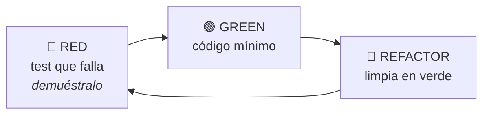

# Estrategia de test

Documento vinculante. Lo aplica `test-engineer` y lo exige `code-reviewer`.

---

## 1. TDD: el ciclo

1. **RED** — escribe el test, ejecútalo, **pega la salida del fallo**. Verifica que falla por
   el assert y no por un import roto.
2. **GREEN** — el código mínimo. Está permitido devolver una constante: el siguiente test te
   obligará a generalizar.
3. **REFACTOR** — con verde, limpia. Los tests también se refactorizan.

**Un test que nunca ha fallado no demuestra nada.**

---

## 2. Pirámide

| Nivel | Proporción | Qué prueba | Velocidad | Herramienta |
|---|---|---|---|---|
| Unitario | ~70 % | Dominio y aplicación, sin I/O | ms | `<...>` |
| Integración | ~20 % | Adaptadores reales (testcontainers) | s | `<...>` |
| Contrato | transversal | Cada frontera entre sistemas | s | `<...>` |
| E2E | ~10 % | Solo flujos críticos de negocio | min | Playwright |

**Antipatrón: cono de helado** (muchos E2E, pocos unitarios). Si la suite tarda más de
10 minutos en CI, algo está en el nivel equivocado.

---

## 3. Cómo se escribe un test

- Nombre: `debe_<comportamiento>_cuando_<condición>`. Se lee como una frase.
- Arrange · Act · Assert separados visualmente. **Un solo Act.**
- Un motivo de fallo por test.
- Sin lógica: nada de `if` ni bucles. Casos múltiples → `test.each` / `@parametrize`.
- Determinista: reloj, aleatoriedad, UUIDs y red **inyectados**. Nunca `sleep`; espera por condición.
- Independiente del orden; crea y limpia su propio estado.
- Prueba **comportamiento observable**, no implementación.
- Datos con Test Data Builder u Object Mother.

---

## 4. Dobles

| Doble | Para qué |
|---|---|
| Dummy | Rellenar un parámetro que no se usa |
| Stub | Devolver datos fijos |
| Spy | Verificar que se llamó |
| Mock | Verificar interacción con expectativas |
| **Fake** | Implementación ligera real (repositorio en memoria) ← **el preferido** |

**No mockees lo que no controlas.** Envuelve la librería de terceros en un puerto propio y
haz un fake de ese puerto. Mockear el SDK de un proveedor es deuda garantizada: cuando
cambien su API, tus tests seguirán en verde mintiendo.

---

## 5. Casos límite obligatorios

Vacío · nulo · uno · muchos · límite exacto (n, n-1, n+1) · negativo · cero · desbordamiento ·
Unicode y emojis · zonas horarias y cambio de hora · concurrencia y carrera · idempotencia ·
fallo de red y timeout · reintento · permisos insuficientes · dependencia externa caída ·
datos corruptos o parciales.

---

## 6. Tests de contrato

En cada frontera (API pública, evento publicado, integración con terceros), el contrato de
`contracts/` genera el test. **Consumer-driven**: el consumidor declara lo que espera, el
productor lo verifica en su CI. Un cambio incompatible **debe romper el build**.

---

## 7. E2E

- Solo flujos críticos de negocio: registro, login, compra, publicación.
- Selectores por **rol y texto accesible** (`getByRole`), nunca por clase CSS.
- Sin `waitForTimeout`: espera por estado.
- Datos propios por test, creados **por API**, no por UI.
- Un E2E intermitente se arregla o se borra. Un test flaky enseña al equipo a ignorar el rojo,
  y eso es peor que no tener test.

---

## 8. Criterios de suficiencia

| Métrica | Umbral |
|---|---|
| Cobertura dominio/aplicación | ≥ 80 % |
| Cobertura total | ≥ `<...>` % |
| Mutation score en el core | ≥ `<...>` % |
| Duración de la suite en CI | < 10 min |
| Tests flaky | 0 |
| `.only` / `.skip` en la rama principal | 0 |

La cobertura es un **termómetro, no el objetivo**. Un 95 % con asserts triviales vale menos
que un 70 % con casos límite reales. Por eso existe el mutation testing.

**Y por eso importa más que antes.** Los tests generados por un modelo tienen un patrón
reconocible: cobertura presentable y *mutation score* bajo, porque no detectan los defectos que se
les inyectan. Herramientas: **Stryker** (TypeScript/JS), **mutmut** (Python). Ratio test:código
sano en proyectos con TDD real: **1:1 a 1,5:1**.

El umbral de *mutation score* **no tiene cifra universal defendible**: se declara en la
constitución del proyecto y se justifica. Lo que no es negociable es medirlo en el core y
reportarlo en `evidence.md` como número, no como adjetivo.

El rigor se justifica con evidencia del propio proyecto: defectos escapados, caminos críticos,
mutation score y tiempo de feedback. Las cifras externas pueden orientar una investigación, pero
no se copian como umbral ni como decisión automática.

---

## 9. Auditoría de la suite

Señales de que los tests mienten: tests sin assert · asserts triviales (`expect(true)`) ·
tests que nunca han fallado · mocks que replican la implementación · dependencia del orden ·
setup gigante duplicado · cobertura alta con aserciones pobres.

Comprobación rápida: rompe una línea de producción a propósito. Si la suite sigue en verde,
esa línea no está probada.
