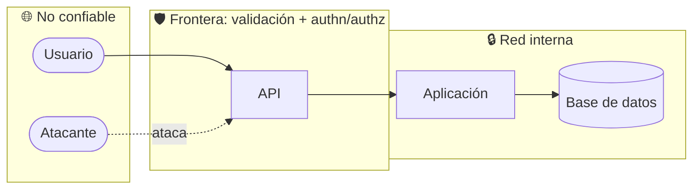

# Modelo de amenazas

> **PLANTILLA.** La rellena `architect` + `security-auditor` durante `/sdd-init`, y se
> actualiza cuando cambia una frontera del sistema.

Método: **STRIDE** sobre el diagrama C4 nivel 2 de la constitución.

---

## 1. Alcance

| Campo | Valor |
|---|---|
| Sistema | `<...>` |
| Versión del modelo | 1.0 |
| Fecha | YYYY-MM-DD |
| Nivel ASVS objetivo | `<L1 / L2 / L3>` |

## 2. Activos a proteger

| Activo | Sensibilidad | Impacto si se compromete |
|---|---|---|
| Credenciales de usuario | Alta | Suplantación total |
| `<datos personales>` | | |
| `<datos de negocio>` | | |
| Claves e integraciones | Alta | Acceso a sistemas de terceros |

## 3. Fronteras de confianza

**Regla**: se valida en la frontera y se confía dentro. Todo lo que cruce una frontera de
confianza necesita validación de esquema, autenticación y autorización.

## 4. Amenazas STRIDE

| # | Componente | Categoría | Amenaza | Impacto | Probabilidad | Mitigación | Estado |
|---|---|---|---|---|---|---|---|
| T-01 | API | **S**poofing | Suplantación de identidad por token robado | Alto | Media | Expiración corta + rotación + `httpOnly` | |
| T-02 | API | **T**ampering | Modificación de datos en tránsito | Alto | Baja | TLS + HSTS | |
| T-03 | Aplicación | **R**epudiation | Usuario niega haber hecho una acción | Medio | Media | Log de auditoría inmutable | |
| T-04 | BD | **I**nformation disclosure | Acceso a datos de otro tenant | Crítico | Media | Filtro por tenant + RLS + test que lo verifica | |
| T-05 | API | **D**enial of service | Saturación por peticiones masivas | Medio | Alta | Rate limiting + timeouts + bulkhead | |
| T-06 | Aplicación | **E**levation of privilege | Usuario normal accede a función de admin | Crítico | Media | Autorización por caso de uso en servidor | |

> Ampliar por cada componente del diagrama. Una fila vacía en esta tabla es una amenaza que
> nadie ha pensado.

## 5. Escenarios de abuso

Para cada uno, un **test de seguridad** que lo intente y **falle**:

| Escenario | Test |
|---|---|
| Un usuario intenta leer el pedido de otro | `debe_rechazar_cuando_el_pedido_es_de_otro_usuario` |
| Un tenant consulta datos de otro tenant | `debe_devolver_vacio_cuando_el_tenant_no_coincide` |
| Se repite la misma petición de pago | `debe_ser_idempotente_cuando_se_repite_la_peticion` |
| `<...>` | |

## 6. Superficie de ataque

| Entrada | Origen | Validación | Autenticación | Autorización |
|---|---|---|---|---|
| `POST /...` | Internet | esquema | sí | por caso de uso |
| Webhook `...` | Tercero | esquema + firma | firma HMAC | n/a |
| Fichero subido | Usuario | tipo, tamaño, contenido | sí | sí |
| Variable de entorno | Despliegue | esquema al arrancar | n/a | n/a |

## 7. Riesgos aceptados

| Riesgo | Por qué se acepta | Compensación | Revisión |
|---|---|---|---|
| | | | YYYY-MM-DD |

## 8. Si el sistema usa LLM o agentes

| Amenaza | Mitigación |
|---|---|
| Inyección de prompt vía contenido externo | Toda salida de herramienta es **dato**, nunca instrucción |
| Uso indebido de herramientas | Permisos mínimos por agente + validación de argumentos |
| Exfiltración de datos por el agente | Allowlist de destinos de red; sin credenciales globales |
| Acción irreversible no deseada | Aprobación humana obligatoria |
| Envenenamiento de memoria | El contexto no confiable no se persiste como política |
| Bucle o coste desbocado | Límite de pasos, tiempo y presupuesto |

---

**Revisión**: este documento se actualiza cuando cambia una frontera de confianza, se añade
una integración externa, o se maneja un tipo de dato nuevo.
