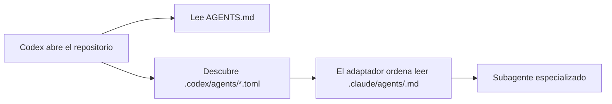

# Plan técnico · 001-agentes-codex

## 1. Resumen

Añadir una superficie nativa y aislada para Codex bajo `.codex/`. Cada agente será un TOML
mínimo con nombre, descripción e instrucciones para cargar el perfil canónico equivalente.
El instalador por proyecto copiará esta superficie automáticamente y el gate comprobará esquema,
referencia y paridad. No se modificarán los adaptadores de otros IDE.

## 2. Componentes

- `.codex/config.toml`: habilita los subagentes del proyecto sin fijar modelo ni concurrencia.
- `.codex/agents/*.toml`: veinte adaptadores; los cuatro auditores conservan solo lectura.
- `scripts/check-sdd.mjs`: valida el esquema oficial y la paridad con `.claude/agents/`.
- `scripts/test-install.mjs`: demuestra que `init` distribuye la superficie de Codex y que el gate detecta ausencias.
- Documentación y bitácora: corrigen la afirmación antigua de que Codex solo admite agentes personales.

## 3. Flujo

## 4. Estrategia de test

1. RED: el test del instalador exige configuración y agentes de Codex; falla porque aún no existen.
2. GREEN: se añaden los TOML y la validación de paridad.
3. Regresión: `npm run verify` verifica gates, skills, hooks e instalación de todas las superficies.

## 5. Seguridad y permisos

`orchestrator`, `code-reviewer`, `security-auditor` y `research-analyst` declaran
`sandbox_mode = "read-only"`. Los demás heredan el sandbox y las aprobaciones del padre.
No se añaden MCP, secretos ni configuración global.

## 6. Riesgos y reversión

La reversión consiste en retirar `.codex/` y las validaciones/documentación asociadas. Las demás
superficies quedan desacopladas, por lo que no requieren restauración.

## 7. Conformidad

- Solución mínima, sin dependencias y con una única fuente canónica.
- Cubre RF-01 a RF-05 sin introducir funcionalidad fuera de alcance.
- No requiere ADR: añade un adaptador de host sin cambiar la arquitectura del sistema SDD.
