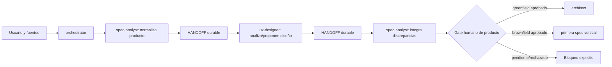

# Diseño del flujo documental · 005

No aplica diseño de interfaz de aplicación. El flujo conversacional/documental es:

Estados del gate: `legacy-pending`, `pendiente`, `aprobado`, `rechazado`. No existe transición a
arquitectura/spec si el estado es pendiente o rechazado.
