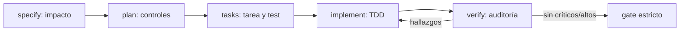

# Plan técnico · 007-seguridad-jwt-owasp-2025

| Campo | Valor |
|---|---|
| **Spec** | [`spec.md`](./spec.md) |
| **Estado** | aprobado |
| **Fecha** | 2026-08-11 |
| **Arquitectura vigente** | Plantilla y CLI Node.js 18+, sin dependencias de runtime |
| **ADR relacionados** | ninguno: se amplía el contrato sin elegir auth para aplicaciones |
| **Gate de producto** | `legacy-pending` · capacidad interna de la plantilla |
| **Gate funcional** | `approved` · usuario · 2026-08-11 |
| **Gate de diseño** | `skipped-no-ui` |

## 1. Resumen de la solución

Se convierte la política OWASP/JWT existente en un contrato trazable y verificable. Se actualizan
referencias, plantillas, skills y perfiles; se añade un gate `security` configurable y validación
material del informe. Todo sigue siendo agnóstico de stack y el instalador entrega referencias
vírgenes, sin decisiones de autenticación.

## 2. Aplicación de la arquitectura

| Capa | Cambio |
|---|---|
| Doctrina | Top 10:2025, ASVS 5.0.0, referencia JWT/CSRF y checklist versionada |
| Contrato SDD | Impacto y matriz de seguridad en spec/plan/tasks/test/evidence |
| Agentes/skills | `security-auditor`, `/security-scan`, planner, tasks, verify y especialistas |
| Herramienta | gate `security`, detección y comprobaciones estrictas del informe/matriz |
| Distribución | manifiesto, paquete, adaptadores multihost, workflow y pruebas de instalación |

Reglas de dependencia respetadas: sí. No se añade dependencia de runtime.

## 3. Componentes

| Componente | Responsabilidad | Riesgo |
|---|---|---|
| `docs/security/AUTH-TOKENS.md` | Referencia stack-neutral para auth, JWT, cookies y CSRF | Bajo |
| `SECURITY-CHECKLIST.md` | Catálogo local versionado y mapeado | Medio |
| Plantillas de spec | Trazabilidad de seguridad desde impacto hasta evidencia | Alto |
| `check-sdd.mjs` | Validar matrices e informe antes de `GO` | Alto |
| `sdd-project.mjs` | Detectar gate `security` solo con evidencia | Medio |
| Router | Distinguir feature de auth frente a auditoría | Medio |
| Instalador/CI | Propagar sin duplicar y fijar cadena de suministro | Alto |

## 4. Patrones

| Problema | Patrón | Alternativa descartada | Motivo |
|---|---|---|---|
| OWASP cambia IDs/categorías | IDs locales estables + mapeo versionado | Usar `A0X` como ID interno | Rompería trazabilidad histórica |
| Herramientas distintas por stack | Gate agregado configurable | Imponer SAST concreto | La plantilla debe ser universal |
| Auditor read-only necesita evidencia durable | HANDOFF estructurado + materialización autorizada | Dar escritura al auditor | Rompería aislamiento |
| Brownfield histórico | Migración progresiva `security-pending` | Bloqueo inmediato | Rompería adopción |

## 5. Flujo

## 6. Datos y contratos

Sin base de datos. Se amplía el esquema documental de tareas, plan, test, evidencia e informe de
seguridad. Los formatos son compatibles: las specs históricas quedan en transición; las nuevas
specs sensibles usan el contrato completo.

## 7. Estrategia de test

Ver [`test-plan.md`](./test-plan.md). Tests de integración sobre copias temporales reales del repo:
fallan primero con el contrato actual y pasan después de cada cambio.

## 8. Calibración

| Módulo / ruta | Tier | Motivo |
|---|---|---|
| `scripts/check-sdd.mjs` | CORE | Decide si una entrega sensible puede declarar `GO` |
| `scripts/sdd-project.mjs` | CORE | Ejecuta/detecta gates del proyecto |
| `scripts/test-install.mjs` | IMPORTANT | Verifica distribución e idempotencia |
| `.sdd/hooks/sdd-router.mjs` | IMPORTANT | Orienta la fase correcta sin bloquear |
| docs, skills y perfiles | INFRASTRUCTURE | Contrato declarativo validado por pruebas estructurales |

## 9. Seguridad

| Control | ASVS | OWASP | Aplica | Decisión / justificación | Tarea | Test | Evidencia |
|---|---|---|---|---|---|---|---|
| SEC-STD-001 | ASVS 5.0.0 (política) | Top 10:2025 | sí | Versionar estándar y mapeo sin heredar Top 10:2021 | T-007-02 | `scripts/test-install.mjs::seguridad_versionada` | `evidence.md#SEC-STD-001` |
| SEC-TRACE-001 | ASVS 5.0.0 (ciclo seguro) | A06:2025 | sí | Matriz completa por spec sensible | T-007-03 | `scripts/test-install.mjs::matriz_seguridad` | `evidence.md#SEC-TRACE-001` |
| SEC-JWT-001 | v5.0.0-9.1.1/9.1.2/9.1.3/9.2.1/9.2.2/9.2.3; 7.4.1; 10.4.5 | A07:2025 | sí | Contrato JWT condicional completo, nunca mecanismo predeterminado | T-007-02 | `scripts/test-install.mjs::contrato_jwt` | `evidence.md#SEC-JWT-001` |
| SEC-CSRF-001 | v5.0.0-3.5.1/3.5.2/3.5.3 | A01:2025 | sí | Transporte y mitigación explícitos; SameSite solo defensa en profundidad | T-007-02 | `scripts/test-install.mjs::csrf_no_samesite_solo` | `evidence.md#SEC-CSRF-001` |
| SEC-GATE-001 | ASVS 5.0.0 (verificación) | A02:2025 | sí | Informe material y veredicto bloqueante | T-007-05 | `scripts/test-install.mjs::gate_security_e_informe` | `evidence.md#SEC-GATE-001` |
| SEC-SUPPLY-001 | ASVS 5.0.0 (dependencias) | A03:2025 | sí | Acciones fijadas y auditoría honesta | T-007-06 | `scripts/test-install.mjs::workflow_supply_chain` | `evidence.md#SEC-SUPPLY-001` |

## 10. Rendimiento

Los parsers recorren únicamente las specs y el informe objetivo. No se añaden accesos de red ni
dependencias. El coste esperado sigue por debajo de un segundo en este repositorio.

## 11. Observabilidad

Los comandos imprimen la regla y el control exactos que fallan. Los informes conservan alcance,
estándares, conteos, veredicto y controles no ejecutados. Sin datos personales ni tokens.

## 12. Despliegue y compatibilidad

- Greenfield: contrato estricto para specs sensibles nuevas.
- Brownfield: `security-pending` para historia existente; nuevas specs sensibles cumplen completo.
- Update: bloques gestionados y ficheros de referencia; nunca vacía informes o decisiones.
- Sin feature flags. Versión objetivo `v0.5.0`.

## 13. Riesgos y mitigaciones

| Riesgo | Mitigación |
|---|---|
| Falsos positivos por Markdown | Contrato de tabla cerrado y mensajes precisos |
| Duplicados por host | Fuente canónica + adaptadores mínimos + test de paridad |
| Bloquear repos sin stack | Gate sin comando queda `unconfigured`; se bloquea solo un `GO` sensible no justificado |
| Informe inventado | Campos y conteos coherentes; salida real en evidencia |

## 14. Reversión

Un único `git revert <commit-007>` restaura el contrato previo. No hay migraciones de datos. Los
proyectos instalados conservan sus documentos y reportes por la política brownfield.

## 15. Conformidad

- [x] Arquitectura y dependencias respetadas
- [x] Sin agente, skill o comando adicional
- [x] Cada RF y CA tiene tarea/test previsto
- [x] Seguridad modelada antes de implementar
- [x] Sin decisiones JWT heredadas por greenfield
- [x] Plan aprobado explícitamente por el usuario el 2026-08-11

## 16. Gate humano

| Campo | Valor |
|---|---|
| **Estado** | `approved` |
| **Persona** | usuario |
| **Fecha** | 2026-08-11 |
| **Alcance aprobado** | plan completo de integración JWT, OWASP 2025, gates, instalador y hosts |
| **Condiciones / riesgos aceptados** | entrega final sigue en `NO-GO` hasta verificaciones |

### HANDOFF
- Agente origen: planner
- Fase completada: plan
- Artefactos: `plan.md`, `test-plan.md`, `research.md`, `data-model.md`, `contracts/`
- Patrones aplicados: IDs locales, gate agregado, transición progresiva, auditor read-only
- Dependencias nuevas: ninguna
- Conformidad: OK
- Gate humano del plan: approved · usuario · 2026-08-11
- Siguiente agente sugerido: planner — comando: `/sdd-tasks`
