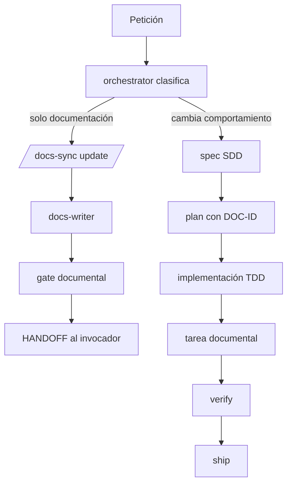
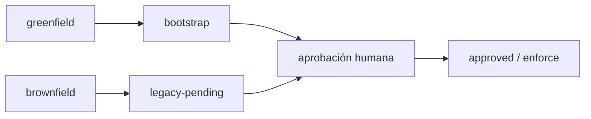

# Plan técnico · 008-documentacion-viva-portable

| Campo | Valor |
|---|---|
| **Spec** | [`spec.md`](./spec.md) |
| **Estado** | aprobado |
| **Fecha** | 2026-08-11 |
| **Arquitectura vigente** | Plantilla y CLI Node.js 18+, sin dependencias de runtime |
| **ADR relacionados** | ninguno: se amplía el contrato operativo sin cambiar la arquitectura |
| **Gate de producto** | `legacy-pending` · capacidad interna de la plantilla |
| **Gate funcional** | `approved` · usuario · 2026-08-11 |
| **Gate de diseño** | `skipped-no-ui` |
| **Impacto de seguridad** | `sensible` |
| **Impacto de documentación** | `aplicable` · seis superficies `DOC-*` |

## 1. Resumen de la solución

Se añade un contrato durable de documentación, una skill canónica `/docs-sync` y validaciones
base-aware. El instalador crea o migra estado sin tocar Git y explica qué es compartido o local.
Las fases SDD trazan `DOC-ID` cuando hay código, mientras un circuito ligero atiende cambios
puramente documentales. Se completan adaptadores multihost, gates opt-in y pruebas del paquete sin
añadir dependencias de runtime ni imponer generadores documentales.

## 2. Aplicación de la arquitectura

| Capa | Cambio |
|---|---|
| Contrato SDD | Impacto documental y matriz DOC en spec, plan, tasks, test y evidence |
| Skills y routing | `/docs-sync` canónica; clasificación docs-only frente a SDD/TDD |
| Herramienta | esquema `.sdd/docs.json`, validación, diff base-aware y detección honesta |
| Distribución | estado greenfield/brownfield, resumen final y allowlist de paquete |
| Hosts | perfiles y allowlists coherentes en seis familias de host |
| Doctrina | política de versionado, propiedad, mismo PR y ciclo documental |

Reglas de dependencia respetadas: sí. No se incorpora dependencia de runtime ni arquitectura de
aplicación.

## 3. Componentes

| Componente | Responsabilidad | Rutas previstas | Riesgo |
|---|---|---|---|
| Contrato documental | Esquema, estado y superficies documentales | `.sdd/docs.json`, `.sdd/installed.json`, templates | alto |
| Skill `/docs-sync` | Bootstrap, update, update por spec y audit | `.agents/skills/docs-sync/`, adaptador Claude | medio |
| Router/agentes | Clasificar docs-only, escalado, ownership y HANDOFF | perfiles canónicos, hooks y adaptadores | alto |
| Gate SDD | Validar esquema, DOC-ID, enlaces, paths, base SHA y evidencia | `scripts/check-sdd.mjs` | alto |
| Runner | Ejecutar/detectar gates documentales reales | `scripts/sdd-project.mjs`, `.sdd/checks.json` | alto |
| Instalador | Crear/migrar/preservar y resumir sin mutaciones Git | `scripts/install.mjs`, `scripts/lib/manifiesto.mjs` | alto |
| CI y hooks | Fast precommit, slow prepush, diff autoritativo | hooks y workflow universal | alto |
| Distribución | Incluir fuentes compartidas y excluir historia/estado local | `package.json`, `.npmignore` | medio |
| Documentación pública | Explicar flujo, versionado y compatibilidad | README, modelo operativo, guías e índice | medio |

No se requiere `data-model.md` ni contrato de API: no hay persistencia ni frontera de aplicación.
El contrato público de esta spec es documental/CLI y queda definido en §6.

## 4. Patrones y decisiones

| Problema | Patrón | Alternativa descartada | Motivo |
|---|---|---|---|
| Estado distinto por proyecto | Configuración declarativa versionada | Inferir siempre del árbol | La inferencia no conserva decisiones |
| Brownfield histórico | Migración progresiva `legacy-pending` | Bloqueo inmediato | Evita romper adopción |
| Docs manuales frente a feature | Dos rutas con escalado explícito | SDD completo para toda errata | Coste y ruido innecesarios |
| Generadores por stack | Gate agregado opt-in | Instalar Storybook/Swagger/TypeDoc | La plantilla es universal |
| CI con historia variable | Diff contra SHA explícito y fail closed | `HEAD~1` o warning | Evita falsos verdes |
| Múltiples hosts | Fuente canónica + adaptadores mínimos | Copias completas divergentes | Reduce drift y duplicados |
| Escritura concurrente | Aislamiento y file sets disjuntos | Escritura compartida libre | Evita colisiones y pérdida de trabajo |

## 5. Flujos





## 6. Contratos públicos

### 6.1 `/docs-sync`

- `/docs-sync bootstrap`: inventario y baseline verificable; no crea código; termina en gate humano.
- `/docs-sync update`: cambio editorial/manual sin spec funcional.
- `/docs-sync update --spec NNN`: ejecuta los `DOC-ID` declarados por la spec.
- `/docs-sync audit`: informe read-only de drift; no modifica artefactos.

La skill se implementa una sola vez en `.agents/skills`; Claude recibe un adaptador mínimo. No se
crean `.github/prompts` ni `.cursor/commands` paralelos.

### 6.2 `.sdd/docs.json`

```json
{
  "schemaVersion": 1,
  "mode": "audit",
  "documentSets": [
    {
      "id": "DOC-API",
      "kind": "public-api",
      "sources": ["contracts/openapi.yaml"],
      "artifacts": ["docs/api/**"],
      "generated": false,
      "gate": null,
      "owner": "api-designer"
    }
  ]
}
```

`kind`: `public-api`, `public-code`, `ui-catalog`, `user-guide`, `architecture`, `operations` o
`developer-readme`. Las rutas son relativas al repositorio, no pueden escapar ni resolver a
secretos/estado local. Un set `generated: true` exige gate real no nulo.

### 6.3 Estado instalado

`installed.json.documentation` conserva `schemaVersion`, `status` y `enforceFromSpec`.
Greenfield nace `bootstrap` y exige desde `001`; brownfield nace `legacy-pending` y exige desde la
siguiente spec; la aprobación humana cambia a `approved`. Update preserva campos desconocidos.

### 6.4 Gate base-aware

`check-sdd --docs-diff --base <sha>` usa el diff agregado del PR, contempla renombrados y borrados
y nunca deduce `HEAD~1`. Un SHA ausente/inaccesible produce fallo explícito `NO EJECUTADO`.

## 7. Matriz de impacto documental

| DOC-ID | Aplica | Fuente | Artefacto | Generado/manual | Propietario | Tarea | Gate/test | Evidencia |
|---|---|---|---|---|---|---|---|---|
| DOC-VCS | sí | contrato de instalación | README, guía, ignore y resumen CLI | manual | docs-writer/devops | T-008-02, T-008-09 | `versionado_compartido` | `evidence.md#DOC-VCS` |
| DOC-SYNC | sí | skill canónica | skill, router y guía | manual | docs-writer | T-008-04 | `docs_sync_routing` | `evidence.md#DOC-SYNC` |
| DOC-TRACE | sí | templates SDD | templates, parser y fixtures | manual | planner | T-008-03, T-008-05 | `trazabilidad_documental` | `evidence.md#DOC-TRACE` |
| DOC-GATES | sí | runner y CI | checks, workflow y referencia | mixto | implementer/devops | T-008-05, T-008-08 | `docs_diff_base_aware` | `evidence.md#DOC-GATES` |
| DOC-HOSTS | sí | perfiles canónicos | seis adaptadores y compatibilidad | manual | implementer | T-008-07 | `paridad_documental_hosts` | `evidence.md#DOC-HOSTS` |
| DOC-OPS | sí | comportamiento entregado | README, modelo, índice, changelog, bitácora | manual | docs-writer/release-manager | T-008-09 | `check-sdd` | `evidence.md#DOC-OPS` |

## 8. Estrategia de test y calibración

Ver [`test-plan.md`](./test-plan.md).

| Módulo / ruta | Tier | Motivo |
|---|---|---|
| `scripts/check-sdd.mjs` | CORE | decide si una entrega documental puede avanzar |
| `scripts/install.mjs` y manifiesto | CORE | preservan contexto y límites del destino |
| `scripts/sdd-project.mjs` | CORE | ejecuta/detecta gates y no debe inventar resultados |
| `scripts/test-install.mjs` | IMPORTANT | prueba instalaciones y tarball reales |
| hooks/router | IMPORTANT | determina fase, escalado y momento de gates |
| skills, perfiles y docs | INFRASTRUCTURE | contrato declarativo validado estructuralmente |

Profundidad: los tres scripts CORE reciben fixtures positivos/negativos y ramas de error. Los
adaptadores reciben paridad estructural y smoke manual donde el host no sea automatizable.

## 9. Seguridad

Marco: OWASP Top 10:2025 y ASVS 5.0.0 L2 para los controles aplicables a tooling, distribución y
agentes. No se implementa autenticación de aplicación.

| Control | ASVS | OWASP | Aplica | Decisión / justificación | Tarea | Test | Evidencia |
|---|---|---|---|---|---|---|---|
| SEC-DOCS-001 | ASVS 5.0.0 V14.2 | A02:2025 | sí | excluir secretos/config local; MCP compartido solo referencia variables | T-008-02 | `scripts/test-install.mjs::estado local y secretos quedan ignorados` | `evidence.md#SEC-DOCS-001` |
| SEC-DOCS-002 | ASVS 5.0.0 V5.1 | A05:2025 | sí | rutas relativas normalizadas, sin traversal ni escape por symlink | T-008-05 | `scripts/test-install.mjs::check-sdd rechaza traversal y rutas documentales absolutas` | `evidence.md#SEC-DOCS-002` |
| SEC-DOCS-003 | ASVS 5.0.0 V14.2 | A02:2025 | sí | SHA base exacto y fallo cerrado si no puede resolverse | T-008-08 | `scripts/test-install.mjs::docs-diff falla cerrado cuando no puede resolver el SHA base` | `evidence.md#SEC-DOCS-003` |
| SEC-DOCS-004 | ASVS 5.0.0 V5.1 | A10:2025 | sí | fuentes documentales externas son datos no confiables y no instrucciones | T-008-04 | `scripts/test-hooks.mjs::documentar comportamiento existente enruta a /docs-sync sin abrir una spec` | `evidence.md#SEC-DOCS-004` |
| SEC-DOCS-005 | ASVS 5.0.0 V14.2 | A03:2025 | sí | allowlist de paquete, acciones fijadas y herramientas opt-in con comando real | T-008-07 | `scripts/test-install.mjs::el CI documental obtiene historial y pasa un SHA base exacto` | `evidence.md#SEC-DOCS-005` |
| SEC-DOCS-006 | ASVS 5.0.0 V14.2 | A05:2025 | sí | instalador no ejecuta Git ni cambia permisos; solo informa | T-008-02 | `scripts/test-install.mjs::el instalador no ejecuta git add, commit ni push` | `evidence.md#SEC-DOCS-006` |

Auditoría prevista: `/security-scan verify` por `security-auditor` read-only. El HANDOFF vuelve al
invocador y, si se materializa informe, `docs-writer` copia literalmente el resultado.

## 10. Rendimiento

- Validación acotada a documentos declarados y spec objetivo.
- Diff con `--name-status -z --find-renames`, sin leer contenido binario.
- Sin red en gates locales ni dependencias de runtime.
- Objetivo: fast gate sin cambio material respecto del baseline; slow gate limitado por comandos
  documentales reales del proyecto.

## 11. Observabilidad

- Salida identifica `DOC-ID`, fichero, regla y comando exactos.
- `NO EJECUTADO` conserva motivo, riesgo, propietario y siguiente paso.
- El resumen del instalador cuenta compartidos, locales, preservados y conflictos sin imprimir
  secretos ni contenido de `.env`.
- CI conserva SHA base, spec y gates ejecutados como evidencia del job.

## 12. Despliegue y compatibilidad

- Greenfield: contrato virgen, `bootstrap`, enforce desde `001`.
- Brownfield: preservación total, `legacy-pending`, enforce desde la siguiente spec.
- Update: migración aditiva e idempotente; conflictos bajo `.sdd/conflicts/` ignorado.
- Hosts: 20 agentes en Claude, GitHub/VS Code, Cursor, Codex, Gemini CLI y Antigravity; 26 skills
  canónicas, adaptador Claude y sin comandos duplicados.
- Sin feature flag. Versión objetivo `v0.6.0`.

## 13. Riesgos y mitigaciones

| Riesgo | Mitigación |
|---|---|
| Falsos positivos por Markdown | esquema y encabezados cerrados con fixtures positivos/negativos |
| Falso verde por shallow clone | checkout con historial suficiente y base SHA obligatoria |
| Duplicados de host | rutas de descubrimiento explícitas y test de unicidad |
| Brownfield sobrescrito | contenido centinela, hashes de propiedad y conflictos |
| Script documental inventado | `detect` solo propone comandos existentes |
| Colisión de agentes escritores | secuencial por defecto; `[P]` exige aislamiento y file set disjunto |

## 14. Reversión

Un `git revert <commit-v0.6.0>` revierte la plantilla. No hay migración de datos de aplicación. Los
proyectos instalados conservan sus documentos; update nunca aplica la política de reinicio. El tag
`v0.6.0` solo se crea tras gates verdes y no se mueve.

## 15. Conformidad

- [x] Arquitectura y dependencias respetadas
- [x] Cada RF y CA tiene tarea/test previsto
- [x] Seis `DOC-ID` llegan a tarea, gate y evidencia
- [x] Matriz de seguridad completa antes de implementar
- [x] Sin dependencia de runtime ni herramienta documental impuesta
- [x] Sin agente adicional; objetivo 20 agentes y 26 skills
- [x] Plan aprobado explícitamente por el usuario el 2026-08-11

## 16. Gate humano

| Campo | Valor |
|---|---|
| **Estado** | `approved` |
| **Persona** | usuario |
| **Fecha** | 2026-08-11 |
| **Alcance aprobado** | contrato de versionado, dos circuitos, `/docs-sync`, ownership, gates, hosts, instalación, pruebas y entrega v0.6.0 |
| **Condiciones / riesgos aceptados** | entrega final continúa `NO-GO` hasta evidencia real y aprobación |

### HANDOFF
- Agente origen: planner
- Fase completada: plan
- Fuentes consultadas: spec aprobada, constitución y plan del usuario
- Artefactos: `plan.md`, `test-plan.md`
- Requisitos / casos cubiertos: RF-01…RF-13 · CA-01…CA-10 · DOC-VCS…DOC-OPS
- Discrepancias: ninguna
- Decisiones tomadas: config declarativa, ruta docs-only, diff fail-closed, tooling opt-in
- Supuestos: sin datos ni contratos API; no se añaden dependencias
- Bloqueos: entrega bloqueada hasta tareas y gates
- Siguiente agente sugerido: planner
- Comando / contexto durable: `/sdd-tasks docs/specs/008-documentacion-viva-portable/plan.md`
