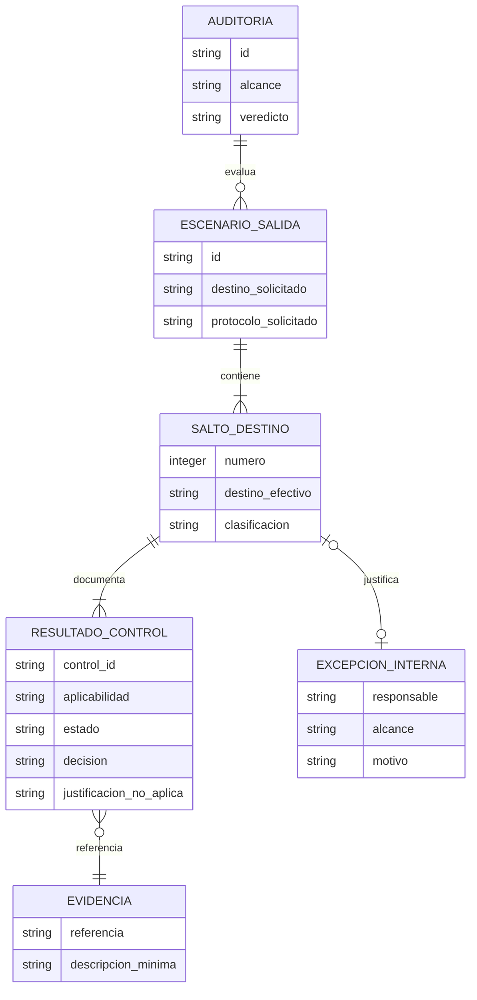

# Modelo de datos · 016-cobertura-ssrf-egress

No se añade base de datos, fichero de estado ni esquema persistente. Este modelo describe el
vocabulario documental que una auditoría SSRF/egress debe conservar en su informe humano. El JSON
`sdd-security-report:v1` no cambia.

## Diagrama conceptual

## Entidades documentales

### `Auditoria`

| Campo | Tipo | Nulo | Restricción | Notas |
|---|---|---|---|---|
| `id` | texto | no | identificador del informe/spec | No se crea un ID global nuevo |
| `alcance` | texto | no | rutas/escenarios revisados | Coincide con el HANDOFF de seguridad |
| `veredicto` | enum | no | `BLOCKED`, `CONDITIONAL`, `PASS` | Vocabulario existente de `sdd-security-report:v1` |

### `EscenarioSalida`

| Campo | Tipo | Nulo | Restricción | Notas |
|---|---|---|---|---|
| `id` | texto | no | único dentro del informe | Permite agrupar sin perder traza |
| `destino_solicitado` | texto minimizado | no | identificable sin credenciales | Nunca incluye userinfo, tokens ni cuerpos |
| `protocolo_solicitado` | texto | no | valor observado o `desconocido` | `desconocido` produce hallazgo, no verde |

### `SaltoDestino`

| Campo | Tipo | Nulo | Restricción | Notas |
|---|---|---|---|---|
| `numero` | entero | no | `>= 0`, ordenado por escenario | Cero representa el destino inicial |
| `destino_efectivo` | texto minimizado | no | dirección/nombre realmente evaluado | Incluye todas las resoluciones A/AAAA relevantes |
| `clasificacion` | enum | no | `permitido`, `metadata`, `local`, `privado`, `link-local`, `otro-no-permitido` | La clasificación no sustituye la decisión |

### `ResultadoControl`

| Campo | Tipo | Nulo | Restricción | Notas |
|---|---|---|---|---|
| `control_id` | `SEC-*` | no | control existente en `plan.md` | Trazable a tarea, test y evidencia |
| `aplicabilidad` | enum | no | `aplica`, `no-aplica` | Se decide por control; nunca se presume |
| `estado` | enum | condicional | `superado`, `fallido`, `no ejecutado` | Obligatorio solo si `aplicabilidad=aplica` |
| `decision` | texto | condicional | resultado o motivo del bloqueo | Obligatorio si aplica; `no ejecutado` conserva riesgo, owner y siguiente paso |
| `justificacion_no_aplica` | texto | condicional | motivo material específico | Obligatorio solo si `aplicabilidad=no-aplica`; no se confunde con estado |

### `ExcepcionInterna`

| Campo | Tipo | Nulo | Restricción | Notas |
|---|---|---|---|---|
| `responsable` | texto | no | persona/rol identificable | No existe para destinos metadata |
| `alcance` | texto | no | destino, uso y duración acotados | Una aprobación general no basta |
| `motivo` | texto | no | justificación material | Enlaza evidencia verificable |

### `Evidencia`

| Campo | Tipo | Nulo | Restricción | Notas |
|---|---|---|---|---|
| `referencia` | texto/ruta | no | localizable desde el informe | No incorpora el cuerpo completo |
| `descripcion_minima` | texto | no | suficiente para reconstruir el control | Sin PII innecesaria, tokens ni secretos |

## Invariantes

1. Toda petición saliente tiene al menos un `EscenarioSalida` y un `SaltoDestino` evaluado.
2. Cada salto conserva decisiones explícitas de destino y protocolo antes de figurar como seguro.
3. Una redirección crea otro `SaltoDestino`; no hereda la aprobación del salto anterior.
4. `metadata` solo admite resultado de rechazo; nunca tiene `ExcepcionInterna`.
5. `local`, `privado` y `link-local` solo se aceptan con excepción completa.
6. `no-aplica` es aplicabilidad, no estado; exige justificación material y no genera un resultado.
7. Un control aplicable sin evidencia es `no ejecutado`, nunca `superado`.
8. Agrupar hallazgos no elimina los IDs de los escenarios afectados.
9. La evidencia no conserva credenciales, secretos ni cuerpos completos.

## Relaciones, índices y migraciones

No hay relaciones persistidas, índices ni migraciones. Las entidades son una vista conceptual de
una tabla Markdown dentro del informe humano. No se modifica `sdd-security-report:v1`, no hay
backfill y los informes históricos siguen siendo válidos.

| Cambio | Reversible | Bloquea | Duración estimada |
|---|---|---|---|
| Añadir guía de escenarios SSRF a informes futuros | sí, mediante revert | no migra historia | inmediata |

## Datos personales y retención

| Dato | ¿PII? | Retención | Borrado/minimización |
|---|---|---|---|
| Responsable de una excepción | potencial | política del proyecto auditado | rol cuando baste; no duplicar identificadores |
| Destino solicitado/efectivo | potencialmente sensible | política del informe de seguridad | sin userinfo, query sensible, token ni cuerpo |
| Evidencia | depende del proyecto | política del proyecto auditado | referencia mínima; nunca copiar secretos o respuestas completas |

La plantilla no impone retención ni almacena tráfico. El informe queda sujeto a la política del
proyecto que se audita.

## Tests del modelo documental

- El test de contrato exige aplicabilidad separada, los tres estados para controles aplicables y
  justificación material para `no-aplica`.
- El caso metadata demuestra que no existe vía de excepción.
- El caso interno aceptado exige responsable, alcance y evidencia.
- El resumen agrupado conserva todos los IDs de escenario.
- Los fixtures usan dominios/IP reservados para documentación y cadenas sin apariencia de secreto.
