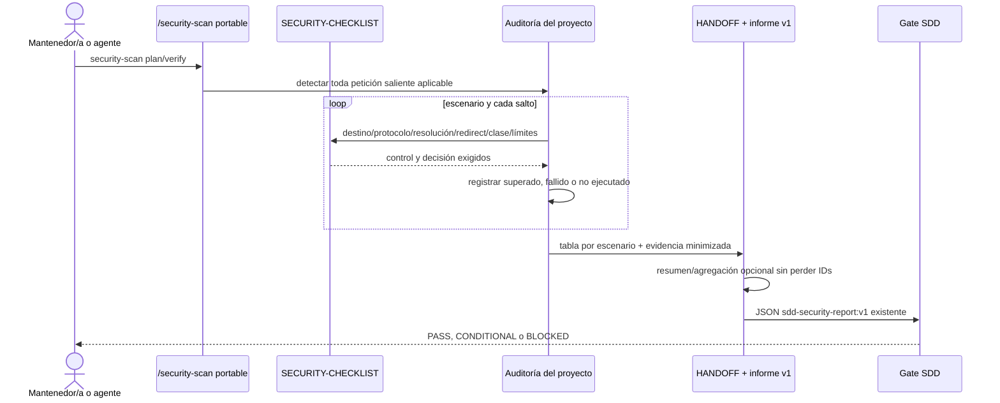

# Plan técnico · 016-cobertura-ssrf-egress

| Campo | Valor |
|---|---|
| **Spec** | [`spec.md`](./spec.md) |
| **Estado** | propuesta pendiente de gate humano |
| **Fecha** | 2026-08-21 |
| **Arquitectura vigente** | distribución monolítica Node.js, procedural y modular, con contratos de fichero/Git |
| **ADR relacionados** | [`ADR-0001`](../../architecture/adr/ADR-0001-arquitectura-heredada.md) · aceptado |
| **Gate de producto** | `approved` · `docs/product/PRD.md` |
| **Gate funcional** | `approved` · [`spec.md`](./spec.md) |
| **Gate de diseño** | `skipped-no-ui` · motivo material en `spec.md` |

## 1. Resumen de la solución

Se añade un corte SSRF/egress explícito al procedimiento portable `/security-scan` y a la
checklist instalada, sin crear agente, skill, comando ni runtime. El contrato obliga a decidir
destino/protocolo, revalidar resolución y redirecciones, bloquear metadata, gobernar excepciones
internas, limitar recursos y evidenciar cada resultado. `test-install.mjs` lo verifica tanto en la
fuente como en una instalación real, conservando el adaptador Claude mínimo y la paridad 20/27.
La guía `DOC-SKILLS` se sincroniza y el informe JSON `sdd-security-report:v1` no cambia.

### Trazabilidad y fuentes de entrada

| OBJ | PRD-RF | UC | RF | CA | Componente previsto | Test previsto |
|---|---|---|---|---|---|---|
| OBJ-001 | PRD-RF-001 | UC-003 | RF-01 | CA-01 | skill + checklist · destino | `contrato_ssrf_exige_destino_permitido` |
| OBJ-001 | PRD-RF-001 | UC-003 | RF-02 | CA-02 | skill + checklist · protocolo | `contrato_ssrf_exige_protocolo_permitido` |
| OBJ-001 | PRD-RF-001 | UC-003 | RF-03 | CA-03 | skill + checklist · resolución | `contrato_ssrf_revalida_destino_efectivo` |
| OBJ-001 | PRD-RF-001 | UC-003 | RF-04 | CA-04 | skill + checklist · redirects | `contrato_ssrf_revalida_cada_redireccion` |
| OBJ-001 | PRD-RF-001 | UC-003 | RF-05 | CA-05 | skill + checklist · metadata | `contrato_ssrf_bloquea_metadata_sin_excepcion` |
| OBJ-002 | PRD-RF-004 | UC-004 | RF-06 | CA-06 | HANDOFF/checklist · evidencia | `contrato_ssrf_no_admite_verde_implicito` |
| OBJ-002 | PRD-RF-004 | UC-004 | RF-07 | CA-07 | checklist · timeout | `contrato_ssrf_exige_timeout_material` |
| OBJ-002 | PRD-RF-004 | UC-004 | RF-08 | CA-08 | checklist · límite de respuesta | `contrato_ssrf_exige_limite_de_respuesta` |
| OBJ-003 | PRD-RF-006 | UC-001 | RF-09 | CA-09 | fuente canónica + instalador/adaptador | `instala_contrato_ssrf_portable_sin_duplicados` |
| OBJ-002 | PRD-RF-004 | UC-004 | RF-10 | CA-10 | HANDOFF humano · resumen opcional | `contrato_ssrf_resume_resultados_verificables` |
| OBJ-002 | PRD-RF-004 | UC-004 | RF-11 | CA-11 | HANDOFF humano · agrupación opcional | `contrato_ssrf_agrupa_sin_perder_escenarios` |
| OBJ-001 | PRD-RF-001 | UC-003 | RF-12 | CA-12 | skill + checklist · excepción interna | `contrato_ssrf_exige_excepcion_interna_completa` |

- Fuentes consideradas: `SRC-001`, `SRC-002`, `SRC-003`, auditoría documental aportada, OWASP
  SSRF Prevention Cheat Sheet y ASVS 5.0.0 estable.
- Discrepancias resueltas: `DISC-016-01`.
- Discrepancias abiertas: 0.

## 2. Aplicación de la arquitectura

| Frontera heredada | Aplicación del plan |
|---|---|
| Distribución | el instalador y la allowlist npm ya transportan `.agents/skills`, adaptadores y checklist; se añaden pruebas, no otra ruta de copia |
| Circuito SDD | `/security-scan` conserva nombre, modos y `sdd-security-report:v1`; solo amplía el procedimiento aplicable |
| Guardas y trazabilidad | la matriz `SEC-*`, tareas futuras, tests y evidencia conservan el encadenado exigido; no se cambian hooks |
| Publicación/documentación | `DOC-SKILLS` actualiza manualmente la guía declarada por `.sdd/docs.json`; no hay generador nuevo |
| Experiencia de instalación | una instalación limpia recibe el contrato; brownfield conserva doctrina propia y hace visible el conflicto conforme a la política existente |

No se inventan capas `domain/application/infrastructure/interfaces` que la arquitectura real no
tiene. El cambio queda en los módulos lógicos de circuito, distribución y documentación.

**Reglas de dependencia respetadas**: sí. Cero dependencias runtime, servicios, red, persistencia o
formatos paralelos. No hace falta ADR nuevo.

## 3. Componentes

### Nuevos en la fase de plan

| Componente | Responsabilidad | Ruta |
|---|---|---|
| Contrato SSRF/egress v1 | fijar el comportamiento observable antes de editar doctrina/tests | `docs/specs/016-cobertura-ssrf-egress/contracts/security-audit-ssrf-v1.md` |
| Modelo conceptual | definir escenarios, saltos, resultados, excepciones y evidencia sin persistencia | `docs/specs/016-cobertura-ssrf-egress/data-model.md` |
| Plan de verificación | cubrir 12 CA, casos límite, seguridad y DOC-SKILLS | `docs/specs/016-cobertura-ssrf-egress/test-plan.md` |

### Modificados durante implementación

| Componente | Qué cambia | Riesgo de regresión |
|---|---|---|
| `.agents/skills/security-scan/SKILL.md` | aplicabilidad y procedimiento SSRF/egress; tabla humana por escenario | Alto: fuente portable de seis hosts |
| `docs/security/SECURITY-CHECKLIST.md` | sección exhaustiva SSRF/peticiones salientes alineada con la skill | Alto: referencia normativa instalada |
| `scripts/test/install-security-contracts.mjs` | módulo interno extraído primero para alojar contratos de seguridad sin crecer el fichero agotado | Medio: nuevo módulo de test, no se empaqueta ni instala |
| `scripts/test-install.mjs` | mantiene el entrypoint e invoca el módulo extraído; no crece ni eleva su trinquete | Medio-alto: suite concentrada y multiplataforma |
| `docs/guides/COMO-TRABAJAR-CON-LOS-AGENTES.md` | explicación breve y enlaces a skill/checklist | Medio: artefacto `DOC-SKILLS` |

### Deliberadamente no modificados

- `.claude/agents/security-auditor.md`: ya cubre SSRF y remite a skill/checklist.
- `.claude/skills/security-scan/SKILL.md`: adaptador mínimo existente, probado por referencia.
- Perfiles de los otros cinco hosts: consumen `.agents/skills`; duplicar texto crearía deriva.
- `scripts/lib/manifiesto.mjs`, `package.json` y `.sdd/docs.json`: sus reglas actuales ya incluyen
  las rutas afectadas.
- `sdd-security-report:v1`: el resumen SSRF vive en Markdown humano, sin esquema nuevo.

## 4. Patrones de diseño aplicados

| Problema | Patrón | Alternativa descartada | Por qué |
|---|---|---|---|
| Seis hosts podrían divergir | fuente canónica + thin adapter | copiar controles por host | una sola fuente verificable reduce deriva |
| Un destino aparente puede cambiar | validación por salto / policy checkpoint | validación única de URL | cada resolución/redirect es una nueva decisión de seguridad |
| La ausencia de evidencia parece verde | fail closed en el contrato | inferir superado | `no ejecutado` conserva riesgo y bloquea GO |
| El informe existente tiene consumidores | evolución aditiva compatible | `sdd-security-report:v2` | no hay consumidor que justifique migración ni breaking change |
| La doctrina puede quedar bonita pero no instalada | contract test + E2E del instalador | revisión manual única | demuestra el artefacto recibido por un proyecto destino |
| Brownfield puede tener doctrina propia | conservative update | sobrescritura automática | conserva trabajo ajeno y hace visible la reconciliación |

## 5. Flujo principal

## 6. Modelo de datos y migraciones

Ver [`data-model.md`](./data-model.md). No hay base de datos, fichero de estado, índice, backfill ni
migración. El modelo es vocabulario documental para informes futuros; los históricos siguen
siendo válidos. La plantilla no retiene tráfico ni cuerpos.

## 7. Contratos y versionado

Ver [`contracts/security-audit-ssrf-v1.md`](./contracts/security-audit-ssrf-v1.md).

- Cambio **aditivo** al procedimiento y checklist actuales.
- Sin API, evento, CLI, esquema JSON o tipo compartido nuevo.
- `sdd-security-report:v1` conserva versión y campos; la tabla SSRF es parte del bloque humano.
- La versión de distribución se decidirá en `/sdd-ship`, fuera de esta spec.
- Una futura salida máquina por escenario exigiría contrato versionado y spec propia.

## 8. Estrategia de test y orden MoSCoW

Ver [`test-plan.md`](./test-plan.md).

| Orden | Prioridad | Bloque previsto | RF/CA | Test primero |
|---:|---|---|---|---|
| 1 | Must | T-016-01 · extraer primero el bloque/harness de contratos de seguridad a `scripts/test/install-security-contracts.mjs`, demostrar suite previa verde sin elevar `maxLineas`, y añadir allí los RED de la 016 | RF/CA-01 a 06, 09 y 12 | extracción verde primero; después RED por cláusula |
| 2 | Must | T-016-02 · mínimo GREEN en skill/checklist y distribución existente | RF/CA-01 a 06, 09 y 12 | usa RED anterior |
| 3 | Should | T-016-03 · límites de timeout y datos | RF/CA-07 y 08 | sí, RED específico |
| 4 | Could | T-016-04 · resumen y agrupación preservando IDs | RF/CA-10 y 11 | sí, RED específico; aplazable sin perder mínimos |
| 5 | obligatorio documental | T-016-05 · sincronizar DOC-SKILLS | DOC-SKILLS | comprobación semántica primero |
| 6 | gate | T-016-06 · suites, `/security-scan verify` y evidencia | todos | solo tras GREEN/REFACTOR |

No se ejecuta ningún `Could` antes de completar Must y Should. Si se consume contingencia, se
aplaza T-016-04 completa; no se recorta un control Must.

| Nivel | Qué se prueba |
|---|---|
| Unitario | helper puro de test; no se crea lógica de producción artificial |
| Integración | coherencia skill/checklist/adapter/configuración documental |
| Contrato | una ausencia por cláusula falla con motivo preciso |
| E2E | instalación limpia y brownfield temporal mediante `test-install.mjs` |

### 8.1 · Calibración de verificación

| Módulo / ruta | Tier | Justificación |
|---|---|---|
| `.agents/skills/security-scan/SKILL.md` | CORE · 100 % del contrato aplicable | decide qué debe auditarse; omitir una cláusula permite falso verde |
| `docs/security/SECURITY-CHECKLIST.md` | CORE · 100 % del contrato aplicable | referencia normativa que completa la auditoría |
| `scripts/test-install.mjs` (casos 016) | CORE · todos los CA/SEC | demuestra portabilidad y evita regresión de doctrina |
| `.claude/skills/security-scan/SKILL.md` | INFRASTRUCTURE | adaptador sin lógica, validado por referencia/esquema |
| `docs/guides/COMO-TRABAJAR-CON-LOS-AGENTES.md` | IMPORTANT · comprobación semántica + revisión | orientación visible; no decide controles |

Las cuatro preguntas de `TEST-STRATEGY.md` §0 dan 4/4 hacia **verificar** para el contrato: conducta
conocida, fallo de alto coste, requisitos estables y simulación completa de distribución. Se exige
suite exhaustiva de cláusulas y todos los casos límite nombrados. No se añade red real ni mutation
engine: el producto no ejecuta requests y el gate mutation está pendiente; el ciclo RED-GREEN-
REFACTOR sí es obligatorio.

## 9. Seguridad

**Impacto**: `sensible`. Marco: OWASP Top 10:2025 y ASVS 5.0.0 L2. No aplica
`AUTH-TOKENS.md`: no se elige JWT, cookie ni bearer.

### Threat model acotado

| Amenaza | Frontera | Control |
|---|---|---|
| URL/protocolo no confiable alcanza servicio interno | proyecto auditado → red saliente | allowlist material y destino efectivo |
| DNS rebinding/pinning cambia A/AAAA | nombre → resolución → conexión | evaluar todas las direcciones inmediatamente antes del salto |
| redirect salta de destino permitido a restringido | respuesta externa → siguiente salto | desactivar automático o revalidar cada salto |
| metadata expone credenciales de infraestructura | workload → metadata service | rechazo incondicional sin excepción |
| excepción interna genérica erosiona denegación | decisión humana → política de red | owner, alcance, motivo y evidencia |
| destino lento/grande agota recursos | servicio externo → aplicación | timeout, tamaño y reintentos acotados |
| auditor no puede ejecutar control pero reporta PASS | evidencia → gate | estado explícito y `controlsNotExecuted` bloqueante |
| informe filtra secretos/cuerpos | auditoría → repositorio/log | minimización + secret scan |
| un host recibe doctrina incompleta | paquete → repositorio destino | fuente canónica + E2E de instalación/paridad |
| contenido auditado intenta ordenar al agente omitir controles o declarar PASS | contenido no confiable → contexto del agente | tratar documentos, URLs y evidencia como datos; solo spec/plan/gates versionados gobiernan alcance |

### 9.1 · Matriz de controles

| Control | ASVS | OWASP | Aplica | Decisión / justificación | Tarea | Test | Evidencia |
|---|---|---|---|---|---|---|---|
| SEC-SSRF-001 | v5.0.0-1.3.6, 13.2.4, 13.2.5 · L2 | A01:2025 · CWE-918 | sí | toda petición identifica destino solicitado y lo contrasta con allowlist/política material | T-016-02 | `scripts/test/install-security-contracts.mjs::contrato_ssrf_exige_destino_permitido` | `evidence.md#SEC-SSRF-001` |
| SEC-SSRF-002 | v5.0.0-1.3.6, 13.2.4, 13.2.5 · L2 | A01:2025 · CWE-918 | sí | protocolo permitido explícitamente; ningún esquema se acepta por omisión | T-016-02 | `scripts/test/install-security-contracts.mjs::contrato_ssrf_exige_protocolo_permitido` | `evidence.md#SEC-SSRF-002` |
| SEC-SSRF-003 | v5.0.0-1.1.1, 1.3.6, 13.2.4 · L2 | A01:2025 · CWE-918 | sí | todas las direcciones A/AAAA efectivas se canonizan/clasifican inmediatamente antes de usarlas; resolución previa no se hereda | T-016-02 | `scripts/test/install-security-contracts.mjs::contrato_ssrf_revalida_destino_efectivo` | `evidence.md#SEC-SSRF-003` |
| SEC-SSRF-004 | v5.0.0-15.3.2, 1.3.6 · L2 | A01:2025 · CWE-918/CWE-601 | sí | redirects automáticos deshabilitados o cada salto revalidado, con máximo/bucle declarados | T-016-02 | `scripts/test/install-security-contracts.mjs::contrato_ssrf_revalida_cada_redireccion` | `evidence.md#SEC-SSRF-004` |
| SEC-SSRF-005 | v5.0.0-13.2.4, 13.2.5, 1.3.6 · L2 | A01:2025 · CWE-918/CWE-441 | sí | destinos de metadata se rechazan siempre; no existe excepción | T-016-02 | `scripts/test/install-security-contracts.mjs::contrato_ssrf_bloquea_metadata_sin_excepcion` | `evidence.md#SEC-SSRF-005` |
| SEC-SSRF-006 | v5.0.0-13.2.4, 13.2.5, 1.3.6 · L2 | A01:2025 · CWE-918 | sí | local/privado/link-local se rechaza o exige owner, alcance, motivo y evidencia; negación prevalece | T-016-02 | `scripts/test/install-security-contracts.mjs::contrato_ssrf_exige_excepcion_interna_completa` | `evidence.md#SEC-SSRF-006` |
| SEC-SSRF-007 | v5.0.0-16.2.1, 16.3.3, 16.3.4, 16.5.3 · L2 | A09/A10:2025 | sí | aplicabilidad separada del estado; ausencia de verificación nunca es PASS; contenido auditado es dato no confiable | T-016-02 | `scripts/test/install-security-contracts.mjs::contrato_ssrf_no_admite_verde_implicito` | `evidence.md#SEC-SSRF-007` |
| SEC-SSRF-008 | v5.0.0-15.1.3, 15.2.2, 16.5.2, 16.5.3 · L2; 13.1.3 · L3 suplementario | A10:2025 · CWE-400 | sí | timeout, cancelación y reintentos acotados o hallazgo por ausencia | T-016-03 | `scripts/test/install-security-contracts.mjs::contrato_ssrf_exige_timeout_material` | `evidence.md#SEC-SSRF-008` |
| SEC-SSRF-009 | v5.0.0-15.1.3, 15.2.2 · L2 | A10:2025 · CWE-400 | sí | tamaño máximo aceptado y procesamiento acotado o hallazgo | T-016-03 | `scripts/test/install-security-contracts.mjs::contrato_ssrf_exige_limite_de_respuesta` | `evidence.md#SEC-SSRF-009` |
| SEC-SSRF-010 | v5.0.0-16.2.1, 16.2.5, 16.3.4 · L2 | A09:2025 · CWE-532 | sí | evidencia por referencia, sin userinfo, query sensible, tokens, credenciales o cuerpos completos | T-016-02 | `scripts/test/install-security-contracts.mjs::contrato_ssrf_minimiza_evidencia` | `evidence.md#SEC-SSRF-010` |
| SEC-SSRF-011 | ASVS 5.0.0 · sin requisito técnico directo; control de integridad del SDLC | A03/A08:2025 | sí | skill canónica autosuficiente aun con checklist brownfield personalizada; instalación/paridad verificables y catálogo 20/27 | T-016-02 | `scripts/test/install-security-contracts.mjs::instala_contrato_ssrf_portable_sin_duplicados` | `evidence.md#SEC-SSRF-011` |

### 9.2 · Auditoría prevista

- Plan: `/security-scan plan`, `security-auditor` read-only; HANDOFF integrado antes del gate.
- Verificación: `/security-scan verify` sobre diff, tests y evidencia en T-016-06.
- Informe: `docs/security/reports/2026-08-21-016-cobertura-ssrf-egress.md`, materializado
  literalmente por agente autorizado, con `sdd-security-report:v1`.
- GO exige cero CRÍTICO/ALTO, MEDIO aceptado formalmente o corregido y cero controles no ejecutados.

### 9.3 · Usabilidad

**Impacto**: `sin-ui` porque solo cambia doctrina Markdown y pruebas de instalación. No se crean
controles `UX-*`, no se consulta UX/frontend, no hay WCAG, formulario, espera percibida ni
actualización optimista que evaluar.

## 10. Rendimiento y coste

| Métrica/coste | Objetivo | Decisión |
|---|---|---|
| Auditoría de 100 escenarios ya disponibles | p95 < 1 s para aplicar el conjunto declarado | contrato tabular sin red ni servicio; el proyecto consumidor mide su implementación |
| Escala | 100 escenarios × 10 saltos con traza individual | IDs y filas lineales; agrupación opcional no elimina detalle |
| Test añadido | no hacer perceptible el crecimiento de `test-install.mjs` | lecturas locales y un destino temporal ya existente; sin red/sleeps |
| Infraestructura/licencias | 0 € y 0 servicios | Markdown + Node estándar existente |
| Dependencias | 0 | ninguna propuesta |
| Mantenimiento | bajo | una skill, una checklist, una guía y asserts semánticos |

No hay consultas, caché ni invalidación. El p95 del comportamiento de un agente no puede inferirse
de un test de Markdown; si no se ejecuta un smoke real se declara no ejecutado, no verde.

## 10 bis. Documentación

| DOC-ID | Superficie | Aplica / motivo | Fuente de verdad | Artefacto | Generado / manual | Propietario | Tarea | Gate / comprobación | Evidencia |
|---|---|---|---|---|---|---|---|---|---|
| DOC-SKILLS | developer-readme | sí · cambia qué comprueba `/security-scan` | `.agents/skills/security-scan/SKILL.md` + `docs/security/SECURITY-CHECKLIST.md` | `docs/guides/COMO-TRABAJAR-CON-LOS-AGENTES.md` | manual | docs-writer | T-016-05 | `scripts/test/install-security-contracts.mjs::la_guia_enlaza_el_contrato_ssrf_portable` | `evidence.md#DOC-SKILLS` |

`.sdd/docs.json` ya declara `DOC-SKILLS`; no se modifica ni se crea generador.

## 11. Observabilidad

La plantilla no ejecuta requests ni añade camino runtime, por lo que no se crean logs, métricas,
trazas o alertas operativas. La observabilidad del control es el informe existente:

- evento documental por escenario/control con estado y evidencia;
- `controlsNotExecuted` con riesgo, owner y siguiente paso;
- conteos y veredicto en `sdd-security-report:v1`;
- sin PII, secretos, tokens ni cuerpos completos.

El proyecto consumidor decide alertas y runbooks de su egress real; imponerlos aquí sería ampliar
alcance.

## 12. Despliegue y compatibilidad

- Feature flag: no aplica; no hay comportamiento runtime.
- Orden: Must → Should → Could → DOC-SKILLS → verify; luego release normal mediante `/sdd-ship`.
- Greenfield/instalación limpia: recibe skill y checklist completas.
- Brownfield sin modificaciones locales: sigue la actualización gestionada existente.
- Brownfield con doctrina propia: se preserva y el conflicto debe reconciliarse explícitamente.
- Compatibilidad: aditiva; informes v1 e instalaciones anteriores no se migran ni invalidan.

## 13. Riesgos y mitigaciones

| Riesgo | Prob. | Impacto | Mitigación |
|---|---:|---:|---|
| Skill y checklist vuelven a divergir | media | alto | helper semántico común + test fuente/instalación |
| Se confunde auditoría documental con mitigación implementada | media | alto | contrato declara que no ejecuta red ni impone librería |
| Allowlist demasiado genérica produce falsa seguridad | media | alto | exige política material por proyecto y destino efectivo por salto |
| DNS/redirect se valida solo una vez | media | alto | controles independientes y tests negativos |
| Brownfield personalizado no recibe automáticamente la doctrina | media | medio | preservación explícita + conflicto visible + guía de reconciliación; nunca overwrite silencioso |
| Evidencia filtra secretos | baja | alto | minimización contractual + secret scan |
| `test-install.mjs` ya agotó su trinquete 3831/3831 | alta | medio | T-016-01 extrae primero contratos de seguridad a módulo interno, prueba suite previa verde y no eleva `maxLineas` |
| Paridad declarada sin smoke vivo de host | media | medio | distinguir contrato estático de `observed`; no presentar smoke no ejecutado como verde |
| Los `Could` retrasan los Must | baja | medio | orden MoSCoW bloqueante y aplazamiento íntegro de T-016-04 |

## 14. Plan de reversión

1. Ejecutar `git revert --no-edit <SHA-del-commit-016>` sobre el commit entregado; no usar reset ni
   mover tags.
2. Ejecutar `node scripts/sdd-project.mjs run --fast` y después los gates lentos antes de publicar
   la reversión.
3. Tiempo estimado: 5–15 minutos más CI.

No hay datos ni migraciones que revertir. Los informes ya escritos permanecen como historia; las
instalaciones existentes no se mutan a distancia. Si el cambio ya formó parte de una release, se
publica una versión correctiva nueva en vez de mover el tag.

## 15. Conformidad con la constitución

- [x] Respeta las fronteras reales de distribución, circuito y documentación.
- [x] No introduce arquitectura distinta, servicio, base de datos ni dependencia runtime.
- [x] Usa contratos de fichero versionados y pruebas de instalación.
- [x] Cada RF tiene componente y cada CA tiene test previsto.
- [x] Cada patrón responde a un riesgo observado.
- [x] No crea agente, skill, comando, formato JSON o mitigación de red no solicitados.
- [x] Toda decisión no trivial está en `research.md`; dependencias nuevas: ninguna.
- [x] No requiere ADR adicional.

## 16. Gate humano del plan técnico

| Campo | Valor |
|---|---|
| **Estado** | `approved` |
| **Persona** | Jesus Chamorro |
| **Fecha** | 2026-08-21 |
| **Alcance aprobado** | plan íntegro presentado: contrato SSRF/egress, orden T-016-01 a T-016-06, extracción previa del harness sin elevar el trinquete 3831, skill/checklist, instalación/paridad, DOC-SKILLS y verificación independiente |
| **Condiciones / riesgos aceptados** | brownfield conserva doctrina propia; la validación estática por host no se presenta como smoke vivo; la implementación mantiene esos límites |
| **Evidencia de aprobación** | respuesta literal del usuario: «ok aprobado» |

> Gate aprobado por Jesus Chamorro el 2026-08-21. `/sdd-tasks` puede comenzar dentro del alcance
> registrado; cualquier ampliación vuelve a gate humano.
