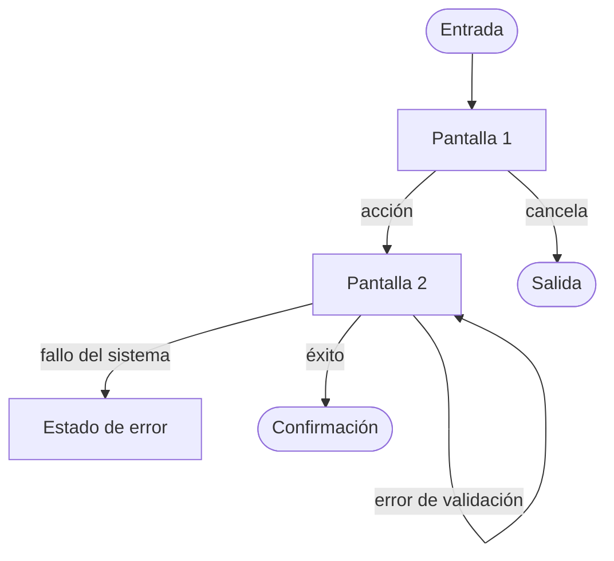

# NNN · Diseño — <Título de la funcionalidad>

| Campo | Valor |
|---|---|
| **Spec** | [`spec.md`](./spec.md) |
| **Estado** | borrador \| en revisión \| aprobado |
| **Autor** | |
| **Fecha** | YYYY-MM-DD |
| **Diseño de referencia** | <enlace Figma/Stitch con el nodo exacto, o "ninguno"> |

> ⚠️ Este documento describe **cómo se ve y cómo se recorre**. Sin decisiones técnicas: ni
> framework, ni librería de componentes, ni estructura de carpetas. Eso va en `plan.md`.
>
> Se rellena en `/sdd-design`. Si la funcionalidad no tiene interfaz, esta fase se salta y se
> escribe aquí por qué.

---

## 1. Flujo de usuario

> Camino completo, **con los errores**. Un flujo que solo dibuja el camino feliz es una demo.



Flujo detallado: [`docs/design/flows/NNN-<flujo>.md`](../../design/flows/)

| Paso | Pantalla | Qué decide el usuario | Puede volver atrás |
|---|---|---|---|
| 1 | | | sí / no — por qué |

## 2. Pantallas y sus estados

> **Obligatorio: los seis estados por pantalla.** Es la mitad del diseño y lo que más se olvida.

### Pantalla 1 — <nombre> *(cubre CA-01, CA-02)*

| Estado | Qué se ve | Qué puede hacer el usuario |
|---|---|---|
| Vacío | | |
| Cargando | | |
| Parcial | | |
| Error | | |
| Sin permiso | | |
| Éxito | | |

Wireframe de baja fidelidad:

```
┌──────────────────────────────┐
│                              │
└──────────────────────────────┘
```

## 3. Componentes

| Componente | Reutiliza / Extiende / Nuevo | Justificación si es nuevo |
|---|---|---|
| | | |

> Un componente nuevo es coste permanente de mantenimiento. Se justifica o se reutiliza.

### Inconsistencias con el design system

| Valor usado en el diseño | Token que debería usar | Decisión |
|---|---|---|
| | | |

> Un valor fuera de los tokens se señala, no se codifica a pelo. Por ahí se desintegra un design
> system.

## 4. Contenido y microcopy

| Sitio | Texto | Nota |
|---|---|---|
| Botón principal | | Verbo de la acción real: "Guardar cambios", no "Aceptar" |
| Estado vacío | | Debe enseñar el siguiente paso |
| Error de validación | | Concreto y accionable: "La fecha debe ser posterior a hoy" |

## 5. Responsive

| Ancho | Qué cambia |
|---|---|
| Móvil | |
| Tablet | |
| Escritorio | |

Qué se degrada o se oculta en pantalla estrecha, y por qué **eso** y no otra cosa.

## 6. Accesibilidad — WCAG 2.2 AA verificada sobre el diseño

| Comprobación | Estado | Nota |
|---|---|---|
| Contraste ≥ 4.5:1 (≥ 3:1 grande y controles) | | |
| Nada comunicado solo por color | | |
| Foco visible diseñado | | |
| Objetivos táctiles ≥ 24×24 px con separación | | |
| Orden de tabulación pensado | | |
| Jerarquía de encabezados coherente | | |
| Errores concretos y asociados a su campo | | |
| Alternativa para `prefers-reduced-motion` | | |

## 7. Requisitos descubiertos en el diseño

> El diseño casi siempre descubre requisitos que la spec no vio. **No se meten aquí de tapadillo:
> vuelven a `/sdd-specify`.**

| Qué apareció | Impacto | ¿Vuelve a la spec? |
|---|---|---|
| | | |

## 8. Trazabilidad

| CA de la spec | Pantalla / paso que lo cubre |
|---|---|
| CA-01 | |

> Cada `CA` necesita recorrido; cada pantalla, un `CA` que la justifique. Una pantalla que no
> responde a ningún criterio es alcance que nadie pidió.

## 9. Preguntas abiertas

- `[NEEDS CLARIFICATION: <pregunta>]`

> Con marcadores aquí, `/sdd-plan` no arranca.
