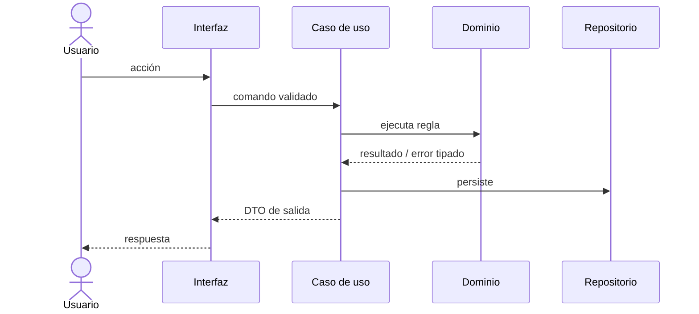

# Plan técnico · NNN-slug

| Campo | Valor |
|---|---|
| **Spec** | [`spec.md`](./spec.md) |
| **Estado** | borrador \| aprobado |
| **Fecha** | YYYY-MM-DD |
| **Arquitectura vigente** | <de `docs/architecture/constitution.md`> |
| **ADR relacionados** | |
| **Gate de producto** | `<approved/legacy-pending>` · `docs/product/PRD.md` |
| **Gate funcional** | `<approved>` · [`spec.md`](./spec.md) |
| **Gate de diseño** | `<approved/skipped-no-ui>` · [`design.md`](./design.md) |

---

## 1. Resumen de la solución

<5 líneas. Si no cabe en 5 líneas, la solución es demasiado compleja o no está clara.>

### Trazabilidad y fuentes de entrada

| OBJ | PRD-RF | UC | RF | CA | Componente previsto | Test previsto |
|---|---|---|---|---|---|---|
| OBJ-001 | PRD-RF-001 | UC-001 | RF-01 | CA-01 | `<componente>` | `<test>` |

- Fuentes consideradas: `<SRC-...>`.
- Discrepancias resueltas: `<DISC-... / ninguna>`.
- Discrepancias abiertas: `<0 para aprobar>`.

## 2. Aplicación de la arquitectura

| Capa | Qué se añade aquí |
|---|---|
| `domain/` | |
| `application/` | |
| `infrastructure/` | |
| `interfaces/` | |

**Reglas de dependencia respetadas**: sí / no (si no, ADR requerido).

## 3. Componentes

### Nuevos
| Componente | Responsabilidad (una sola) | Ruta prevista |
|---|---|---|
| | | |

### Modificados
| Componente | Qué cambia | Riesgo de regresión |
|---|---|---|
| | | |

## 4. Patrones de diseño aplicados

> Cada patrón necesita un problema real detrás. Si no puedes nombrar el problema, quita el patrón.

| Problema | Patrón | Alternativa descartada | Por qué |
|---|---|---|---|
| | | | |

## 5. Flujo principal

## 6. Modelo de datos

Ver [`data-model.md`](./data-model.md).
Resumen de cambios de esquema y estrategia de migración: <…>

## 7. Contratos

Ver [`contracts/`](./contracts/).
¿Cambios rompedores? <sí/no> · Versionado: <…>

## 8. Estrategia de test

Ver [`test-plan.md`](./test-plan.md).

| Nivel | Qué se prueba aquí |
|---|---|
| Unitario | |
| Integración | |
| Contrato | |
| E2E | |

### 8.1 · Calibración de verificación

**Tier de cobertura por módulo.** Lo que no se declare aquí se exigirá al **100 %**: el defecto es
el estricto a propósito, porque clasificar cuesta menos que justificar después por qué un módulo
sin clasificar está al 40 %.

| Módulo / ruta | Tier | Por qué |
|---|---|---|
| `<ruta>` | CORE \| IMPORTANT \| INFRASTRUCTURE | `<maneja dinero / lo ve el usuario / lo valida el compilador>` |

Criterio en [`TEST-STRATEGY.md`](../../quality/TEST-STRATEGY.md) §8. Ningún módulo que maneje
dinero, datos críticos o permisos puede quedar por debajo de CORE, y `/sdd-verify` lo comprueba.

**Profundidad, cuando no es obvia.** Las cuatro preguntas de §0 —comportamiento conocido, coste de
fallar, estabilidad del requisito, simulabilidad—:

| Componente | Respuesta | Decisión |
|---|---|---|
| `<componente>` | `<n>` de 4 hacia verificar | `<suite exhaustiva / camino feliz + instrumentación>` |

Calibra cuántos casos límite, si hay E2E y si se mide mutation score. **No** calibra si hay ciclo
rojo-verde: eso no se negocia.

## 9. Seguridad

| Aspecto | Decisión |
|---|---|
| Entradas externas y validación | |
| Autorización (quién puede, comprobado dónde) | |
| Datos sensibles y su tratamiento | |
| Amenazas STRIDE relevantes | |
| Controles añadidos | |

## 10. Rendimiento

| Métrica | Objetivo | Cómo se consigue |
|---|---|---|
| | | |

Consultas críticas: <…> · Estrategia de caché e **invalidación**: <…>

## 11. Observabilidad

- Logs (eventos, campos, sin PII): <…>
- Métricas: <…>
- Trazas: <…>
- **Caminos que se instrumentan** y clases de error esperadas (red, negocio, recursos, terceros): <…>
- **Salud por versión**: qué indicadores se vigilan y qué combinación dispara la reversión: <…>
- **Eventos de negocio** del rastro, sin datos personales: <…>
- Alertas: umbral de aviso, umbral crítico y **playbook** de cada una: <…>

Procedimiento: [`/observability`](../../../.agents/skills/observability/SKILL.md).
Si esta spec introduce caminos que pueden fallar delante de un usuario, aquí sale una tarea con
terreno `observability`.

## 12. Despliegue

- Feature flag: `<nombre>` — se retira cuando <condición>
- Orden de despliegue: <…>
- Compatibilidad con la versión anterior: <…>

## 13. Riesgos y mitigaciones

| Riesgo | Mitigación |
|---|---|
| | |

## 14. Plan de reversión

<Comando exacto y tiempo estimado. Qué pasa con los datos ya migrados.>

## 15. Conformidad con la constitución

- [ ] Respeta las reglas de dependencia
- [ ] No introduce una arquitectura distinta sin ADR
- [ ] Cada RF de la spec tiene componente(s) que lo cubren
- [ ] Cada CA tiene un test previsto
- [ ] Cada patrón tiene un problema real detrás
- [ ] Nada implementado que la spec no pida (YAGNI)
- [ ] Toda dependencia nueva justificada en `research.md`

## 16. Gate humano del plan técnico

| Campo | Valor |
|---|---|
| **Estado** | `pending` \| `approved` \| `rejected` |
| **Persona** | `<quién decide>` |
| **Fecha** | `<YYYY-MM-DD>` |
| **Alcance aprobado** | `<componentes, contratos, datos y despliegue>` |
| **Condiciones / riesgos aceptados** | `<ninguno / lista>` |

> `/sdd-tasks` no comienza con este gate pendiente, con discrepancias abiertas o con un gate de
> producto, spec o diseño incompatible.
